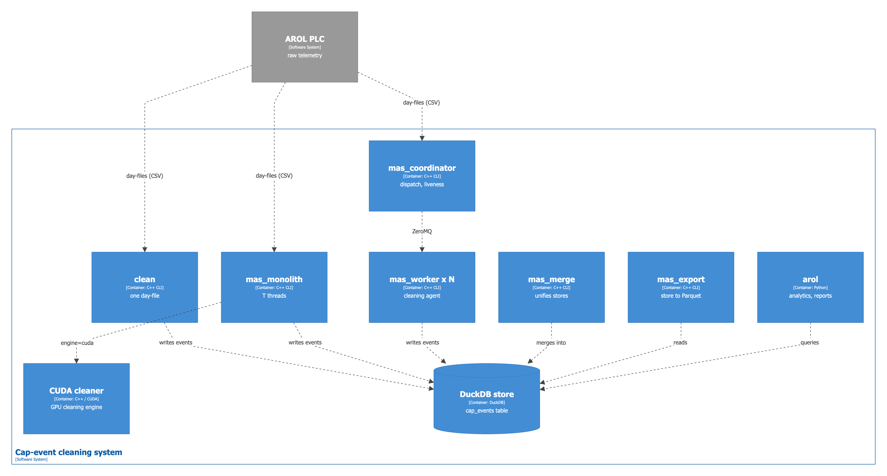
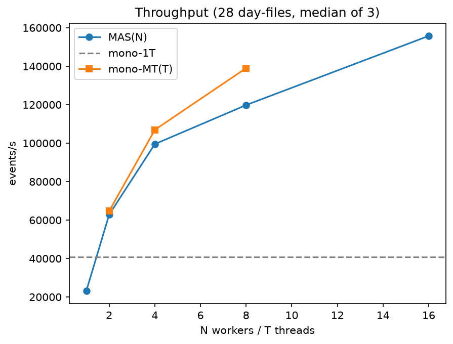
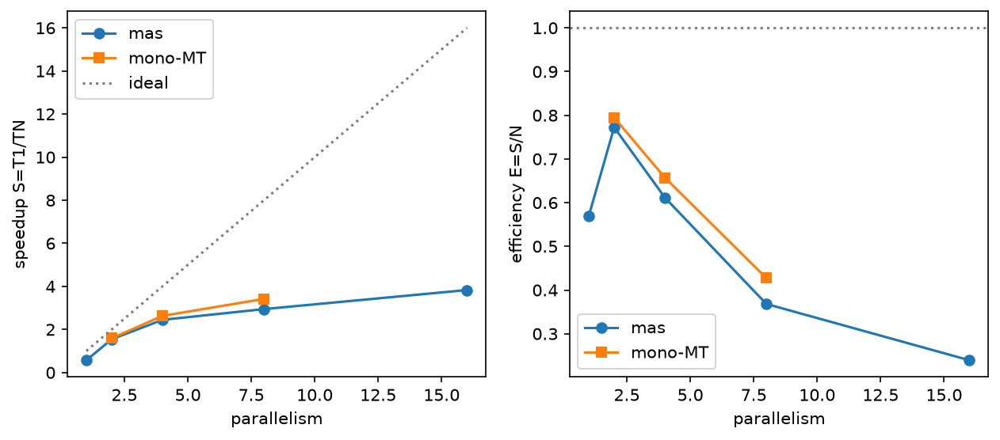
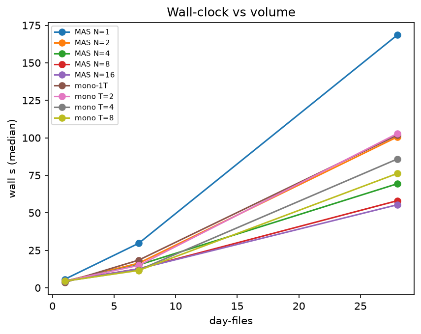
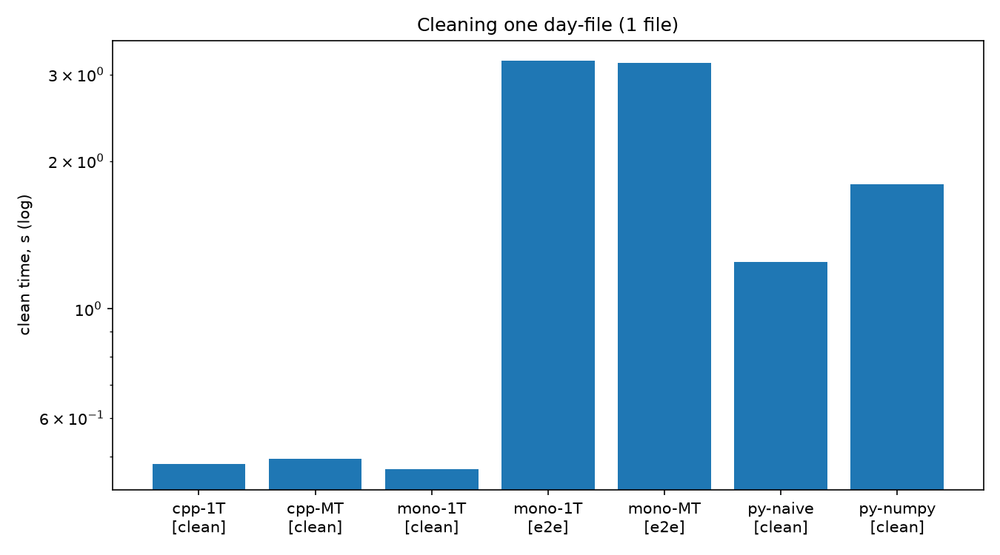
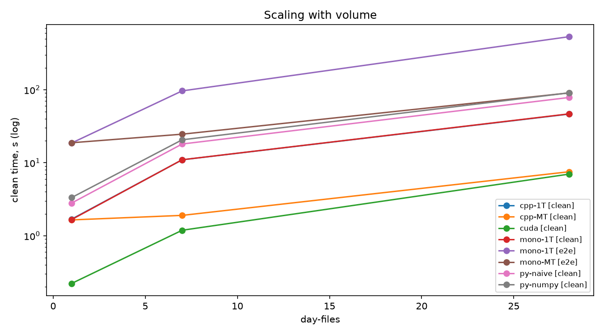
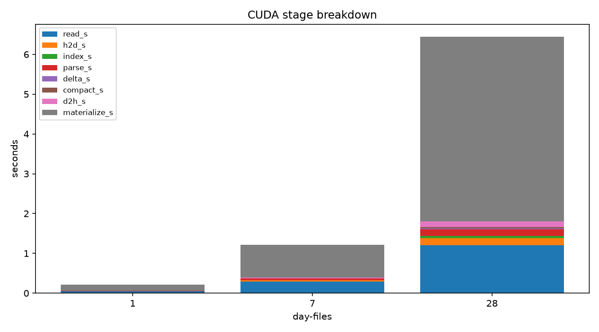

# Project Q3 - Design Choices and Experimental Evaluation

Multi-Agent System for Industrial IoT Data Refinement (AROL Equatorque capping machine).

The system reads the raw telemetry of the machine, 36 capping heads polled at about 1 Hz
and uploaded as one wide CSV per day (about 86,400 rows x 109 columns, 58 MB). Most rows
repeat the previous state. The job is to collapse this stream into the real cap events,
one row per cap applied per head, with correct timestamps. One month (28 day-files)
produces 21,872,663 events. Build and run instructions are in `README.txt`.

**Note on the template.** The project track asks for "graph format", "degree
distributions" and similar items. This project does not process a graph: it is a
tabular, time-series cleaning pipeline. Each requested item is answered here with its
counterpart in this system, and Section 1.5 says explicitly what the "skew" problem
becomes. No graph measurement is reported because none exists.

---

## 1. Design choices

*Figure 1 - C4 container diagram (source: `docs/diagrams/structurizr/workspace.dsl`).*

The C++ code is built as four libraries. `mas_clean_core` holds the cleaning transform, the
row parsing and the CSV reader, and uses only the C++ standard library. `mas_store` adds
the event stores (DuckDB, Parquet, CSV) and the `clean_file` pipeline on top of it, and
`mas_agent` adds the messages, the worker and the coordinator on top of that. `mas_transport`
is the ZeroMQ adapter. The agent code reaches the network only through the interfaces
`IMessageSource` and `IMessageSink`, so its logic is tested without sockets, and the
pipeline writes through `IEventStore`. Because `mas_clean_core` needs neither DuckDB nor
ZeroMQ, the benchmark builds without them (`MAS_BENCH_ONLY=ON`).

### 1.1 Data format (the counterpart of the "graph format")

**Input.** One CSV per day, 109 columns: `timestamp`, then `H01..H36 Count`,
`H01..H36 AppTorque`, `H01..H36 Status`. Each `Count` is the cap counter of one head: it
advances when a cap is applied and is flat in between. The reader checks the header,
skips (and counts) malformed rows, and accepts CRLF.

**The transform.** Per head, comparing each row with the previous one:

| Counter change | Result |
|---|---|
| `c == last` | nothing (no cap applied) |
| `c > last`, delta = 1 | one event |
| `c > last`, delta > 1 | one event, `aggregated = true` (several caps between two polls) |
| `c < last` | one event, `reset = true`, delta = 0 (PLC reset) |

The first row of a file only seeds the counters, so day-files are cleaned independently.
`Status` is a bitmask, not an enumeration: bit 0 is the reject signal, bits 1-6 the cause.
A closure is rejected if and only if the status is odd.

**Output event** (10 columns): `machine_id, head_id, ts, cap_seq, app_torque, status,
delta, is_fault, aggregated, reset`.

**Identity.** An event is identified by `(machine_id, head_id, ts)`. The first
implementation used the PLC counter value instead; that register resets, so a closure
recorded weeks later could carry an already used value and be silently dropped. The
timestamp is safe because a head closes at most once per poll (missed caps arrive as one
event with delta > 1). The three-month store (55,132,433 rows) holds 0 duplicate keys. The same
identity makes reprocessing idempotent: running a file twice adds no rows.

**Three storage backends behind one interface (`IEventStore`):**

| Backend | Use | Properties |
|---|---|---|
| DuckDB (`.duckdb`) | default persistent store, queried by the analytics tier | `UNIQUE (machine_id, head_id, ts)`, `INSERT OR IGNORE`, staging table then merge, single writer |
| Parquet | export (`mas_export`) and an experimental write path (`--format parquet`) | columnar, one file per input, no index, atomic publish (temp file + rename); 233.4 MB against 1182.8 MB for the same February store |
| CSV | interchange and tests | plain text |

### 1.2 Memory layout

| Where | Layout | Reason |
|---|---|---|
| Streaming CPU path | one `RawRow` at a time: timestamp string + three `std::array<double,36>` (Count, AppTorque, Status); events leave in batches of at least 8,192 | constant memory per file |
| Column path (`load_columns`, input of the GPU comparison) | `count`, `torque`, `status`: three contiguous row-major arrays `[n_rows][36]` of `double`, head index fastest; timestamps in a separate vector | the same layout as the device buffers; the transform becomes a pass over arrays |
| Device (one day-file) | raw bytes in pinned host memory, uploaded in one copy; `count`, `torque`, `status` as three `n_rows x 36` double arrays (about 25 MB each); timestamps as fixed 24-byte slots; 1 byte of flags per row; one event slot per (row, head), about 3.1 M slots | one slot per input cell means no thread ever needs to know how many events others produce |
| `CapEventDevice` | 40-byte flat struct (`cap_seq`, `app_torque`, `status`, `row_index`, `delta`, `head_id`, `reset`, padding) | timestamps never travel to the GPU as strings: the event carries a row index and the host maps it back after the download |
| Torque and status | kept as `double` on the device | the GPU result is compared bit by bit with the CPU result, not within a tolerance |

DuckDB column types: `head_id SMALLINT`, `ts TIMESTAMP`, `cap_seq BIGINT`, `app_torque REAL`,
`status REAL`, `delta INTEGER`, three `BOOLEAN` flags.

### 1.3 CPU parallelisation

**Key property.** The transform never reads state older than the previous row (after row
*i* the stored count equals the count of row *i*). So the work is 3,110,364 independent
(row, head) pairs per day-file rather than 36 sequential chains, and day-files are
independent of each other. An element-wise form (`extract_flat`) is kept next to the
stateful extractor that ships; a test proves they emit identical events (all nine fields,
on edge cases and on a real day-file), and the GPU port is checked against it.

**Unit of work: one day-file.** It is coarse, self-contained and needs no communication.
Three architectures use it:

| Architecture | Scheme | Store |
|---|---|---|
| `mono-1T` | sequential baseline: one file after another | one DuckDB store |
| `mono-MT` (`mas_monolith`, T threads) | thread pool; each thread takes the next file index from a shared `std::atomic` counter | one DuckDB store per thread, merged after the join |
| MAS (`mas_coordinator` + N `mas_worker` processes) | coordinator sends one `WorkItem` per file over ZeroMQ PUSH/PULL; workers return results; a third socket carries heartbeats | one DuckDB store per worker, merged by `mas_merge` |

*Why one store per worker.* DuckDB admits a single writer, so workers write private files
and the stores are unified once at the end. The price is the merge phase, which is the
main scaling limit in Section 2.2. `merge_all()` replaced N per-row index-probing passes
with one hash-based `DISTINCT` over the union of the sources.

*MAS protocol.* Three endpoints (work, results, heartbeats). A worker sends a heartbeat on
start, on every idle tick and after every result, and a `CLAIM` frame for the item it takes.
The coordinator declares a worker dead after 30 s of silence and re-sends its claimed
items (at most 2 charged re-sends per item); a worker that announces its idle exit with
`BYE` is a departure, not a death. Because inserts are idempotent, a re-dispatched file
only produces harmless overlap. A chaos test (`scripts/chaos_e2e.sh`) kills a worker with
`kill -9` mid-run and checks that the merged store still matches the oracle (2,290,233
events over 3 files).

### 1.4 GPU parallelisation

`mas_cuda_clean` (and `mas_monolith --engine=cuda`) moves the whole transform, including
CSV parsing, to the GPU. A day-file goes through eight timed stages:

| Stage | Mapping | Primitive |
|---|---|---|
| read, H2D | file read into pinned memory, one upload | `cudaHostAlloc`, one copy |
| index | one thread per byte flags `'\n'` (blocks of 256); line offsets extracted | CUB `DeviceSelect::Flagged` |
| parse | one thread per row (blocks of 128), about 650 contiguous bytes each; writes `count`, `torque`, `status`, timestamp | custom parser |
| delta | one thread per (row, head), about 3.1 M threads; two loads and a compare; writes an event slot and a flag | kernel |
| compact | keep only the flagged slots, preserving order | CUB `DeviceSelect::Flagged` |
| D2H | one download | copy |
| materialize | host: row index -> timestamp string, derive `is_fault` and `aggregated` | host loop |

Events come out in the same `(row, head)` order as the CPU extractor.

Design points:

- **Correct parsing first.** The device parser accumulates an integer mantissa and divides
  once by an exact power of ten, which is correctly rounded while the mantissa fits in 53
  bits. About 2% of torque cells carry a 17-digit value that does not fit; the device
  flags them and the host re-parses the affected cells with `strtod`. A first version was
  one ulp off, which `--verify` (the built-in bitwise comparison against the CPU,
  non-zero exit on any difference) caught on its first run.
- **Row policy shared with the CPU.** Blank lines, short rows and out-of-range cells
  are treated exactly as the CPU readers treat them, so a malformed row cannot produce a
  fabricated reset on the GPU only.
- **Limits.** A file larger than 2 GB is refused (CUB takes an `int` item count). One
  device is fed file by file, so `--engine=cuda` requires `threads = 1`. There is no
  silent fallback: a binary built without CUDA refuses `--engine=cuda`.

### 1.5 Skewed distributions: what the problem is in this project

There are no vertices or degrees, so there is no degree skew. The system has two other
kinds of skew, and the measures against them are:

**Uneven work per file.** Production varies a lot from day to day (in February, 961,147
events on the 1st and 353,498 on the 4th, against a mean of about 781,000 per calendar day),
and the cost of a file is dominated by writing its events.
- The unit of work is a whole file, taken on demand, not a pre-assigned share.
- `mono-MT` uses dynamic self-scheduling (the atomic counter): a thread that finishes a
  light file simply takes the next one, so no static partition can leave a thread idle.
- In MAS, ZeroMQ PUSH distributes round-robin over connected workers. Without care, the
  first worker to connect received every item (observed: one worker took all 7 files).
  The coordinator therefore waits for `--workers N` hello heartbeats before the first
  dispatch, and re-dispatches the items of dead workers to the survivors.

**Uneven density of output on the GPU.** Most (row, head) cells produce no event; events
are sparse and unevenly spread. Thread mapping does not depend on the data: every thread
does the same two loads and one compare, and the variable-sized output is produced by
stream compaction over fixed-size slots, with no atomics on a shared counter and no
per-thread output queues.

**Limits that remain.** File-grain scheduling cannot use more workers than there are
files: with 7 files, 8 and 16 workers take the same time (Table 2). A starved-but-alive
MAS worker can exceed its 60-tick idle budget on a long skewed run and exit; counts stay
exact because its items are re-dispatched, only the death statistic is inflated.

---

## 2. Experimental evaluation

### 2.1 Setup

- **Data:** February 2026, one machine, 28 day-files: 21,872,663 events (3,901,017 for the
  first 7 files, 765,711 for the first file).
- **Correctness gate:** every run of every architecture produced the event count of the
  independent Python oracle (`python/oracle.py`). The CUDA sweep also runs the bitwise
  differential before the timed repeats.
- **Machine (CPU and GPU tables):** HP Victus 16, Intel i7-13700H (6 P-cores + 8 E-cores,
  20 threads), 16 GB, NVMe SSD, active cooling, AC power, Windows; RTX 4070 Laptop GPU
  (CUDA 13.3); MSVC 19.41 `/O2`, DuckDB 1.2.2, libzmq 4.3.5.
- **Method:** median of 3 repeats (warm cache); the spread over repeats is 0.1-1.8% on the
  clean phase and 0.3-4.8% on the total time for every 28-day CPU configuration.
- **Two timing modes:** `clean` times the transform alone (no store); `e2e` includes the
  DuckDB write. Both are reported because the store is much larger than the transform
  once cleaning is fast.
- Absolute seconds do not transfer between machines (Section 2.2); the Parquet comparison
  (Section 2.5) was measured on a different machine and is marked as such.

### 2.2 CPU scaling: sequential, threads and processes

Baselines and parallel versions of the same work, 28 day-files, median of 3.
`S = T(mono-1T) / T`, `E = S / N` where N is the thread or worker count.

**Table 1 - 28 day-files**

| arch | N | clean (s) | merge (s) | total (s) | events/s | S | E | peak RSS (MB) |
|---|---:|---:|---:|---:|---:|---:|---:|---:|
| mono-1T | 1 | 537.8 | - | 537.8 | 40,672 | 1.00 | 1.00 | 222 |
| mono-MT | 2 | 264.9 | 73.4 | 338.3 | 64,647 | 1.59 | 0.79 | 3,374 |
| mono-MT | 4 | 134.9 | 69.7 | 204.6 | 106,916 | 2.63 | 0.66 | 3,576 |
| mono-MT | 8 | 86.0 | 71.3 | 157.3 | 139,009 | 3.42 | 0.43 | 3,832 |
| MAS | 1 | 513.9 | 430.4 | 944.3 | 23,162 | 0.57 | 0.57 | 3,207 |
| MAS | 2 | 279.5 | 68.6 | 348.1 | 62,827 | 1.54 | 0.77 | 4,458 |
| MAS | 4 | 151.7 | 68.2 | 219.8 | 99,496 | 2.45 | 0.61 | 4,300 |
| MAS | 8 | 111.9 | 70.7 | 182.6 | 119,790 | 2.95 | 0.37 | 4,599 |
| MAS | 16 | 75.6 | 64.8 | 140.4 | 155,746 | 3.83 | 0.24 | 4,859 |

*Figure 2 - Throughput (events/s) against workers N or threads T, 28 day-files. The
dashed line is `mono-1T`.*

*Figure 3 - Speedup `S = T1/TN` (left, dotted line = ideal) and efficiency `E = S/N`
(right), against the sequential baseline.*

**Table 2 - Effect of volume (total seconds)**

| files (events) | mono-1T | mono-MT T=8 | MAS N=8 | MAS N=16 |
|---|---:|---:|---:|---:|
| 1 (765,711) | 18.4 | 21.2 | 21.8 | 22.0 |
| 7 (3,901,017) | 97.6 | 38.3 | 36.3 | 36.5 |
| 28 (21,872,663) | 537.8 | 157.3 | 182.6 | 140.4 |

*Figure 4 - Wall-clock time against number of events, all configurations.*

What the data say:

- **Parallel cleaning pays off at month scale: MAS N=16 is 3.83x the sequential baseline
  (537.8 s to 140.4 s), mono-MT T=8 is 3.42x.** The clean phase alone speeds up about 7x
  with 16 workers; the rest is the merge.
- **The merge is the scaling wall.** It costs 65-73 s whatever the number of sources
  (N = 2..16, T = 2..8): it scales with the data volume, not with the partitioning. At
  N=16 it is 46% of the wall time. (In an isolated test on the M2 the set-based merge was
  2.89x faster than the per-row merge it replaced.) The `MAS N=1` row (430.4 s of merge)
  is the control: with a single source `merge_all` falls back to the per-row path, which
  costs 6.2x the set-based pass on the same volume.
- **At equal parallelism threads beat processes.** At 8 workers, MAS trails mono-MT by
  25.2 s (182.6 s against 157.3 s): the price of processes, transport and per-worker
  stores. MAS leads only at N=16, a parallelism the thread pool was not swept to.
- **Small volumes do not pay.** For one file every parallel configuration is slower than
  `mono-1T` (21-22 s against 18.4 s): process start, connection and the merge are fixed
  costs.
- **Granularity limit.** With 7 files, N=8 and N=16 take the same time (36.3 s, 36.5 s):
  only 7 work items exist. With 28 files and 16 workers each worker handles 1.75 files on
  average, so the end of the run is set by the last files to finish; the low efficiency at
  N=16 (0.24) is consistent with this, but it was not isolated in a separate experiment.
- **Memory.** Per-thread and per-worker stores buffer data: 3.2-4.9 GB peak at 28 files
  for the parallel configurations against 222 MB for the sequential run.
- **Reproducibility.** The ratio depends on the machine: the same experiment gave 1.84x
  for MAS N=16 on a fanless MacBook Air M2, because there the sequential baseline was 5.28x
  cheaper than here while 16 workers were only 2.54x cheaper. A speedup measures the
  machine's serial cost as much as the design; quote it with the machine. (The M2 series
  also drifted with the thermal state of the chassis, which is why this sweep was repeated
  on an actively cooled machine.)

### 2.3 Cleaning on CPU, GPU and Python

The same transform, five implementations, `clean` mode (no store), on the same machine:
pure Python (`oracle.py`), vectorised Python (`clean_vectorized.py`, pandas + one
`numpy.diff`), C++ with 1 and 8 threads (`bench_cpu`), and CUDA (`mas_cuda_clean`).

**Table 3 - 28 day-files, median [min-max] of 3**

| implementation | clean (s) | vs CUDA |
|---|---:|---:|
| CUDA | 6.99 [6.92-7.05] | - |
| C++ 8 threads | 7.53 [7.48-7.61] | 1.08x |
| C++ 1 thread | 46.45 [46.06-46.59] | 6.6x |
| Python, plain loop | 78.35 [77.86-78.58] | 11.2x |
| Python, pandas + numpy | 90.68 [90.61-91.92] | 13.0x |

*Figure 5 - Time to clean one day-file, per implementation (`mono-1T [clean]` is the
monolith run without store).*

*Figure 6 - Time against number of day-files (log scale), including the two end-to-end
rows `mono-1T [e2e]` and `mono-MT [e2e]`.*

*Figure 7 - Time per GPU stage for 1, 7 and 28 day-files.*

What the data say:

- **The GPU is on par with 8 CPU threads, not far ahead.** 1.08x on the stage-sum window.
  The windows are not identical: CUDA's time is the sum of its stage timers, the C++ rows
  time the whole process. Wall to wall, CUDA takes 9.08 s against 7.53 s for 8 threads,
  i.e. it is slower. Both readings are given.
- **The kernels are not the cost.** Of the 6.99 s at 28 files, 5.08 s are host-side
  materialisation of the events, 1.22 s file reading, 0.36 s PCIe transfers and about 0.33 s
  GPU compute (index + parse + delta + compact).
- **The 6.6x over one C++ thread partly measures a slow CPU parser** (`std::istringstream`
  and 108 `std::stod` calls per row), not only the GPU speed.
- **The vectorised Python version is slower than the plain loop.** The cost is float
  parsing: the pandas default parser is one ulp off on values like `2.002`, and the setting
  that agrees with the oracle (`round_trip`) costs most of the time. The faster, wrong
  parser was not kept.

### 2.4 End to end: where the time goes

Cleaning is not the bottleneck; persistence is. Single-thread monolith, 28 files:
533.3 s in total against 46.7 s of store-free cleaning, so about 487 s, around 91% of the
wall clock, is the DuckDB write. Replacing the cleaning engine leaves that untouched:

**Table 4 - cleaning engine + store, 28 day-files**

| engine | clean + store (s) | sum (s) | vs mono-1T |
|---|---:|---:|---:|
| C++ 1 thread | 46.4 + 486.6 | 533.0 | 1.00x |
| C++ 8 threads | 7.5 + 486.6 | 494.1 | 1.08x |
| CUDA | 7.0 + 486.6 | 493.6 | 1.08x |

A 6.6x faster cleaning phase, which is 9% of the total, gives 1.08x end to end. All
three independent attempts to speed the pipeline (threads, processes, GPU) end at the
same limit: the cost is persistence, not transformation. (The table adds the store cost of
the sequential run to each cleaning time; this session's sequential total, 533.3 s, is
0.8% from the 537.8 s of Table 1.)

### 2.5 Storage backend: DuckDB against Parquet

Persistence being the cost, the Parquet backend removes the UNIQUE index, the write-ahead
log and the checkpoint. *Measured on a different machine (MacBook Air M2), 28 day-files,
one `mas_monolith` run per backend, single thread; both stores hold 21,872,663 events.*

**Table 5 - write, size and read**

| | DuckDB | Parquet | ratio |
|---|---:|---:|---:|
| write, month | 98.96 s | 35.48 s | Parquet 2.79x faster |
| size on disk | 1182.8 MB | 233.4 MB | Parquet 5.07x smaller |
| read, 3 reports (median) | 5.139 s | 12.400 s | Parquet 2.41x slower |

The write saving is 63.48 s once; each later run of the three reports costs 7.26 s more on
Parquet, so **the saving is gone after 8.7 report runs**. The extra read cost is not the
format (a plain scan is 2.05x a native table) but the `DISTINCT ON` that replaces the
write-time UNIQUE index. Decision: DuckDB for the store that is queried, Parquet for the
copy that is handed over (`mas_export`). Caveat: the write cells are single invocations
(a month-scale store does not fit three times on the test disk); three other estimates of
the ratio agree (2.69x-2.91x), and repeated pairs differ by under 1%.

### 2.6 Conclusions

1. The cleaning transform is element-wise, which makes it parallelisable on every level:
   files across threads or processes, and (row, head) pairs across GPU threads.
2. At month scale the best CPU configuration is 3.83x faster than the sequential baseline
   on this machine; threads are the cheaper vehicle at equal parallelism, processes only
   win at higher N and bring fault tolerance (a killed worker does not lose data).
3. The limits are the merge of per-worker stores (about 46% of the wall at N=16) and the
   file-sized unit of work.
4. The GPU matches 8 CPU threads on the transform and gives 1.08x end to end, because the
   DuckDB write is about 91% of the sequential run.
5. The remaining lever is persistence: Parquet writes 2.79x faster but reads 2.41x slower,
   and is kept as an export format.

### 2.7 Limits of the evaluation and sources

- Every table is n = 3 on a laptop; the spreads quoted above are the resolution, the
  medians are the claim.
- The CPU sweep (Tables 1 and 2) was measured on the code at commit `ba6d4f8`; later
  commits changed the CSV read path, transaction boundaries and the agent protocol. It
  measures the design rather than the exact current binaries. One re-measurement
  (`mono-1T`, 28 files) agreed with it to 0.8%.
- Raw data: `bench/results.csv` (CPU sweep, 81 runs), `bench/results_cuda.csv` and
  `bench/results_cuda_stages.csv` (GPU sweep), `bench/read_results.csv` and
  `bench/parquet-comparison/` (Parquet comparison). Plots are generated from these files
  by `python/bench_plots.py`.
- Full analysis with every caveat and withdrawn claim: `docs/bench/results.md`;
  measurement log: `docs/validation-log.md`; commands to repeat the runs: `README.txt`,
  section 7.
