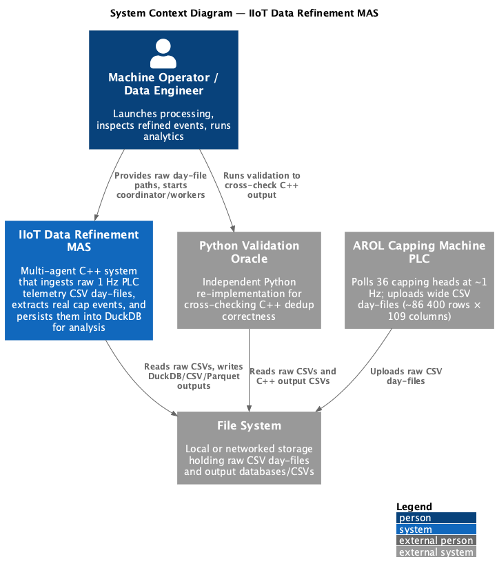
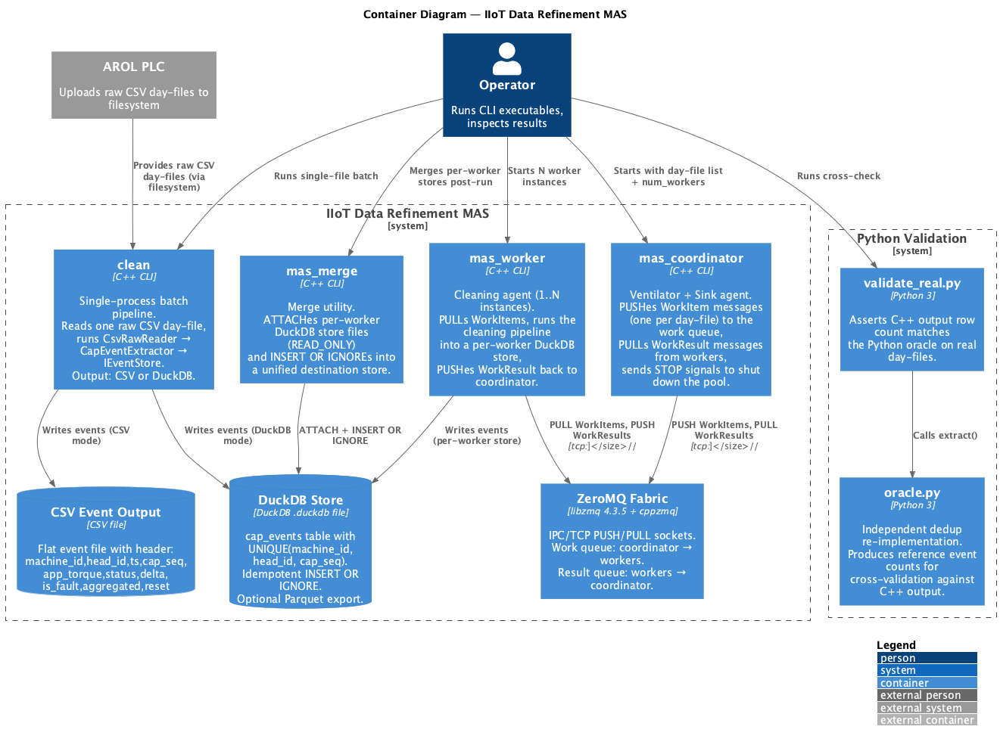
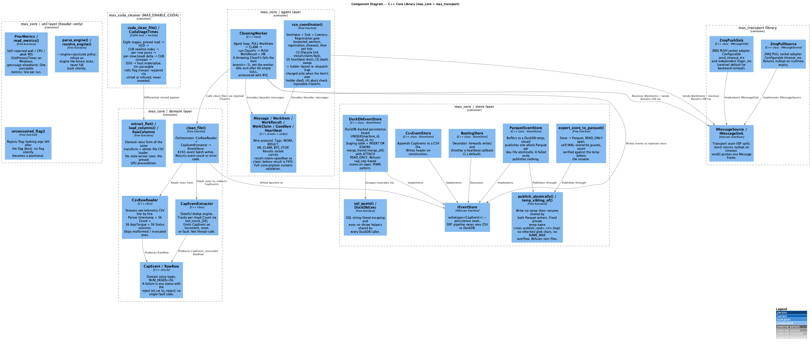

# IIoT Data Refinement MAS — AROL Capping Machine Telemetry

Multi-agent system (MAS) for refining Industrial IoT telemetry from an AROL
capping machine, plus an **agentic analytics layer** that answers questions
about the refined data and writes reports. Built for the **System and Device
Programming** course at Politecnico di Torino.

Two tiers, each usable on its own:

1. **Ingestion (C++)** — collapses a 1 Hz polling stream of 89 CSV day-files
   into reconstructed cap closures in DuckDB. 55.1M events over three months.
2. **Analytics and reporting (Python)** — eight deterministic analysis tools, an
   LLM that chooses which of them to run and writes the prose, and the `arol`
   CLI. **No figure, table, or plot is computed by the model**; all of them
   come from the same parameterised SQL whether the model is involved or not
   (the model's own prose is quoted as prose, and can be wrong -- the trace on
   the same page is what to check it against).

**Stack:** C++20 core · ZeroMQ PUSH/PULL with heartbeat-driven liveness ·
DuckDB persistence · Python analytics toolkit · Claude (structured outputs,
registry-validated plans) · matplotlib · Python validation oracles ·
Chaos E2E resilience testing · Benchmark sweep harness

---

## Table of Contents

- [Problem Statement](#problem-statement)
- [Architecture Overview](#architecture-overview)
  - [C4 Context (Level 1)](#c4-context-level-1)
  - [C4 Container (Level 2)](#c4-container-level-2)
  - [C4 Component (Level 3)](#c4-component-level-3)
- [Project Structure](#project-structure)
- [Core Domain: The Dedup Transform](#core-domain-the-dedup-transform)
- [Status Semantics](#status-semantics)
- [Components in Detail](#components-in-detail)
  - [Domain Layer](#domain-layer)
  - [Store Layer](#store-layer)
  - [Agent Layer](#agent-layer)
  - [Transport Layer](#transport-layer)
  - [Util Layer](#util-layer)
  - [CUDA Layer](#cuda-layer)
- [Database Design](#database-design)
  - [DuckDB Schema](#duckdb-schema)
  - [Write Path (Staging + Merge)](#write-path-staging--merge)
  - [Idempotent Reprocessing](#idempotent-reprocessing)
  - [Cross-Worker Merge](#cross-worker-merge)
  - [Parquet Export](#parquet-export)
- [Executables](#executables)
  - [clean — Single-File Batch Pipeline](#clean--single-file-batch-pipeline)
  - [mas_monolith — Multi-Threaded In-Process Pipeline](#mas_monolith--multi-threaded-in-process-pipeline)
  - [mas_coordinator — Ventilator + Sink + Liveness Monitor](#mas_coordinator--ventilator--sink--liveness-monitor)
  - [mas_worker — Cleaning Agent](#mas_worker--cleaning-agent)
  - [mas_merge — Post-Run Store Unification](#mas_merge--post-run-store-unification)
  - [mas_export — Parquet Export](#mas_export--parquet-export)
  - [bench_cpu — Store-Free Cleaning Contender](#bench_cpu--store-free-cleaning-contender)
  - [mas_cuda_clean — GPU Cleaning Pipeline](#mas_cuda_clean--gpu-cleaning-pipeline)
- [Resilience: Heartbeats, Death Detection, and Re-Dispatch](#resilience-heartbeats-death-detection-and-re-dispatch)
- [Distributed Processing Flow](#distributed-processing-flow)
- [Python Validation Oracle](#python-validation-oracle)
- [Benchmarking](#benchmarking)
  - [CUDA cleaning benchmark](#cuda-cleaning-benchmark)
- [Chaos E2E Testing](#chaos-e2e-testing)
- [Build & Run](#build--run)
  - [Prerequisites](#prerequisites)
  - [Build](#build)
  - [Build Options](#build-options)
  - [Run Tests](#run-tests)
  - [Single-File Processing](#single-file-processing)
  - [Monolith Multi-Threaded Processing](#monolith-multi-threaded-processing)
  - [Distributed Multi-File Processing](#distributed-multi-file-processing)
  - [Validation Against Python Oracle](#validation-against-python-oracle)
  - [Chaos E2E Test](#chaos-e2e-test)
  - [Performance Benchmark](#performance-benchmark)
  - [CUDA Benchmark (Python vs C++ vs CUDA)](#cuda-benchmark-python-vs-c-vs-cuda)
- [Analytics CLI and Reports](#analytics-cli-and-reports)
  - [Build the analytics environment](#build-the-analytics-environment)
  - [Generate a report](#generate-a-report)
  - [Ask a question](#ask-a-question)
  - [Running the model locally](#running-the-model-locally)
  - [Configuration (WP5)](#configuration-wp5)
  - [Reproduce the demo](#reproduce-the-demo)
- [Testing](#testing)
- [Design Decisions](#design-decisions)
- [Roadmap](#roadmap)

---

## Problem Statement

The AROL capping machine's PLC pipeline polls **36 capping heads** at **~1 Hz**
and uploads wide CSV day-files — each containing roughly **86,400 rows × 109
columns** per day (~1.6 GB/month unzipped; the month zips are 26–42 MB).

Most of this data is noise:

- **~24.5%** of rows are exact consecutive duplicates (the PLC re-reports the
  same state)
- The per-head **cap counters** only advance when a cap is actually applied; the
  vast majority of polls show a "held" (unchanged) counter

**The system's job:** Collapse this 1 Hz polling stream into the *real* cap
events — **one row per cap applied, per head, with correct timestamps** — then
persist, distribute, and analyze them.

---

## Architecture Overview

The system follows a **C4 model** architecture. PlantUML source files are in
[`docs/diagrams/`](docs/diagrams/) and rendered PNGs are shown below.

### C4 Context (Level 1)

Shows the MAS system boundary, external actors, and data flows.



**Key actors:**
- **AROL PLC** — uploads raw CSV day-files to the filesystem
- **Operator** — launches executables (single-file, monolith, or distributed MAS), inspects results
- **Python Oracle** — independent cross-check for correctness

### C4 Container (Level 2)

Shows the C4 containers — the diagram groups the eight executables into five containers — the ZeroMQ fabric (now with 3 endpoints),
database stores, and the testing/validation scripts.



**Containers:**
| Container | Type | Purpose |
|-----------|------|---------|
| `clean` | C++ CLI | Single-process batch pipeline (CSV or DuckDB output) |
| `mas_monolith` | C++ CLI | Multi-threaded in-process pipeline (1T or MT modes) |
| `mas_coordinator` | C++ CLI | Ventilator + sink + liveness monitor with death detection |
| `mas_worker` | C++ CLI | Cleaning agent with heartbeat emission and idle-exit |
| `mas_merge` | C++ CLI | Merges per-worker/thread DuckDB stores (skips corrupt ones) |
| `mas_export` | C++ CLI | Exports a store to Parquet, read-only, row count verified |
| `bench_cpu` | C++ CLI | Store-free cleaning contender for the benchmark sweep |
| `mas_cuda_clean` | C++ CLI | GPU cleaning contender (`--verify` differentials against the CPU) |
| ZeroMQ Fabric | libzmq 4.3.5 | 3-endpoint PUSH/PULL: work, results, heartbeats |
| DuckDB Store | DuckDB | Persistent `cap_events` table with idempotent upserts |
| `chaos_e2e.sh` | Bash | Resilience test: SIGKILL a worker, verify full recovery |
| `run_bench.sh` | Bash | Performance sweep across architectures, threads, and volumes |
| `arol` | Python CLI | WP4 BOT interface: three fixed report types plus free-text `ask` |
| analytics toolkit | Python | WP2: eight deterministic tools reading the `cap_events` store |
| report agent | Python + Claude | WP3: plans which tools to run and narrates the result |

The C4 diagrams below predate the analytics tier and show the C++ ingestion
containers only. For how a request becomes a report, see
[`docs/agent-decision-flow.md`](docs/agent-decision-flow.md).

### C4 Component (Level 3)

Shows every class, interface, and function inside the C++ core libraries,
organized by layer.



---

## Project Structure

```
.
├── CMakeLists.txt                          # Build system (CMake 3.16+, C++20, optional CUDA)
├── .gitattributes                          # Pins *.csv/*.sh/*.py/*.cu to LF (Windows co-dev)
├── README.md                               # This file
│
├── core/                                   # C++ source code
│   ├── include/mas/
│   │   ├── domain/                         # Domain layer (pure logic, no I/O)
│   │   │   ├── CapEvent.hpp                # RawRow, CapEvent, NUM_HEADS, is_reject
│   │   │   ├── CapEventExtractor.hpp       # Stateful per-head dedup engine
│   │   │   ├── CapEventExtractorFlat.hpp   # Element-wise form + column loader (GPU precondition)
│   │   │   └── Pipeline.hpp                # clean_file() orchestrator
│   │   ├── store/                          # Storage layer (persistence)
│   │   │   ├── EventStore.hpp              # IEventStore abstract interface (DIP seam)
│   │   │   ├── CsvRawReader.hpp            # Raw telemetry CSV streaming reader
│   │   │   ├── CsvEventStore.hpp           # CSV file persistence backend
│   │   │   └── DuckDbEventStore.hpp        # DuckDB persistence backend (PIMPL)
│   │   ├── agent/                          # Agent layer (MAS coordination)
│   │   │   ├── Message.hpp                 # Wire protocol: WorkItem, WorkResult, Heartbeat, STOP
│   │   │   ├── CleaningWorker.hpp          # Worker agent with heartbeats + idle-exit
│   │   │   └── Coordinator.hpp             # Coordinator with liveness + re-dispatch
│   │   ├── transport/                      # Transport layer (ZeroMQ abstraction)
│   │   │   ├── Transport.hpp               # IMessageSource / IMessageSink interfaces
│   │   │   └── ZmqTransport.hpp            # ZMQ PUSH/PULL adapters (linger_ms control)
│   │   └── util/
│   │       └── platform_metrics.hpp        # Self-reported wall/CPU/peak-RSS (one of three #ifdef _WIN32 sites)
│   ├── cuda/                               # CUDA cleaning pipeline (built only with MAS_ENABLE_CUDA)
│   │   ├── CudaCleaner.hpp                 # Host-callable interface; leaks no CUDA types
│   │   └── CudaCleaner.cu                  # Kernels S2-S5 + host orchestration (CUB)
│   └── src/
│       ├── domain/                         # Domain implementations
│       │   ├── CapEventExtractor.cpp
│       │   ├── CapEventExtractorFlat.cpp
│       │   └── Pipeline.cpp
│       ├── store/                          # Store implementations
│       │   ├── CsvRawReader.cpp
│       │   ├── CsvEventStore.cpp
│       │   ├── DuckDbEventStore.cpp
│       │   ├── ParquetEventStore.cpp
│       │   └── ParquetExport.cpp
│       ├── agent/                          # Agent implementations
│       │   ├── Message.cpp
│       │   ├── CleaningWorker.cpp
│       │   └── Coordinator.cpp
│       ├── transport/                      # Transport implementation
│       │   └── ZmqTransport.cpp
│       └── apps/                           # Executable entry points
│           ├── clean_main.cpp              # → clean
│           ├── monolith_main.cpp           # → mas_monolith
│           ├── coordinator_main.cpp        # → mas_coordinator
│           ├── worker_main.cpp             # → mas_worker
│           ├── merge_main.cpp              # → mas_merge
│           ├── export_main.cpp             # → mas_export      (store → Parquet, read-only)
│           ├── bench_cpu_main.cpp          # → bench_cpu       (store-free contender)
│           └── cuda_clean_main.cpp         # → mas_cuda_clean  (GPU contender, --verify)
│
├── tests/                                  # Google Test unit tests (21 files, 184 tests)
│   ├── test_cap_event.cpp
│   ├── test_cap_event_extractor.cpp
│   ├── test_cap_event_extractor_flat.cpp   # The GPU precondition, proved against the stateful one
│   ├── test_platform_metrics.cpp
│   ├── test_csv_raw_reader.cpp
│   ├── test_bench_cpu_parity.cpp           # bench_cpu's loop == load_columns + extract_flat
│   ├── test_cli_args.cpp
│   ├── test_engine_select.cpp
│   ├── test_atomic_publish.cpp
│   ├── test_pipeline.cpp
│   ├── test_duckdb_smoke.cpp
│   ├── test_duckdb_event_store.cpp
│   ├── test_parquet_event_store.cpp
│   ├── test_parquet_export.cpp
│   ├── test_zmq_smoke.cpp
│   ├── test_zmq_transport.cpp
│   ├── test_message.cpp
│   ├── test_cleaning_worker.cpp
│   ├── test_coordinator.cpp
│   ├── test_cuda_cleaner.cpp               # GPU/CPU differential (needs MAS_ENABLE_CUDA + a device)
│   └── fakes/
│       └── FakeTransport.hpp               # FakeSource, FakeSink, FakeTickSource
│
├── python/                                 # Analytics tier (WP2-WP5) + validation oracles
│   ├── requirements.txt                    # duckdb, pandas, numpy, matplotlib, anthropic, markdown-it-py, pytest
│   ├── oracle.py                           # Reference dedup implementation
│   ├── clean_vectorized.py                 # Vectorized (numpy/pandas) contender; same tuples
│   ├── test_oracle.py                      # Pytest unit tests for the oracle
│   ├── validate_real.py                    # Cross-validation: C++ vs Python on real data
│   ├── bench_plots.py                      # Sweep plots; --cuda renders the CUDA-sweep figures
│   ├── oracle_kpi.py                       # Independent KPI oracle, recomputed from raw CSV
│   └── analytics/
│       ├── config.py                       # WP5: every path, band and threshold (no hard-coding)
│       ├── log.py                          # Logging, configured once at the CLI boundary
│       ├── status.py                       # The slide-6 status bitmask; REJECT_SQL lives here
│       ├── store.py                        # DuckDB connection + period scoping
│       ├── result.py                       # ToolResult: values + status + provenance
│       ├── cli.py                          # WP4: arol report kpi|drift|anomalies, arol ask
│       ├── tools/                          # WP2: the eight deterministic analyses
│       │   ├── overview.py                 # Scope and data quality
│       │   ├── success.py                  # The flagship KPI: success rates
│       │   ├── torque.py                   # Per-head torque distribution
│       │   ├── speed.py                    # Capping speed (pieces/hour)
│       │   ├── idle.py                     # Idle periods (gaps-and-islands)
│       │   ├── anomaly.py                  # Threshold + robust (median +/- k*MAD) detection
│       │   ├── trend.py                    # Mann-Kendall drift
│       │   └── correlation.py              # Per-head torque correlation
│       ├── agent/                          # WP3: the report agent
│       │   ├── plan.py                     # Plan / PlanStep, and effective_args()
│       │   ├── registry.py                 # The tools as data -> LLM + plan JSON schemas
│       │   ├── router.py                   # Keyword router and the three canned plans
│       │   ├── llm.py                      # The one place this project calls the API
│       │   ├── planner.py                  # Claude -> a registry-validated plan
│       │   ├── narrator.py                 # Claude -> prose around numbers it cannot alter
│       │   └── executor.py                 # Runs a plan; every failure becomes a value
│       └── report/
│           ├── render.py                   # The six mandated sections + tool-call trace
│           ├── plots.py                    # Five matplotlib figures, driven only by ToolResults
│           └── export.py                   # Self-contained HTML; best-effort PDF
│   └── tests/                              # golden report + mocked-LLM agent tests (count guarded by test_readme_counts.py)
│
├── scripts/
│   ├── arol                                # WP4 entry point: arol report kpi --period 2026-02
│   ├── demo.sh                             # One command: three report types on the real store
│   ├── chaos_e2e.sh                        # Resilience E2E: kill worker mid-run, verify recovery
│   ├── build_store.sh                      # Rebuild ../events_3mo.duckdb from the three month zips
│   └── setup_windows_toolchain.ps1         # Windows bench box: VS Build Tools + CMake + CUDA checks
│
├── bench/                                  # Performance benchmarking
│   ├── run_bench.sh                        # Sweep: mono {1,2,4,8}T + MAS {1..16}W × {1,7,28}d
│   ├── results.csv                         # Raw sweep data: 81 runs (27 configs × 3 repeats)
│   ├── run_bench_cuda.py                   # Portable driver: Python | C++ | CUDA, one command
│   ├── README.md                           # Windows/Linux/macOS run instructions
│   ├── requirements-bench.txt              # numpy, pandas, matplotlib
│   ├── results_cuda.csv                    # CUDA-sweep data (RTX 4070 Laptop, 2026-08-13)
│   ├── results_cuda_stages.csv             # Per-stage GPU timings from the same sweep
│   └── fixtures/
│       └── make_tiny_csvs.py               # Deterministic 2-row fixture generator
│
├── docs/
│   ├── validation-log.md                   # Real-data test results log
│   ├── analytics-methods.md                # Per-tool: definition, SQL shape, assumptions
│   ├── agent-decision-flow.md              # How a request becomes a report, and every fallback
│   ├── presentation/outline.md             # 13-slide outline, bullets fully written
│   ├── reports/                            # Committed sample reports (hand-reconciled)
│   │   ├── kpi-2026-02/
│   │   ├── drift-2026-02_2026-04/
│   │   └── anomalies-2026-02/
│   ├── bench/
│   │   ├── results.md                      # Benchmark analysis: medians, scaling, bottleneck
│   │   ├── cuda_throughput.png             # Clean time per arch at one day-file (log scale)
│   │   ├── cuda_scaling.png                # Clean time vs volume, per arch
│   │   └── cuda_stages.png                 # GPU stage breakdown (RTX sweep)
│   ├── superpowers/
│   │   ├── specs/                          # Design specs, one per plan
│   │   └── plans/                          # Phased implementation plans
│   └── diagrams/                           # C4 architecture diagrams
│       ├── c4-context.puml                 # Level 1: System Context
│       ├── c4-container.puml               # Level 2: Container
│       ├── c4-component.puml               # Level 3: Component
│       ├── C4_Context.png                  # Rendered context diagram
│       ├── C4_Container.png                # Rendered container diagram
│       └── C4_Component.png                # Rendered component diagram
│
├── telemetry_*/                            # Raw data (git-ignored, ~1.6 GB/month)
├── build/                                  # Primary CMake build directory (git-ignored)
├── build-full/                             # Full-option build: ZMQ + DuckDB + tests (git-ignored)
├── build-bench/                            # MAS_BENCH_ONLY build (git-ignored)
└── build-plan/                             # Scratch configure dir for option matrices (git-ignored)
```

---

## Core Domain: The Dedup Transform

`CapEventExtractor` is the heart of the system. It scans each of the 36 heads'
`Count` column and emits one `CapEvent` per counter transition:

| Transition | Condition | Emitted Event |
|-----------|-----------|---------------|
| **Normal increment** | `c > last` and `delta == 1` | One event with `aggregated=false` |
| **Aggregated increment** | `c > last` and `delta > 1` | One event with `aggregated=true` (carousel advanced multiple counts between polls) |
| **Counter reset** | `c < last` | One event with `reset=true`, `delta=0` (PLC reset or rollover) |
| **Held** | `c == last` | *No event emitted* (no cap applied) |

Each event carries: `head_id` (1–36), `timestamp`, `cap_seq` (counter value),
`app_torque`, `status`, `delta`, `is_fault` (the reject bit — see
[Status semantics](#status-semantics)), `aggregated`, `reset`.

**The transform is element-wise, not a scan.** Every branch of `process()` ends
with `last = c`, and the held branch is entered only when `c == *last` — so
`last_count_[h]` after row `i` is always `llround(count[i][h])`, and the
transform never reads state older than one row back. `extract_flat()` in
[`CapEventExtractorFlat.hpp`](core/include/mas/domain/CapEventExtractorFlat.hpp)
is that same transform written over consecutive row pairs, and
[`test_cap_event_extractor_flat.cpp`](tests/test_cap_event_extractor_flat.cpp)
proves the two produce identical `CapEvent` vectors — all nine fields — on the
edge cases and on a real day-file (765,711 events).

That is what makes the day-file 3,110,364 independent (row, head) pairs rather
than 36 sequential chains, and it is the precondition for both the GPU port and
the one-`numpy.diff` Python contender.

---

## Status Semantics

The `status` column is **a bitmask, not an enumeration**. Bit 0 is the reject
signal; bits 1–6 are the conditions that caused it. The machine brief's status
table lists 14 rows, which is 7 conditions × {reject, no reject}.

| bit | value | condition |
|---|---|---|
| 0 | 1 | **reject signal** — the cap was rejected |
| 1 | 2 | No Load |
| 2 | 4 | No Closure |
| 3 | 8 | No InTorque |
| 4 | 16 | No CapTurns |
| 5 | 32 | Following Error |
| 6 | 64 | Bad Closure |

So `65` is `64 + 1` (Bad Closure **with** reject) and `9` is `8 + 1` (No
InTorque with reject). **A closure is a rejection iff its status is odd:**

```sql
CAST(status AS BIGINT) % 2 <> 0   -- <> 0, not = 1: covers negative status
```

Single-sourced in [`analytics/status.py`](python/analytics/status.py)
(`REJECT_SQL`) and `CapEvent::is_reject`.

**This corrected a shipped number.** An earlier `status == 65` rule missed every
rejection that was not a Bad Closure. Measured on the three-month store:

| period | successful | rejects (`status == 65`) | rejects (reject bit) |
|---|---:|---:|---:|
| 2026-02 | 14,817,976 | 732 | **748** |
| 2026-02..2026-04 | 31,655,161 | 1,071 | **1,096** |

The bitmask reading is confirmed by the data, not assumed: 1,071 closures at
status 65, plus 24 at status 9 and 1 at status 65 with no torque, is exactly the
1,096 the odd-status rule returns.

A closure that is neither `status == 0` nor a reject carries **no pass/fail
verdict** — 12,461 No-Load-with-torque rows over three months — and is excluded
from the success-rate denominator rather than being guessed at. The reports say
so explicitly. Full detail in
[`docs/analytics-methods.md`](docs/analytics-methods.md).

---

## Components in Detail

The C++ code is organized into **four layers** with strict dependency direction:

```
transport → agent → domain ← store
                      ↓
                  IEventStore (DIP seam)
```

The CMake targets mirror that split, so the cleaning hot path can be built with
nothing attached to it:

| Target | Sources | Links |
|--------|---------|-------|
| `mas_clean_core` | `CapEventExtractor`, `CapEventExtractorFlat`, `CsvRawReader` | **nothing** — C++20 stdlib only (`psapi` on Windows) |
| `mas_store` | `CsvEventStore`, `DuckDbEventStore`, `ParquetEventStore`, `ParquetExport`, `Pipeline` | `mas_clean_core` + DuckDB |
| `mas_agent` | `Message`, `CleaningWorker`, `Coordinator` | `mas_store` |
| `mas_transport` | `ZmqTransport` | cppzmq |
| `mas_core` | *(INTERFACE alias)* | `mas_agent` — kept so no call site changed |

`Pipeline.cpp` lives with the DuckDB stores, so before the split every consumer
of the cleaning path also linked `duckdb_imported`. `mas_clean_core` linking
nothing is what lets the benchmark build on a machine with no DuckDB at all.

### Domain Layer

**Directory:** `core/include/mas/domain/` · `core/src/domain/`

| Component | File(s) | Description |
|-----------|---------|-------------|
| `CapEvent` / `RawRow` | [`CapEvent.hpp`](core/include/mas/domain/CapEvent.hpp) | Domain value types. `NUM_HEADS=36`; a failure is any status with the reject bit set (`is_reject`), not a single code — `FAULT_STATUS=65` was removed in Plan 7. |
| `CapEventExtractor` | [`CapEventExtractor.hpp`](core/include/mas/domain/CapEventExtractor.hpp) · [`.cpp`](core/src/domain/CapEventExtractor.cpp) | Stateful per-head dedup. Maintains `last_count_[36]`. Not thread-safe. |
| `extract_flat()` / `RawColumns` / `load_columns()` | [`CapEventExtractorFlat.hpp`](core/include/mas/domain/CapEventExtractorFlat.hpp) · [`.cpp`](core/src/domain/CapEventExtractorFlat.cpp) | Element-wise form of the same transform, plus a whole-file CSV→columns loader. Stdlib only, no state across rows. Tolerates CRLF; validates the 109-column header. |
| `clean_file()` | [`Pipeline.hpp`](core/include/mas/domain/Pipeline.hpp) · [`.cpp`](core/src/domain/Pipeline.cpp) | Orchestrator: CsvRawReader → CapEventExtractor → IEventStore in ≥8192-event batches (8192 is a floor: the flush check runs per row, which appends up to 36 events). |

### Store Layer

**Directory:** `core/include/mas/store/` · `core/src/store/`

| Component | File(s) | Description |
|-----------|---------|-------------|
| `IEventStore` | [`EventStore.hpp`](core/include/mas/store/EventStore.hpp) | Abstract `write(span<CapEvent>)` interface (DIP seam). |
| `CsvRawReader` | [`CsvRawReader.hpp`](core/include/mas/store/CsvRawReader.hpp) · [`.cpp`](core/src/store/CsvRawReader.cpp) | Streams raw 109-column CSVs. Skips malformed rows with counter. |
| `CsvEventStore` | [`CsvEventStore.hpp`](core/include/mas/store/CsvEventStore.hpp) · [`.cpp`](core/src/store/CsvEventStore.cpp) | CSV file backend. Writes header on construction. |
| `DuckDbEventStore` | [`DuckDbEventStore.hpp`](core/include/mas/store/DuckDbEventStore.hpp) · [`.cpp`](core/src/store/DuckDbEventStore.cpp) | DuckDB backend (PIMPL). Staging → merge. `merge_from()` with best-effort DETACH, `merge_all()` (the bulk path mas_merge takes). `export_parquet()` was deliberately removed — the header explains why (COPY ... TO truncates; the guarded `export_store_to_parquet` is the one export path). |
| `ParquetEventStore` | [`ParquetEventStore.hpp`](core/include/mas/store/ParquetEventStore.hpp) · [`.cpp`](core/src/store/ParquetEventStore.cpp) | Experimental Parquet backend: one file per input, no index, no WAL. Buffers in memory, writes on `close()` through a temp + atomic rename; `abandon()` for a clean that failed. |
| `ParquetExport` | [`ParquetExport.hpp`](core/include/mas/store/ParquetExport.hpp) · [`.cpp`](core/src/store/ParquetExport.cpp) | `mas_export`'s engine. Opens the store READ_ONLY, refuses to overwrite the source, an existing file or the store's `.wal`, and verifies the row count it wrote. |
| `BeatingStore` | [`BeatingStore.hpp`](core/include/mas/store/BeatingStore.hpp) | Decorator that fires a heartbeat callback after the inner `write()`, and only once its `every_` interval has elapsed — so a long clean does not look dead to the coordinator without beating 2,670× per day-file. Wraps either backend. |
| `sql_quote` | [`SqlQuote.hpp`](core/include/mas/store/SqlQuote.hpp) | Header-only. Doubles embedded `'` — ATTACH, COPY and `read_parquet` take paths as SQL literals and DuckDB binds no parameters for them. |
| `exec_or_throw` | [`DuckDbExec.hpp`](core/include/mas/store/DuckDbExec.hpp) | Header-only. DuckDB reports errors in the result rather than throwing; these three wrappers turn a missed `HasError()` from a silent wrong answer into an exception. |
| `publish_atomically` | [`AtomicPublish.hpp`](core/include/mas/store/AtomicPublish.hpp) | Header-only. Write to a private sibling name, verify, rename into place, remove the temp on any throw. Shared by both Parquet writers, so a failed write cannot leave a partial file under a name readers glob. |

### Agent Layer

**Directory:** `core/include/mas/agent/` · `core/src/agent/`

| Component | File(s) | Description |
|-----------|---------|-------------|
| `Message` / `WorkItem` / `WorkResult` / `Heartbeat` | [`Message.hpp`](core/include/mas/agent/Message.hpp) · [`.cpp`](core/src/agent/Message.cpp) | Wire protocol with tags `WORK`, `RESULT`, `HB`, `CLAIM`, `BYE`, `STOP`. `WorkResult` carries `worker_id` for attribution. `WorkClaim` names the worker holding an item (sent on the results socket, so claim-before-result is FIFO-guaranteed); `Goodbye` announces a voluntary idle-exit, which is departure, not death. `Heartbeat` carries `worker_id` + monotonic `seq`. |
| `CleaningWorker` | [`CleaningWorker.hpp`](core/include/mas/agent/CleaningWorker.hpp) · [`.cpp`](core/src/agent/CleaningWorker.cpp) | Agent loop with heartbeats: hello-beat on entry → PULL work → PUSH claim → clean → PUSH result + beat. A throwing clean fails the item (`events=-1` result), never the worker. Idle-exit after `kIdleExitTicks=60` consecutive empty ticks (~60 s at 1 s recv timeout) announces itself with a `BYE` frame. |
| `run_coordinator()` | [`Coordinator.hpp`](core/include/mas/agent/Coordinator.hpp) · [`.cpp`](core/src/agent/Coordinator.cpp) | Ventilator + Sink + Liveness monitor. Registration gate first (with `expected_workers > 0`, the initial dispatch waits for that many hellos, up to `registration_timeout`), then the 4-phase loop: (1) lifecycle tick (result, claim, or goodbye), (2) heartbeat drain, (3) death sweep + holder-based re-dispatch, (4) abort check. A death re-dispatches the dead worker's claimed items (charging their cap) and unclaimed items (uncharged); items held by live workers are untouched, and an announced `BYE` reopens nothing. Injectable `ClockFn` for deterministic tests. `CoordinatorConfig`: `death_threshold=30s`, `redispatch_cap=2`, `expected_workers=0`, `registration_timeout=10s`. |

### Transport Layer

**Directory:** `core/include/mas/transport/` · `core/src/transport/`

| Component | File(s) | Description |
|-----------|---------|-------------|
| `IMessageSource` / `IMessageSink` | [`Transport.hpp`](core/include/mas/transport/Transport.hpp) | ISP-split interfaces. `recv()` returns `nullopt` on timeout. |
| `ZmqPushSink` | [`ZmqTransport.hpp`](core/include/mas/transport/ZmqTransport.hpp) · [`.cpp`](core/src/transport/ZmqTransport.cpp) | ZMQ PUSH adapter. Independent `linger_ms` parameter (default sentinel preserves backward compat; `linger_ms=0` for fire-and-forget sinks). |
| `ZmqPullSource` | (same files) | ZMQ PULL adapter. Configurable `timeout_ms`. |

### Util Layer

**Directory:** `core/include/mas/util/` (header-only)

| Component | File(s) | Description |
|-----------|---------|-------------|
| `ProcMetrics` / `read_metrics()` / `metrics_line()` | [`platform_metrics.hpp`](core/include/mas/util/platform_metrics.hpp) | Self-reported wall, CPU (user+sys) and peak RSS. `GetProcessTimes`/`GetProcessMemoryInfo` on Windows, `getrusage` elsewhere (`ru_maxrss` is bytes on macOS, KB on Linux). One of five `#ifdef _WIN32` sites in core (AtomicPublish.hpp holds the other three: `_getpid`, and the fsync pair). Emits one machine-readable `metrics:` line that the benchmark driver parses. |
| `Engine` / `parse_engine()` / `resolve_engine()` | [`engine.hpp`](core/include/mas/util/engine.hpp) | The `--engine=cpu\|cuda` policy: parse the flag value, refuse an engine the binary was not built with (the error names `-DMAS_ENABLE_CUDA=ON` as the remedy), never fall back. Kept as pure functions so the refusal rules are unit-tested from builds that have no CUDA. |

This replaces the old harness's `/usr/bin/time -l` wrapper, which is BSD-only —
GNU coreutils rejects the flag and Windows has no equivalent. Having each binary
report its own numbers also excludes process spawn from the measurement.

### CUDA Layer

**Directory:** `core/cuda/` — compiled only when `-DMAS_ENABLE_CUDA=ON`

| Component | File(s) | Description |
|-----------|---------|-------------|
| `cuda_clean_file()` / `CudaStageTimes` | [`CudaCleaner.hpp`](core/cuda/CudaCleaner.hpp) · [`.cu`](core/cuda/CudaCleaner.cu) | Eight stages: read into pinned memory → one H2D upload of the raw bytes → CUB newline index → thread-per-row parse → thread-per-`(row,head)` delta → CUB stream compaction → one D2H download. Emits events in `(row asc, head asc)` order, identical to `CapEventExtractor`. |

Design notes:

- **Timestamps never reach the GPU as strings.** Each device event carries a row
  index; the host maps it back after the download, which is what keeps the
  device struct flat and 40 bytes.
- **Torque and status stay `double`** so `--verify` compares bitwise against
  `extract_flat` rather than with a tolerance. A parse one ulp out is a bug to
  find, not a tolerance to widen.
- **The delta kernel is the payoff** of the element-wise finding: 3.1M threads
  each doing two loads and a compare.

> **Compiled and measured** on the Windows target box (RTX 4070 Laptop, CUDA
> Toolkit 13.3, MSVC 14.41) on 2026-08-10 — three real build breaks from CUDA
> 13's CCCL later. `--verify` earned its keep on the first run: it caught the
> GPU parse one ulp under the CPU on the pool's 17-digit torque cells, bitwise.
> Re-measured on 2026-08-13 with the corrected timers (an eighth
> `materialize_s` stage, process wall clock recorded as `total_s`): the
> numbers below are measurements, not estimates. See
> [`docs/validation-log.md`](docs/validation-log.md), entries 2026-08-10 and
> 2026-08-13.

---

## Database Design

### DuckDB Schema

```sql
CREATE TABLE IF NOT EXISTS cap_events (
    machine_id VARCHAR NOT NULL,
    head_id    SMALLINT NOT NULL,       -- 1..36
    ts         TIMESTAMP NOT NULL,      -- poll timestamp; part of the identity
    cap_seq    BIGINT NOT NULL,         -- head's Count value at this cap
    app_torque REAL,                     -- applied torque (Nm)
    status     REAL,                     -- AROL Equatorque status code
    delta      INTEGER,                  -- caps since last observation
    is_fault   BOOLEAN,                  -- true if the reject bit is set (status is odd)
    aggregated BOOLEAN,                  -- true if delta > 1
    is_reset   BOOLEAN,                  -- true if counter reset/rollover
    UNIQUE (machine_id, head_id, ts)
);
```

The `UNIQUE` constraint on `(machine_id, head_id, ts)` is the backbone of
idempotent reprocessing — and the identity is the timestamp, not the counter.

It used to be `cap_seq`, the PLC's Count register. That register resets, so a
closure recorded weeks later can carry a value already used, and `INSERT OR
IGNORE` dropped it onto the older row. The project called this "replay dedup"
and never tested it: of head 1's 23,851 day-17 closures whose `cap_seq`
collides with days 1-15, **18,721 carry a different torque**. They were
distinct physical caps, and February persisted 21,872,663 events as 14,372,237
rows.

`ts` works because a head closes at most once per poll — caps missed between
polls arrive as a single event with `delta > 1` — and the day-files are
contiguous and non-overlapping. Measured on the rebuilt store: **0 duplicate
`(machine_id, head_id, ts)` across 55,132,433 rows**.

A store written under the old key is **refused at open** rather than silently
reused: `CREATE TABLE IF NOT EXISTS` would keep its index and every downstream
number would stay wrong. A `store_meta` table records the identity in use; if it
is missing while `cap_events` holds rows, the constructor throws and tells you
to rebuild.

### Write Path (Staging + Merge)

To avoid partial inserts on failure, `DuckDbEventStore` uses a **two-phase
write path**:

1. **Stage:** Batch-append events to `staging_cap_events` (VARCHAR timestamp,
   no UNIQUE constraint) using DuckDB's `Appender` API for bulk throughput.
2. **Merge:** `INSERT OR IGNORE INTO cap_events SELECT ... CAST(ts AS TIMESTAMP) FROM staging_cap_events`
   — the UNIQUE key silently drops duplicates.
3. **Cleanup:** `DELETE FROM staging_cap_events` clears the staging table.

On construction, any stale rows from a crashed run are cleared from staging.

### Idempotent Reprocessing

Re-running the same day-file against the same database produces **zero new rows**
thanks to `INSERT OR IGNORE` and the `UNIQUE(machine_id, head_id, ts)` key.
Validated on real data: two runs of the same 86,399-row file both produce
765,711 events, but the second run adds 0 new rows.

### Cross-Worker Merge

In distributed mode (MAS or monolith-MT), each worker/thread writes to its own
`.duckdb` file. After completion, `mas_merge` (or the monolith's post-join
phase) unifies them:

```sql
ATTACH 'worker_N.duckdb' AS src (READ_ONLY);
INSERT OR IGNORE INTO cap_events SELECT * FROM src.cap_events;
DETACH src;
```

**Error handling:** `merge_from()` wraps the INSERT in try/catch and always
DETACHes `src` — a failed merge (corrupt store) doesn't poison subsequent
ATTACHes. `mas_merge` skips corrupt stores loudly instead of aborting.

**Precondition:** source stores must be closed/checkpointed before merge —
`ATTACH READ_ONLY` may not see another connection's unflushed WAL.

### Parquet Export

**DuckDB is the persistent format. Parquet is for handing the data to something
else.** Exporting is what `mas_export` does, and it is the only supported use of
Parquet in normal operation:

```
mas_export events.duckdb out.parquet [--since TS] [--until TS]
```

Under the hood:

```sql
COPY (SELECT * FROM cap_events ORDER BY head_id, ts)
TO 'output.parquet' (FORMAT PARQUET);
```

The `ORDER BY` makes the file deterministic — two exports of one store compare
equal. Roughly a fifth of the bytes: a February store is 1182.8 MB as `.duckdb`
and 233.4 MB as Parquet.

There is also a `--format parquet` flag on `clean`, `mas_monolith` and
`mas_worker` that writes Parquet *instead of* DuckDB during cleaning. That
exists to make the two backends measurable against each other
(`docs/bench/results.md`) and is **not** the recommended way to run the system:
Parquet writes 2.79x faster and reads 2.41x slower, and the write saving is
gone after 8.7 report runs — a close call, which is why the split the numbers
recommend is DuckDB for the store that gets queried and Parquet for the copy
that gets handed over.

---

## Executables

### `clean` — Single-File Batch Pipeline

```
usage: clean [--format duckdb|parquet] <raw_in.csv> <events_out.csv|.duckdb|out_dir> [machine_id]
```

Processes a single raw CSV day-file. Output selection:
- `--format parquet` → the second argument is a *directory*; writes
  `<dir>/<input basename without extension>.parquet` via `ParquetEventStore`. Nothing is written
  at all if the clean fails, so a short file never reads as a whole day.
- otherwise, by file extension: `.duckdb` → `DuckDbEventStore` (probes input
  first to avoid creating an empty DB); anything else → `CsvEventStore`

Default `machine_id`: `"MCC"`.

### `mas_monolith` — Multi-Threaded In-Process Pipeline

```
usage: mas_monolith [--no-store] [--engine=cpu|cuda] [--format duckdb|parquet] <out.duckdb|out_dir> <machine_id> <threads> <day1.csv> [day2.csv ...]
```

Two operating modes:

- **`threads=1` (mono-1T):** Sequential baseline — one DuckDB store, files processed one after another. No merge step.
- **`threads>1` (mono-MT):** Thread pool with atomic counter work-stealing. Each thread owns a per-thread `.duckdb` store (shared-nothing). After all threads join, the thread stores are merged into the output store. Uses `std::thread` + `std::atomic` (no ZeroMQ).

**`--no-store`** swaps the DuckDB store for a null store that counts events and
discards them, so the clean path can be timed on its own. It requires
`threads=1` — the MT path's whole shape is per-thread stores and a merge, so
there is nothing coherent to measure without them. Measured on the M3 at one
day-file: 0.47 s with `--no-store` against 3.2 s with the store, i.e. the write
is ~85% of the wall clock. Both report the same 765,711 events; the `--no-store`
run reports `store holds 0 rows`.

**`--engine=cpu|cuda`** (default `cpu`) selects the cleaning engine; the store
and every downstream consumer see identical events either way (the flat
extractor is proved bitwise-equal to the stateful one, and the GPU path to the
flat one by `mas_cuda_clean --verify`). `cuda` requires a binary configured
with `-DMAS_ENABLE_CUDA=ON` — a build without it **refuses the run and names
that flag** rather than quietly cleaning on the CPU, and a CUDA failure at
runtime aborts the same way. There is deliberately no fallback: the summary
line ends in `engine cpu` or `engine cuda`, and that stamp is only worth
printing if it cannot lie. `--engine=cuda` requires `threads=1` — the pool
parallelizes CPU cleaning, while the GPU path is one device fed file by file.

Every run also emits a `metrics:` line on stderr with wall, CPU and peak RSS.

### `mas_coordinator` — Ventilator + Sink + Liveness Monitor

```
usage: mas_coordinator <work_endpoint> <result_endpoint> <hb_endpoint> [--workers N] <day1.csv> [day2.csv ...]
```

Binds three PUSH/PULL sockets:
- **Work** (PUSH, bind): sends `WorkItem` and `STOP` messages to workers
- **Results** (PULL, bind, 200 ms timeout): receives `WorkResult`, `WorkClaim` and `Goodbye` messages — paces the loop
- **Heartbeats** (PULL, bind, 0 ms timeout): drained without blocking each tick

`--workers N` gates the initial dispatch on N workers registering (hello
heartbeat or result), so PUSH round-robins over all their pipes instead of
queueing the whole batch into the first one; after `registration_timeout` it
proceeds degraded with whoever showed up, or aborts if nobody did.

Death detection: workers silent > 30 s are tombstoned, their completed items
re-opened, their claimed items re-dispatched (up to 2 charged re-sends per
item), and unclaimed items re-sent free of charge — an item a live worker has
claimed is left alone, and a worker that announced its idle-exit with `BYE` is
departed, not dead: nothing of its is reopened.

### `mas_worker` — Cleaning Agent

```
usage: mas_worker [--format duckdb|parquet] <work_endpoint> <result_endpoint> <hb_endpoint> <out.duckdb|out_dir> <worker_id> [machine_id]
```

Connects to all three coordinator endpoints. Key behaviors:
- **1 s work recv timeout** — each empty tick emits a heartbeat
- **Idle-exit after 60 consecutive empty ticks** (~60 s) — exits cleanly if the coordinator vanishes
- **`linger_ms=0`** on result and heartbeat sinks — process exit is prompt (fixed a 121 s teardown bug found by chaos E2E)
- **Hello heartbeat** on `run()` entry — registers with the coordinator promptly

### `mas_merge` — Post-Run Store Unification

```
usage: mas_merge <dst.duckdb> <machine_id> <src1.duckdb> [src2.duckdb ...]
```

Merges one or more per-worker stores into a unified destination. **Crash-tolerant:** a corrupt source store (from a killed worker) is skipped with a warning instead of aborting. Idempotent: running twice produces the same result.

### `mas_export` — Parquet Export

```
usage: mas_export <store.duckdb> <out.parquet> [--since TS] [--until TS]
```

Exports `cap_events` to Parquet for tools that do not read `.duckdb`. Three
properties worth knowing:

- **The store is opened `READ_ONLY`.** Exporting must not modify what it
  exports, and must work against a store on read-only media. This is why it is
  not a method on `DuckDbEventStore`, whose constructor creates tables and
  writes `store_meta` — routing the export through it would make the exporter a
  writer. A test chmods the store `444` and exports from it.
- **The written file is verified before exit 0.** Its row count is read back and
  compared with the store's for the same predicate; a mismatch throws instead of
  leaving a plausible, wrong file behind.
- **A bare date as `--until` covers that whole day.** `--until 2026-02-03` read
  literally means midnight and would drop the 3rd while still succeeding and
  still printing a count. Give a time to bound it exactly.

```
$ mas_export events.duckdb feb03.parquet --since 2026-02-03 --until 2026-02-03
exported 451898 rows to feb03.parquet
```

451,898 is the 3rd's real count, not a truncated day: production varies widely
across the month (the 1st is 961,147, the 4th is 353,498) against a mean near
781k. (961,147 is the 1st as a *calendar day* — `mas_export`'s `--since/--until`
cut. The 765,711 quoted for `2026-02-01.csv` elsewhere is the 1st as a
*day-file*, which starts at 2026-01-31T16:00 — the pool's files are offset
from midnight, so the two counts measure different windows.) `max(ts)` on that export is 23:56:05, so the bare date did cover the whole
day.

### `bench_cpu` — Store-Free Cleaning Contender

```
usage: bench_cpu <threads> <day1.csv> [day2.csv ...]
```

The C++ entry in the [CUDA benchmark](#cuda-cleaning-benchmark). Runs the same
`CsvRawReader → CapEventExtractor` hot path with the same file-grain threading as
`mas_monolith`, but accumulates events in memory instead of writing DuckDB — so
the headline measurement does not require DuckDB on the target machine. Links
only `mas_clean_core`, which is why it survives `MAS_BENCH_ONLY=ON`.

[`test_bench_cpu_parity.cpp`](tests/test_bench_cpu_parity.cpp) keeps the
substitution auditable: the streamed loop and `load_columns + extract_flat` must
agree event-for-event on a real day-file.

### `mas_cuda_clean` — GPU Cleaning Pipeline

```
usage: mas_cuda_clean [--verify] <day1.csv> [day2.csv ...]
```

Built only with `-DMAS_ENABLE_CUDA=ON`. Prints a `stages:` line with the
eight per-stage GPU timings, which is what says how much of any win is "the GPU
parses the CSV" versus "the GPU does the compare".

**`--verify`** runs the bitwise differential against `extract_flat` inside the
binary and exits non-zero on any disagreement, dumping the first ten differing
events with all nine fields. The sweep passes it on the first repeat of every
volume, so a fast-but-wrong implementation cannot produce a number — and a
failure on a machine the author cannot reach is diagnosable from one paste.

---

## Resilience: Heartbeats, Death Detection, and Re-Dispatch

The MAS implements a heartbeat-driven liveness protocol:

```
     ┌──────────────┐        Heartbeat (HB)        ┌──────────────┐
     │  mas_worker   │ ──────────────────────────►  │mas_coordinator│
     │               │        WorkResult            │               │
     │  PULL work    │ ──────────────────────────►  │  PULL results │
     │  PUSH result  │                              │  PULL HB      │
     │  PUSH HB      │◄──────────────────────────── │  PUSH work    │
     └──────────────┘        WorkItem / STOP        └──────────────┘
```

**Worker liveness contract:**
1. Hello heartbeat on `run()` entry
2. One heartbeat per empty recv tick (1 s period in production)
3. One heartbeat after each `WorkResult`
4. The only silent window is during `clean_file()` execution

**Coordinator loop (per tick), after the registration gate:**
1. **Lifecycle tick** — take one frame: a result, a claim (who holds which item), or a goodbye (200 ms timeout paces the loop)
2. **Heartbeat drain** — drain all pending heartbeats without blocking
3. **Death sweep** — tombstone workers silent > `death_threshold` (30 s), reopen their completed items, re-dispatch the dead worker's claimed items (each charged against its `redispatch_cap=2`) plus any unclaimed items (uncharged); leave items claimed by live workers alone
4. **Abort check** — if no live workers remain and items are open, abort

**Dead-worker store write-off:** A dead worker's store is written off entirely
— its items are re-dispatched to survivors. The idempotent upsert absorbs any
overlap. `mas_merge` safely skips corrupt stores.

---

## Distributed Processing Flow

```
┌─────────────────────────┐
│     mas_coordinator      │
│ (ventilator + sink +     │
│  liveness monitor)       │
│                          │
│  PUSH WorkItems          │── tcp://..:5591 (work) ──►┌───────────────┐
│  PULL WorkResults        │◄─ tcp://..:5592 (results) │  mas_worker 1 │
│  PULL Heartbeats         │◄─ tcp://..:5593 (hb) ─────│  → w1.duckdb  │
│  Sweep deaths (30s)      │                            │  worker_id=w1 │
│  Re-dispatch dead items  │                            └───────────────┘
│ PUSH STOP × live+tombst. │                                   ...
│                          │── tcp://..:5591 ──────►┌───────────────┐
│                          │◄─ tcp://..:5592 ───────│  mas_worker N │
│                          │◄─ tcp://..:5593 ───────│  → wN.duckdb  │
└─────────────────────────┘                         └───────────────┘
         │
         │  (after all workers done)
         ▼
┌─────────────────────────┐
│       mas_merge          │
│                          │
│  ATTACH w1.duckdb        │
│  ATTACH w2.duckdb        │──►  unified.duckdb
│  ...                     │
│  INSERT OR IGNORE        │
│  (skips corrupt stores)  │
└─────────────────────────┘
```

---

## Python Validation Oracle

Independent Python re-implementations serve as **reference oracles**, sharing no
code with the implementations they check — an oracle that imports the definition
under test cannot detect an error in it:

| File | Purpose |
|------|---------|
| [`oracle.py`](python/oracle.py) | `extract(path)` → list of event tuples. Mirrors `CapEventExtractor` logic exactly. |
| [`clean_vectorized.py`](python/clean_vectorized.py) | Same tuples, same order, no Python row loop: pandas parses, one `numpy.diff` does the transform. `np.nonzero` already returns `(row asc, head asc)` — the C++ emission order. The fair Python contender in the benchmark; `test_clean_vectorized.py` holds it to byte-equality with `oracle.py`. |
| [`test_oracle.py`](python/test_oracle.py) | Pytest: verifies increment counting, dedup of held rows, and aggregated detection. |
| [`validate_real.py`](python/validate_real.py) | Asserts C++ output row count matches oracle count on real data. |
| [`oracle_kpi.py`](python/oracle_kpi.py) | Recomputes the headline KPIs straight from the raw CSV — no DuckDB, no toolkit SQL. Cross-checks the WP2 analytics tier. |

**Validated result:** On 2026-02-01 day-file (86,399 rows): C++ = 765,711 events, Python = 765,711 events → **MATCH**.

---

## Benchmarking

The benchmark harness [`bench/run_bench.sh`](bench/run_bench.sh) runs a
comprehensive sweep:

- **Architectures:** monolith-1T, monolith-MT (threads ∈ {1,2,4,8}), MAS (workers ∈ {1,2,4,8,16})
- **Volumes:** 1, 7, or 28 day-files (`--quick` flag for 1-day only)
- **Repeats:** 3 per configuration
- **Per-run correctness check** against the oracle
- **Metrics captured:** clean time, merge time, total time, events, rows/s, events/s, peak RSS, CPU%

Raw data (81 runs = 27 configs × 3 repeats) lands in
[`bench/results.csv`](bench/results.csv); the analysis, with median tables and
caveats, is in [`docs/bench/results.md`](docs/bench/results.md). The fixture
generator [`bench/fixtures/make_tiny_csvs.py`](bench/fixtures/make_tiny_csvs.py)
creates deterministic 2-row test files with cross-day counter continuity for
smoke testing.

**Headline finding — the merge phase was the scaling wall, and `merge_all`
moved it.** Cleaning parallelizes well; unifying the per-worker stores is what
capped the run. Before `merge_all` the merge cost 63–65 s at month scale
against a ~101 s sequential baseline on the original sweep machine, so the
whole gain from parallel cleaning went back into the sink — the price of the
"per-worker single-writer stores, merge at the sink" design, and the finding
the sweep was worth running for. With the set-based merge the cost is flat
across source count (65–72 s at month scale, N=2..16 and T=2..8 alike) and is
46% of MAS N=16's wall — the same 46% it was on the original machine once both
are measured with the set-based merge.

**The end-to-end ratios are repeatable, on hardware that can hold its clock —
and they belong to that hardware.**
The original sweep machine was a `Mac14,2` — a fanless MacBook Air M2 whose
interleaved A/B put parallel `clean_s` spreads at 21–53%, so its ratios
recorded run order, not code. The full matrix was re-measured on 2026-08-13 on
an actively-cooled i7-13700H (6P+8E cores, 20 threads, 16 GB): every 28-day
configuration now repeats within 0.1–1.8% on `clean_s` and 0.3–4.8% on
`total_s`, and the medians read: mono-1T 537.8 s, mono-MT T=8 157.3 s
(**3.42×**), MAS N=16 140.4 s (**3.83×** end-to-end; the clean phase alone
parallelizes at 7.2×). At equal parallelism the thread pool wins — MAS N=8
trails mono-MT T=8 by 25.2 s, the cost of processes, transport and per-worker
stores — and MAS takes the matrix only at N=16. **The ratio does not transfer,
though: it is 1.84× on the M2 and 3.83× here** because the sequential baseline
degrades 5.28× between the two machines while sixteen workers degrade only
2.54× — this box answers a more expensive per-row path with 20 hardware threads
against the M2's 8. A speedup measures the machine's serial penalty as much as
the design's parallel efficiency, so quote it with the box attached. The
analysis, with per-config spreads and caveats, is in
[`docs/bench/results.md`](docs/bench/results.md) and the full
measurement in the [validation log](docs/validation-log.md) (entry 2026-08-13,
resweep).

These numbers replace an earlier sweep that was timing 66% of the work: under
the old `cap_seq` key the store wrote 14.4M rows where it now writes 21.9M for
the same input, and the benchmark counted the shortfall as speed. The merge
cost also used to *grow* with store count (35 s at N=1 to 51 s at N=16); it is
now flat, because that growth was the defect doing work — more stores meant
more colliding `cap_seq` for `INSERT OR IGNORE` to resolve, and every
resolution discarded a real closure.

The wall was attacked by `DuckDbEventStore::merge_all()`: N per-row
index-probing passes became one hash-based `DISTINCT` over the union of the
sources. Measured in isolation on the M2, alternating binaries: **65.9 s →
22.8 s, 2.89×**, identical row counts — a like-for-like comparison unaffected
by that machine's thermal caveat. The cooled-hardware resweep shows the same
mechanism from another angle: the set-based pass holds 65–72 s regardless of
source count, while the per-row path it replaced (still reachable as the N=1
fallback) costs 430 s over the same volume there — 6.2× — because per-row
index probing is exactly the work the new platform taxes hardest.

All 81 runs of the resweep matched the correctness oracle exactly —
21,872,663 distinct events at month scale, every repeat.

### CUDA cleaning benchmark

`CapEventExtractor` never reads state older than the previous row — every branch
of `process()` leaves `last_count_[h]` equal to the current row's count. So the
transform is element-wise over 3,110,364 independent (row, head) pairs per
day-file, not 36 sequential chains, and it ports to the GPU cleanly.

`bench/run_bench_cuda.py` measures the same transform five ways on one machine:
pure-Python (`oracle.py`), vectorized Python (`clean_vectorized.py`), C++ 1-thread
and 8-thread (`bench_cpu`), and CUDA (`mas_cuda_clean`).

```bash
cmake -S . -B build -DMAS_BENCH_ONLY=ON -DMAS_ENABLE_CUDA=ON
cmake --build build --config Release
python bench/run_bench_cuda.py --data telemetry_..._2026-02.zip
```

`MAS_BENCH_ONLY=ON` builds only the cleaning core and the benchmark binaries —
no DuckDB, no ZeroMQ, nothing downloaded — so it configures on any machine with
CMake, a C++20 compiler, and Python. **It also builds no tests** (the suite is a
googletest fetch): on the GPU box, build the 8-case GPU/CPU differential from a
second build directory before trusting the numbers —
`cmake -B build-gpu-tests -DMAS_ENABLE_CUDA=ON -DMAS_ENABLE_ZMQ=OFF`, then
`ctest --test-dir build-gpu-tests` (this one does download). See
[`bench/README.md`](bench/README.md) for the Windows path and
[`docs/superpowers/specs/2026-08-10-cuda-cleaning-bench-design.md`](docs/superpowers/specs/2026-08-10-cuda-cleaning-bench-design.md)
for the design.

**Two timing modes.** `clean` times the transform alone (`--no-store`,
`bench_cpu`, the Python `extract()` calls); `e2e` includes the DuckDB write. At
GPU speeds the store is ~33× the transform, so reporting only `e2e` would
flatten every architecture into the same number.

**Measured — Windows target box (RTX 4070 Laptop), 28 day-files, median of 3,
`clean` mode, corrected timers (sweep 2026-08-13):**

| Arch | clean_s, median [min–max] |
|------|---------------------------|
| `cuda` | 6.43 [6.33–8.34] |
| `cpp-MT` (8 threads) | 8.21 [8.12–8.32] |
| `cpp-1T` | 46.26 [45.91–46.57] |
| `py-naive` (`oracle.py`) | 74.64 [74.32–76.31] |
| `py-numpy` (`clean_vectorized.py`) | 85.82 [84.53–86.99] |

Every arch at every volume × repeat emitted identical event counts (21,872,663
for the month); the sweep aborts if any two disagree. With `materialize_s`
timed, the CUDA row reads **1.3× the 8-thread C++ and 7.2× the single-thread**
on the stage-sum window — and **1.18× end to end**, because the DuckDB store is
~82% of the wall clock. One qualification the ratio needs: CUDA's `clean_s` is
the sum of its stage timers, while the C++ rows time their whole process —
**wall to wall it is CUDA 8.43 s vs cpp-MT 8.21 s, i.e. not faster than the
8-thread C++**. These numbers were measured at the kernel of commit `45d4831`
(2026-08-13); the kernel now in the tree was revised after that and is not yet
re-measured. The full analysis, intervals and the per-contender measurement
windows included, is in [`docs/bench/results.md`](docs/bench/results.md).

**The vectorized Python contender is slower than the naive loop** — the reverse
of what was expected. The cost is not vectorization failing to pay, it is float
parsing: `oracle.py` uses `float()`, which is correctly rounded, while pandas'
default C parser is not and lands one ulp off on values like `2.002`.
`float_precision="round_trip"` is the only setting that agrees, and it costs
1.18 s of the 1.79 s. The remaining ~0.6 s is materializing 765,711 Python
tuples, which numpy does not remove either. The wrong-but-fast parse was not
kept — see [`docs/validation-log.md`](docs/validation-log.md) for the full
write-up, including why the sweep's own cross-arch gate would *not* have caught
it.

**The number that matters is the end-to-end one.** 7.2× on the clean phase
moves the month's pipeline by 1.18×, because persistence dominates — which is
the finding, not a footnote. The 2026-08-13 re-run with the corrected stage
timers replaced the ~ estimates with these measurements.

---

## Chaos E2E Testing

[`scripts/chaos_e2e.sh`](scripts/chaos_e2e.sh) validates resilience under
real failure conditions:

1. Starts a coordinator + 2 workers on real day-files
2. **`kill -9`** worker 1 after 2 seconds (mid-processing)
3. Waits for the coordinator to detect the death (30 s threshold), re-dispatch items, and complete
4. Merges both worker stores (dead worker's store is harmlessly skipped or idempotently absorbed)
5. Asserts merged row count matches the oracle

**Result:** PASS — 2,290,233 events across 3 day-files, even with one worker
killed mid-run. Wall clock ~57 s (30 s death threshold dominates).

**Defect found:** Chaos testing exposed a 121 s teardown bug in orphan workers — connect-mode PUSH sockets with 60 s linger held undeliverable heartbeats. Fixed with `linger_ms=0`, regression-guarded by a unit test.

---

## Build & Run

### Prerequisites

- **CMake** ≥ 3.16
- **C++20** compiler (clang 14+, gcc 12+, or MSVC 2022) — the DuckDB prebuilt
  asset is pinned for macOS, Linux x86-64 **and** Windows (see `CMakeLists.txt`)
- **Java** (for rendering PlantUML diagrams, optional)
- **Python 3** (for validation oracle and benchmark, optional)
- **CUDA Toolkit** (only for `-DMAS_ENABLE_CUDA=ON`; ships CUB, which the kernels use)

On a Windows box missing MSVC or the CUDA Toolkit, `scripts\setup_windows_toolchain.ps1`
(elevated) installs both; CMake can come from the venv (`pip install cmake`).

All C++ dependencies are fetched automatically via CMake `FetchContent`:
- Google Test v1.14.0
- libzmq 4.3.5 + cppzmq 4.10.0
- DuckDB v1.2.2 (prebuilt binary — Windows amd64, macOS universal, or Linux amd64)

### Build

```bash
cmake -B build -DCMAKE_BUILD_TYPE=Release
cmake --build build --parallel
```

### Build Options

| Option | Default | Effect |
|--------|---------|--------|
| `MAS_BENCH_ONLY` | `OFF` | Build only the cleaning core and the benchmark binaries. Fetches no DuckDB asset and no libzmq source, and forces `MAS_ENABLE_ZMQ=OFF`. |
| `MAS_ENABLE_ZMQ` | `ON` | Build the ZeroMQ agent runtime (`mas_transport`, `mas_worker`, `mas_coordinator`) and its 8 transport tests. The agent layer's 49 tests run on `FakeTransport` in every store build, ZMQ or not. |
| `MAS_ENABLE_CUDA` | `OFF` | Build `mas_cuda_clean`, and (in the full build) compile the GPU cleaner into `mas_monolith` so `--engine=cuda` works. Requires the CUDA Toolkit. |
| `MAS_BUILD_TESTS` | `ON` | Build the GoogleTest suite. `OFF` drops the last dependency that needs network. |

The default triple (`OFF, ON, OFF, ON`) is the build this project has always
had: **176 tests green**. With `MAS_BENCH_ONLY=ON` **no tests are built at
all** — the suite is a googletest fetch and the bench build's contract is
"downloads nothing", so `_deps/` is never created:

```bash
# Portable benchmark build: configures anywhere with CMake + a C++20 compiler
cmake -S . -B build -DMAS_BENCH_ONLY=ON -DMAS_BUILD_TESTS=OFF
cmake --build build --config Release
```

ZeroMQ is **compiled out, never deleted** — it carries the processes-vs-threads
axis of the scalability proof. `MAS_ENABLE_ZMQ=OFF` is the only mechanism for
dropping it.

### Run Tests

```bash
cd build && ctest --output-on-failure
```

### Single-File Processing

```bash
# Output as CSV
./build/clean telemetry_*/*2026-02-01.csv events.csv MCC

# Output as DuckDB
./build/clean telemetry_*/*2026-02-01.csv events.duckdb MCC
```

### Monolith Multi-Threaded Processing

```bash
# Single-threaded baseline (mono-1T)
./build/mas_monolith unified.duckdb MCC 1 telemetry_*/*.csv

# 4-thread parallel (mono-MT)
./build/mas_monolith unified.duckdb MCC 4 telemetry_*/*.csv
```

### Distributed Multi-File Processing

```bash
# Terminal 1 — start 2 workers (note: 3 endpoints now)
./build/mas_worker tcp://127.0.0.1:5591 tcp://127.0.0.1:5592 tcp://127.0.0.1:5593 \
    w1.duckdb w1 MCC &
./build/mas_worker tcp://127.0.0.1:5591 tcp://127.0.0.1:5592 tcp://127.0.0.1:5593 \
    w2.duckdb w2 MCC &

# Terminal 2 — start coordinator
./build/mas_coordinator tcp://127.0.0.1:5591 tcp://127.0.0.1:5592 tcp://127.0.0.1:5593 \
    telemetry_*/*2026-02-01.csv telemetry_*/*2026-02-02.csv

# After completion — merge per-worker stores
./build/mas_merge unified.duckdb MCC w1.duckdb w2.duckdb
```

### Validation Against Python Oracle

```bash
# Count-only check
python3 python/oracle.py telemetry_*/*2026-02-01.csv

# Cross-check C++ output
python3 python/validate_real.py telemetry_*/*2026-02-01.csv events.csv
```

### Chaos E2E Test

```bash
scripts/chaos_e2e.sh telemetry_*/*2026-02-01.csv telemetry_*/*2026-02-02.csv telemetry_*/*2026-02-03.csv
```

### Performance Benchmark

```bash
# Full sweep (1, 7, 28-day volumes × all architectures × 3 repeats)
bench/run_bench.sh

# Quick sweep (1-day volume only)
bench/run_bench.sh --quick
```

### CUDA Benchmark (Python vs C++ vs CUDA)

```bash
cmake -S . -B build -DMAS_BENCH_ONLY=ON -DMAS_ENABLE_CUDA=ON
cmake --build build --config Release
pip install -r bench/requirements-bench.txt

python bench/run_bench_cuda.py --data telemetry_..._2026-02.zip
python bench/run_bench_cuda.py --data telemetry_..._2026-02 --quick   # 1-day only

python python/bench_plots.py --cuda      # → docs/bench/cuda_*.png
```

`--data` takes either a month zip or an already-extracted directory. Arches
whose binary is missing are skipped with a warning rather than aborting, which
is what lets one script cover both the portable build and the full build — add
`mas_monolith` (i.e. configure without `MAS_BENCH_ONLY`) and the `e2e` rows
appear too. See [`bench/README.md`](bench/README.md) for the Windows path.

---

## Analytics CLI and Reports

WP2–WP5. The C++ MAS above refines raw telemetry into a DuckDB store; this layer
answers questions about it and writes reports a human can hand over.

### Build the analytics environment

```bash
python3 -m venv .venv
.venv/bin/pip install -r python/requirements.txt
```

### Generate a report

```bash
# First write a config naming your store (the repo ships no arol.json;
# a missing --config file exits 2 with the message naming it):
cat > arol.json <<'JSON'
{ "store_path": "events_3mo.duckdb", "machine_id": "MCC" }
JSON
scripts/arol report kpi       --period 2026-02          --config arol.json
scripts/arol report drift     --period 2026-02..2026-04 --config arol.json
scripts/arol report anomalies --period 2026-02          --config arol.json
```

Each writes a self-contained directory: `report.md` (source of truth),
`report.html` (portable, plots inlined as data URIs), `trace.json` (every tool
call with its arguments and row counts), and PNGs.

These three verbs run **fixed plans with no model in the loop** — the same store
and period gives the same report every time, apart from the generation timestamp
in the header. Committed examples are under
[`docs/reports/`](docs/reports/), and every number in them is reconciled against
a direct DuckDB query in the [validation log](docs/validation-log.md).

### Ask a question

```bash
export ANTHROPIC_API_KEY=...
scripts/arol ask "which head behaves differently, and why?" --period 2026-02
```

Claude chooses which tools to run and writes the narrative. **Every figure,
plot, trace row and limits entry is rendered from the tool results**, computed
by the same deterministic SQL the `report` verbs use, regardless of what the
model says. The honest boundary: the model's prose itself (the Findings
narrative, next-checks, and the plan's goal line) is quoted as written, and a
number the model writes into a sentence is not machine-checked against the
values -- a lying narrative would be contradicted by the trace on the same
page, not silently corrected (see
[`docs/agent-decision-flow.md`](docs/agent-decision-flow.md), "Where the
model's words can appear").

With no API key, no network, a refusal, or a malformed plan, `ask` falls back to
a keyword router and the report's *Confidence and limits* section names the
reason. A model failure costs readability, never correctness.

### Running the model locally

`ask` works against a hosted model or one running on your machine. The only
field that changes is `provider`:

```bash
ollama serve && ollama pull qwen2.5:7b

scripts/arol ask "which head behaves differently?" --period 2026-02 \
  --provider ollama --model qwen2.5:7b
```

Nothing below the planner knows the difference: both paths return the same plan
type, the same executor runs it, and every number still comes from the same SQL.

**How much of the planning the model does** is a separate choice, because a model
can route reliably long before it can compose a plan:

| `--planning` | the model produces | prompt | works on |
|---|---|---:|---|
| `plan` (default) | the whole sequence, arguments included | ~1,850 tok | a capable model |
| `select` | which tools to run; their defaults supply the arguments | ~410 tok | a mid-size local model |
| `classify` | one of the three report types; its fixed plan runs | ~16 tok | almost anything |

All three produce registry-validated steps, so the tier is a cost choice, not a
correctness one.

**Measured on qwen2.5:7b** (Apple M3, 16 GB) — see the
[validation log](docs/validation-log.md):

- `classify` routed 5 of 6 natural questions correctly, including one in Italian.
  The keyword router got **0 of 6** — it only fires on literal keywords.
- `plan` produced registry-valid plans on 6 of 6 with the per-tool schema, and
  only 3 of 6 with the flat one Anthropic requires.
- Narration is the weak spot: the 7B returned *"Here's a summary of the findings
  from both tools:"* and stopped, three times out of three. That is now detected
  and replaced by the deterministic summary, with the reason printed in the
  report's limits section.

A local model is slower: expect ~2 s to classify but ~3 min for a full `ask` on
the three-month store, most of it narration.

### Configuration (WP5)

No path, band, or threshold is hard-coded. `arol.json`:

```json
{
  "store_path": "events_3mo.duckdb",
  "machine_id": "MCC",
  "torque_min": 1.5,
  "torque_max": 2.5,
  "mad_k": 3.0,
  "idle_min_seconds": 300,
  "provider": "anthropic",
  "model": "claude-opus-5",
  "effort": "high",
  "planning": "plan"
}
```

For a local model, three fields change and the rest stay:

```json
{
  "provider": "ollama",
  "model": "qwen2.5:7b",
  "ollama_host": "http://localhost:11434",
  "num_ctx": 8192,
  "narrator_max_items": 20,
  "max_anomaly_items": 5000,
  "planning": "classify"
}
```

`num_ctx` must be at least 4096 and is rejected below it: the planner prompt
alone is ~2,600 tokens, Ollama defaults to 2048, and it **truncates silently**
rather than erroring — which looks exactly like a stupid model.

A configuration problem (unreadable config, unknown report type) exits 2 before
any work starts. An analysis gap — an empty period, a period the tools cannot
parse — is not an error: it produces a report whose limits section names the gap,
because a report generated unattended must still land on disk.

### Reproduce the demo

```bash
scripts/demo.sh
```

Loads the three-month store and generates all three report types into
`docs/reports/` — 55.1 M rows, three reports.

PDF export needs WeasyPrint (`pip install weasyprint`, plus Cairo/Pango); without
it, `--pdf` logs how to install it and writes Markdown and HTML as normal.

---

## Testing

The project has **184 C++ unit tests** across 21 Google Test files — 176 in the
default build plus the 8-case GPU/CPU differential behind `-DMAS_ENABLE_CUDA=ON`
— plus **282
Python tests** for the analytics tier. Every test count in this
README is asserted by `python/tests/test_readme_counts.py`, so adding a test and
forgetting this paragraph fails the suite rather than quietly dating it.

```bash
cd build && ctest --output-on-failure           # 176 C++ tests in the default build; the 8-case GPU/CPU differential is compiled only with -DMAS_ENABLE_CUDA=ON (and skips without a device)
cd python && ../.venv/bin/python -m pytest -q   # 282 Python tests (see the two data gates below)
```

Two separate data gates apply to the Python suite: **5 tests** need the rebuilt
3-month store (`../events_3mo.duckdb`, from `scripts/build_store.sh`) and skip
without it, and **1 test** needs a real extracted day-file and skips without
that — so a fresh clone shows 6 skips, and a machine with the pool extracted
but no store shows 5.

Under `-DMAS_BENCH_ONLY=ON` the C++ suite is not built at all — the bench
contract is "downloads nothing" and googletest is a fetch, so the tests are
excluded by design, not skipped. To test on a machine that only has the bench
toolchain, configure without `MAS_BENCH_ONLY` (add `-DMAS_ENABLE_ZMQ=OFF` to
skip the libzmq build; the agent-layer tests run on `FakeTransport` either
way).

| Test File | What It Tests |
|-----------|---------------|
| `test_cap_event.cpp` | The status bitmask: a closure is rejected iff its status is odd (bit 0), across every condition in the brief's slide-6 table |
| `test_cap_event_extractor.cpp` | Increment, aggregated, reset, held-dedup, first-observation seeding |
| `test_cap_event_extractor_flat.cpp` | The GPU precondition: `extract_flat` and the stateful extractor emit identical events, all nine fields, on the edge cases and on a real day-file. Plus header validation (wrong count *and* wrong name) and CRLF/LF equivalence |
| `test_platform_metrics.cpp` | Wall/CPU/peak-RSS are plausible and the `metrics:` line is exactly parseable |
| `test_csv_raw_reader.cpp` | Happy path, truncated rows, malformed numerics, missing file |
| `test_bench_cpu_parity.cpp` | `bench_cpu`'s streamed loop == `load_columns` + `extract_flat`, event for event, on real data |
| `test_engine_select.cpp` | `--engine=cpu\|cuda` selection, and that the CUDA path is refused when it was not compiled in |
| `test_atomic_publish.cpp` | `publish_atomically`: nothing is visible under the destination's name until the rename, a throw from the writer propagates unmasked with the temp removed, a writer that produced nothing or produced a directory is refused, two publishes to one path use different temps, and a temp cannot be mistaken for a `.parquet` |
| `test_cli_args.cpp` | `unconsumed_flag`: a flag after the positionals is an error, `--format=x` says where the value goes, and `-`/`-1` stay positional |
| `test_pipeline.cpp` | End-to-end CSV→events flow, batch boundary, error codes |
| `test_duckdb_smoke.cpp` | DuckDB library linkage sanity |
| `test_duckdb_event_store.cpp` | Schema creation, write/count, idempotent upsert, malformed-timestamp poison regression, merge_from, merge_all, export via `export_store_to_parquet` |
| `test_parquet_event_store.cpp` | Every column round-trips, reprocessing replaces the file, an empty day still yields a readable one, quoted paths, `abandon()` writes nothing, a failed write writes nothing and leaves no temp, a throw *between* writes (a heartbeat that times out) publishes nothing either, writing after `close()` is an error, two writers on one path leave one whole file |
| `test_parquet_export.cpp` | mas_export: all ten columns round-trip, exports from a chmod-444 store without writing to it, since/until bounds, bare-date upper bound covers the whole day, empty range still readable, quoted paths, refuses the store's WAL including through a `./` spelling, names a path it cannot stat |
| `test_zmq_smoke.cpp` | ZeroMQ library linkage sanity |
| `test_zmq_transport.cpp` | PUSH/PULL round-trip, timeout behavior, zero-linger teardown regression |
| `test_message.cpp` | Encode/decode for WorkItem, WorkResult, Heartbeat, STOP; malformed payload rejection |
| `test_cleaning_worker.cpp` | Agent loop with FakeTransport: heartbeat emission, work processing, STOP handling, idle-exit countdown |
| `test_coordinator.cpp` | Liveness sweep: heartbeat refreshes, death detection, re-dispatch, dead-worker store write-off, redispatch cap, abort, deterministic ClockFn tests |

Test doubles: [`FakeTransport.hpp`](tests/fakes/FakeTransport.hpp) provides
`FakeSource`, `FakeSink`, and `FakeTickSource` (supports interleaved nullopt
ticks to model recv timeouts).

On the Python side, the analytics tools are tested against purpose-built DuckDB
fixtures — including degenerate ones (a head with no pass/fail verdicts, a head
with constant torque, a reject that carried no load) — and the agent's
orchestration is tested against an **injected fake API client**, so the suite
makes no network call and needs no API key. A golden-report test renders a fixed
plan over a fixed store and diffs the Markdown byte-for-byte, so a change in any
tool's SQL surfaces as a diff in a committed file rather than a silent shift in
a number.

---

## Design Decisions

| Decision | Rationale |
|----------|-----------|
| **4-layer directory structure** | `domain/`, `store/`, `agent/`, `transport/` — strict dependency direction enforces separation of concerns. Domain code has zero I/O dependencies. |
| **Dependency Inversion (DIP)** | `IEventStore`, `IMessageSource`, `IMessageSink` — domain code never depends on concrete implementations. Enables unit testing without I/O. |
| **PIMPL for DuckDbEventStore** | Hides `duckdb.hpp` (heavy header) from all compilation units except `DuckDbEventStore.cpp`. |
| **Per-worker/thread DuckDB stores** | DuckDB is single-writer; distributed workers and monolith threads avoid file contention by writing isolated stores, merged post-run. |
| **INSERT OR IGNORE + UNIQUE key** | Idempotent reprocessing: re-running a day-file is always safe. Dead-worker re-dispatches produce harmless overlap. |
| **Heartbeat-driven liveness** | 3-endpoint design: dedicated HB channel drained without blocking. Workers beat on entry, per-tick, and per-result. Coordinator sweeps deaths with injectable `ClockFn` for deterministic testing. |
| **Dead-worker store write-off** | A dead worker's completed items are re-opened and re-dispatched. Its store is written off — `mas_merge` skips corrupt stores, and the idempotent upsert absorbs any partial overlap. |
| **`linger_ms=0` on worker sinks** | Connect-mode PUSH sockets create pipes immediately and queue sends below HWM even without a peer. Infinite linger delays teardown. `linger_ms=0` drops undeliverable heartbeats instantly at exit. |
| **Injectable `ClockFn`** | Coordinator tests drive deadlines by advancing a fake clock, no sleeping. |
| **`FakeTickSource`** | Models interleaved recv timeouts (nullopt entries) for testing idle-exit countdown without real timers. |
| **Monolith mode** | Thread-based alternative to the MAS for environments where multi-process ZeroMQ is overkill. Same file-grain work unit and shared-nothing store strategy. |
| **try/catch DETACH in merge_from** | A failed INSERT from one corrupt store must not leave `src` attached, poisoning subsequent ATTACHes in the same loop. |
| **`mas_clean_core` links nothing** | `Pipeline.cpp` sits with the DuckDB stores, so every consumer of the cleaning path used to drag in `duckdb_imported`. Splitting it out is what lets the benchmark configure on a machine with no DuckDB. `mas_core` survives as an INTERFACE alias, so no call site changed. |
| **Element-wise extractor kept alongside the stateful one** | The stateful `CapEventExtractor` is what ships; `extract_flat` exists to be *compared against* it. Replacing the shipped one with the flat form would remove the very oracle that proves the GPU port is faithful. |
| **Two timing modes (`clean` vs `e2e`)** | At GPU speeds the DuckDB write is two orders of magnitude larger than the transform and would flatten every architecture into the same number. `clean` is the comparison; `e2e` is the deployment truth. Both are reported; neither is presented alone. |
| **Binaries report their own metrics** | `/usr/bin/time -l` is BSD-only, so the old harness could not run on Linux or Windows. Self-reporting also excludes process spawn from the measurement. |
| **Correctly-rounded float parsing everywhere** | pandas' default CSV parser and a naive GPU parse are both one ulp off on values like `2.002`. Every contender is held to `float()`'s result bitwise, even where it costs speed — a fast implementation that is wrong must not produce a benchmark number. |

---

## Roadmap

- [x] **Python analytics agents** — eight deterministic analysis tools, an LLM planner and narrator that cannot alter a number, and the `arol` CLI. See [Analytics CLI and Reports](#analytics-cli-and-reports).
- [x] **CUDA cleaning pipeline and the three-way benchmark** — the transform is element-wise, proved by test, so it ports to the GPU; the portable driver measures Python, C++ and CUDA on one machine. See [CUDA cleaning benchmark](#cuda-cleaning-benchmark).
- [x] **Run the CUDA sweep on real hardware** — done on an RTX 4070 Laptop (CUDA 13.3, Windows 11): first sweep 2026-08-10, re-measured 2026-08-13 with the corrected timers. `--verify` caught a real 1-ulp GPU parse defect on the first run. Clean phase measured 1.3× the 8-thread C++ and 7.2× the single-thread; 1.18× end to end because the store dominates — see [docs/bench/results.md](docs/bench/results.md).
- [x] **Attack the merge bottleneck** — the benchmark's headline finding. `DuckDbEventStore::merge_all()` replaces the per-row `INSERT OR IGNORE` probes with one set-based dedup over the union: 65.9 s → 22.8 s in isolation (2.89×), ~2.1× across the M2 sweep, same rows; end to end on actively-cooled hardware the design lands at **3.83×** the sequential baseline (537.8 s → 140.4 s, MAS N=16, resweep 2026-08-13). Partitioned Parquet output or a concurrent-writer store remain the larger redesigns
- [x] **Worker registration gate** — `--workers N` holds the initial dispatch until N workers say hello (Plan 5), fixing the PUSH slow-joiner capture; implemented over the existing heartbeat channel rather than a REQ/REP pair
- [ ] **PUB/SUB fan-out (and REQ/REP as such)** — the two ZeroMQ socket patterns from the spec that the 3-endpoint PUSH/PULL fabric still does not use
- [ ] **TRY_CAST + quarantine** — gracefully handle malformed timestamps (currently strict-CAST aborts the day-file)
- [ ] **Monitoring dashboard** — live view of processing progress and per-head statistics
- [ ] **Containerized deployment** — Docker Compose for coordinator + N workers