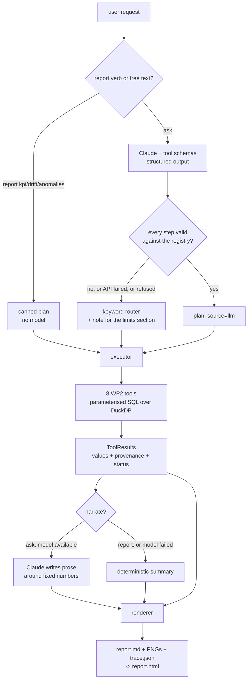

# Agent decision flow

How a request becomes a report, and what happens at every point where the model
could fail.

## The one sentence that makes this safe

**The model plans and narrates; it never computes.**

Every number in every report is produced by parameterised SQL inside a WP2 tool.
The model chooses *which* tools to run and writes prose *around* the results it
is handed. It has no store access and no arithmetic role. The figures, the
tool-call trace and the limits section are all rendered from the `ToolResult`s
regardless of what the model says — which is why a model failure costs
readability and never correctness, and why the fallback at every stage is a
working report rather than an error.

## Why the three `report` verbs bypass the model entirely

`report kpi`, `report drift` and `report anomalies` run fixed plans defined in
`agent/router.py`. No API call is made, no key is needed, and the same store and
period give identical output every time, apart from the generation timestamp.

That matters for three reasons. It is the **reproducible demo path** — a marker
runs `scripts/demo.sh` and gets the reports committed under `docs/reports/`,
identical apart from the generation timestamp in the header. It is the
**offline fallback** — the tool is useful with no credentials and no network. And it is the **reference** the agentic path is
checked against: the same tools, the same SQL, the same numbers, so any
difference between an `ask` report and a `report` report is a difference in
*which analyses were chosen*, never in what they computed.

The agentic behaviour lives entirely in `ask`.

## The three constraints on the planner

`ask` sends the question and the registry's tool schemas to Claude and gets back
a *plan*: an ordered list of tool calls with a rationale for each. Three
independent constraints mean a bad plan degrades instead of breaking.

**1. Structured outputs pin the shape.** The request carries a JSON schema
generated from the registry itself (`registry.plan_json_schema()`), so the reply
is JSON of the right shape or the API rejects it. The schema is derived from the
same `TOOLS` table the executor dispatches on, so it cannot drift out of sync
with what actually exists.

Anthropic's structured outputs require every object to set
`additionalProperties: false` and to list every property in `required`. The tool
arguments are therefore a single flat object containing the union of every
tool's parameters, and the model must emit every key on every step — setting the
ones it is not using to `null`. `plan.effective_args()` drops those nulls, and
validation, execution and figure selection all read a step through it so they
cannot disagree about what the step says.

**2. The registry validates every step.** `registry.validate_step()` rejects a
tool name the model invented, an argument a tool does not take, and an argument
outside its allowed values. A plan is accepted only if every step passes.

**3. Any failure falls back to the keyword router.** Missing SDK, missing key,
network error, rate limit, refusal, unparseable JSON, an invalid step — all of
them produce the same outcome: `router.route()` picks a canned plan by keyword,
and the reason is carried into the report's *Confidence and limits* section.

`planner.plan()` never raises. It returns a `Plan` on every path, and the report
always says which path it took:

> **Planning.** planning failed: the call failed: "Could not resolve
> authentication method…"; the keyword router selected the drift plan (3 keyword
> match(es)).

## Why the executor converts exceptions to values

`executor.execute()` runs each step inside a total error boundary. A tool that
raises, a tool that returns the wrong type, a step that fails validation — each
becomes a `ToolResult` with `status="error"` and a message, and the plan
continues to the next step.

An agent that receives an exception cannot reason about it; an agent that
receives a *value* saying "this analysis could not answer, and here is why" can
route around it and report the gap. A four-step plan where step two fails still
produces a report containing the other three answers and a limits section naming
the failure. That is strictly more useful than a traceback, and it is the reason
a malformed period like `--period February` writes an explanatory report rather
than crashing. It exits **1**, not 0: every step failed, and an unattended caller
must be able to tell that from a run that merely found nothing. A period that is
well-formed but empty exits 0, because the analysis genuinely ran.

The catch-all is deliberate and is the last line of defence: the eight tools are
written not to raise, and the boundary exists for the case where one does anyway.

## Narration

For `ask`, the tool results are handed to Claude verbatim — values, status,
message and provenance — and it writes the *Findings* and *Next checks*
sections. Its instructions forbid stating a number that is not in the results it
was given.

That instruction is a quality measure, not a safety measure. The safety comes
from structure: the model's prose occupies two sections of the report, while the
scope figures, every plot, the full tool-call trace and the entire limits section
are rendered from the `ToolResult`s underneath it. A narrator that hallucinated
a success rate would be contradicted by the trace on the same page — and a
narrator that fails at all is replaced by `render.summarise()`, the deterministic
summary the `report` verbs already use.

The report footer always discloses both choices:

    narrative source: template, plan source: router

## Where the model runs, and how much it is asked to do

Two independent knobs, neither of which touches a number.

**`provider`** — `anthropic` or `ollama`. `agent/llm.py` is the only file that
knows the difference: Ollama never receives `thinking` or `output_config`, which
are Anthropic's, and Anthropic never receives `num_ctx`. Both return the same
`(payload, reason)` pair, so the planner and the narrator cannot tell which one
answered.

One consequence is worth naming. The flat args union — every step carrying every
tool's parameters, most of them null — exists *only* because Anthropic structured
outputs require every property in `required`. Where a provider has no such rule
the schema can have one branch per tool, and attaching `outcome` to `trend`
becomes ungrammatical rather than merely invalid. Measured on qwen2.5:7b over six
questions: 3 plans rejected with the flat schema, **0** with the per-tool one, and
faster, having no nulls to emit.

**`planning`** — how much of the job the model is given:

| tier | the model produces | prompt |
|---|---|---:|
| `plan` | the whole sequence, arguments included | ~1,850 tok |
| `select` | which tools run; their defaults supply the arguments | ~410 tok |
| `classify` | one of the three report types; its canned plan runs | ~16 tok |

Every tier ends in an ordinary `Plan` of registry-validated steps, so the tier
changes what the model is trusted with and never what the numbers are. `classify`
still earns its place over the keyword router: on six naturally-phrased questions
the router matched a keyword in **none** of them and defaulted to KPI, while the
7B routed five correctly, including one asked in Italian.

## Two ways the narrator is rejected

Structured outputs guarantee a string arrives in the `findings` field. They
guarantee nothing about it saying anything, and a small model exploits that gap
in a specific way. Handed real three-month results, qwen2.5:7b returned:

> "The analysis of the success rate for heads 1 through 36 during February to
> April 2026 reveals several key insights and potential issues. Here's a summary
> of the findings from both the correlation matrix and drift analysis tools:"

An announcement of findings, ending on a colon, with the promised list never
arriving — three times out of three. So the narrative is checked before it is
used, and the check is **the bullet, not the number**: that reply does contain
digits ("36", "2026"), so a digit check would have waved it through, while a good
one-line finding may legitimately carry none. What it lacks is the Markdown
bullet the prompt asks for.

Rejected narration falls back to `render.summarise()` and the limits section
carries the reason, exactly as a rejected plan does:

> - **Narration.** the model's findings carried no bullet; it announced findings
>   rather than stating them.

This is the whole design in miniature. The model was genuinely useful at picking
the analyses and useless at describing them, and the report reflects both without
a human having to notice.

## What lands on disk

| file | what it is |
|---|---|
| `report.md` | the source of truth; six mandated sections plus the trace |
| `report.html` | self-contained — every PNG inlined as a data URI, no external requests |
| `trace.json` | the store fingerprint (path, rows, ts range, distinct heads) plus every tool call, its effective arguments, status and rows scanned |
| `*.png` | figures, drawn from `ToolResult`s only |
| `report.pdf` | best-effort, only when WeasyPrint and its native deps are present |

The trace is both the rubric's "clear tool-use flow" and the first place to look
when a number surprises you: it records the arguments the tool was *actually*
called with, after null-stripping, so a plan and its execution can never be
described differently.
