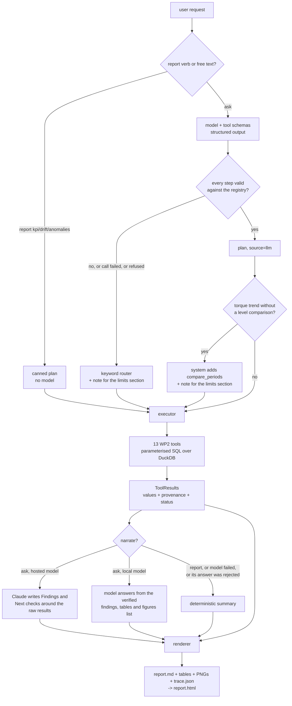

# Agent decision flow

How a request becomes a report, and what happens at every point where the model
could fail.

```mermaid
flowchart TD
    Q[user request] --> C{report verb or free text?}
    C -->|report kpi/drift/anomalies| R[canned plan<br/>no model]
    C -->|ask| L[model + tool schemas<br/>structured output]
    L --> V{every step valid<br/>against the registry?}
    V -->|no, or call failed, or refused| K[keyword router<br/>+ note for the limits section]
    V -->|yes| P[plan, source=llm]
    P --> A{torque trend without<br/>a level comparison?}
    A -->|yes| A2[system adds compare_periods<br/>+ note for the limits section]
    A -->|no| E
    A2 --> E[executor]
    R --> E
    K --> E
    E --> T[13 WP2 tools<br/>parameterised SQL over DuckDB]
    T --> RES[ToolResults<br/>values + provenance + status]
    RES --> N{narrate?}
    N -->|ask, hosted model| HN[Claude writes Findings and<br/>Next checks around the raw results]
    N -->|ask, local model| LN[model answers from the verified<br/>findings, tables and figures list]
    N -->|report, or model failed,<br/>or its answer was rejected| DN[deterministic summary]
    HN --> RD[renderer]
    LN --> RD
    DN --> RD
    RES --> RD
    RD --> OUT[report.md + tables + PNGs + trace.json<br/>-> report.html]
```

## The one sentence that makes this safe

**The model plans and narrates; it never computes.**

Every number in every report is produced by parameterised SQL inside a WP2 tool.
The model chooses *which* tools to run and writes prose *around* the results it
is handed (a local model writes only the answer to the question, from sentences
the system has already verified). It has no store access and no arithmetic role. The figures, the
tool-call trace and the limits section are all rendered from the `ToolResult`s
regardless of what the model says — which is why a model failure costs
readability and never correctness, and why the fallback at every stage is a
working report rather than an error.

## Why the three `report` verbs bypass the model entirely

`report kpi`, `report drift` and `report anomalies` run fixed plans defined in
`agent/router.py`. No API call is made, no key is needed, and the same store and
period give identical output every time, apart from the generation timestamp.

That matters for three reasons. It is the **reproducible demo path** — a marker
runs `scripts/demo.sh` and gets the reports committed under `docs/reports/`,
identical apart from the generation timestamp in the header. It is the
**offline fallback** — the tool is useful with no credentials and no network. And it is the **reference** the agentic path is
checked against: the same tools, the same SQL, the same numbers, so any
difference between an `ask` report and a `report` report is a difference in
*which analyses were chosen*, never in what they computed.

The agentic behaviour lives entirely in `ask`.

## The three constraints on the planner

`ask` sends the question and the registry's tool schemas to the model and gets back
a *plan*: an ordered list of tool calls with a rationale for each. Three
independent constraints mean a bad plan degrades instead of breaking.

**1. Structured outputs pin the shape.** The request carries a JSON schema
generated from the registry itself (`registry.plan_json_schema()`), so the reply
is JSON of the right shape or the API rejects it. The schema is derived from the
same `TOOLS` table the executor dispatches on, so it cannot drift out of sync
with what actually exists.

Anthropic's structured outputs require every object to set
`additionalProperties: false` and to list every property in `required`. The tool
arguments are therefore a single flat object containing the union of every
tool's parameters, and the model must emit every key on every step — setting the
ones it is not using to `null`. `plan.effective_args()` drops those nulls, and
validation, execution and figure selection all read a step through it so they
cannot disagree about what the step says.

**2. The registry validates every step.** `registry.validate_step()` rejects a
tool name the model invented, an argument a tool does not take, and an argument
outside its allowed values. A plan is accepted only if every step passes.

**3. Any failure falls back to the keyword router.** Missing SDK, missing key,
network error, rate limit, refusal, unparseable JSON, an invalid step — all of
them produce the same outcome: `router.route()` picks a canned plan by keyword,
and the reason is carried into the report's *Confidence and limits* section.

`planner.plan()` never raises. It returns a `Plan` on every path, and the report
always says which path it took:

> **Planning.** planning failed: the call failed: "Could not resolve
> authentication method…"; the keyword router selected the drift plan (3 keyword
> match(es)).

### What the system adds to a valid plan

One thing happens after validation, and it is an amendment, not a constraint. A
model asked "did the average torque change over the month?" plans `trend` and
nothing else, whatever the planning rules say, and that is the one plan that gives
the wrong answer: the drift test (Mann-Kendall) reads a steady trend and misses a
step. In March 2026 the median torque goes from 1.999 Nm to 1.748 and back to
2.198 while no head drifts.

So `planner._with_level_check` appends `compare_periods` to a model plan that
trends torque without it: by week for a single month, by month for a longer
period or the whole store. The step's rationale begins "Added by the system", and
the report's *Confidence and limits* says so:

> - **Planning.** compare_periods by week was added to the plan, since a torque
>   trend alone misses a step in level.

It applies only to the tier where the model composes the plan (`plan`). The fixed
plan of a report verb, a `classify` or `select` plan and the router's are what
their names promise, and are left alone.

## Why the executor converts exceptions to values

`executor.execute()` runs each step inside a total error boundary. A tool that
raises, a tool that returns the wrong type, a step that fails validation — each
becomes a `ToolResult` with `status="error"` and a message, and the plan
continues to the next step.

An agent that receives an exception cannot reason about it; an agent that
receives a *value* saying "this analysis could not answer, and here is why" can
route around it and report the gap. A four-step plan where step two fails still
produces a report containing the other three answers and a limits section naming
the failure. That is strictly more useful than a traceback, and it is the reason
a malformed period like `--period February` writes an explanatory report rather
than crashing. It exits **1**, not 0: every step failed, and an unattended caller
must be able to tell that from a run that merely found nothing. A period that is
well-formed but empty exits 0, because the analysis genuinely ran.

The catch-all is deliberate and is the last line of defence: the thirteen tools are
written not to raise, and the boundary exists for the case where one does anyway.

## Narration

For `ask`, the narrator works one of two ways, by provider.

**Hosted (`anthropic`).** The tool results are handed to Claude verbatim —
values, status, message and provenance, plus what each tool does not measure —
and it writes the *Findings* and *Next checks* sections, each as a list of
strings the report turns into bullets. Its instructions forbid stating a number
that is not in the results it was given. A list longer than
`narrator_max_items` is sent as its count and a sample, and says so.

**Local (`ollama`).** The model is given the deterministic summary's own
sentences and the operator's question, and writes one to three statements. The
report prints them under an *Answer* bullet with every deterministic finding
beneath, and the *Next checks* are the template's. This path exists because
`qwen3:14b`, handed the raw results, misread them: it reported all 36 heads as
drifting when none was, said caps per day had improved when they fell 18.7%,
and gave a three-month total as one month's. An answer is rejected, and the
template stands alone, if it states a number the findings do not carry, is
empty, or only announces its findings.

The instruction to state no unseen number is a quality measure on either path.

That instruction is a quality measure, not a safety measure. The safety comes
from structure: the model's prose occupies two sections of the report, while the
scope figures, every plot, the full tool-call trace and the entire limits section
are rendered from the `ToolResult`s underneath it. A narrator that hallucinated
a success rate would be contradicted by the trace on the same page — and a
narrator that fails at all is replaced by `render.summarise()`, the deterministic
summary the `report` verbs already use.

The report footer always discloses both choices:

    narrative source: template, plan source: router

## Where the model's words can appear

The report is rendered from the tool results, and the model's words are in a few
places only:

| where | whose words | checked how |
|---|---|---|
| the title and *Goal* | the planner's restatement of the question | not checked; the operator's own words travel beside it to the narrator |
| each step's rationale in *Analyses executed* | the planner | not checked; the arguments beside it are the ones the tool ran with, as `trace.json` records them |
| the *Answer* bullet and the bullets nested under it (local model), or *Findings* and *Next checks* (hosted model) | the narrator | local: every number must be in the findings and tables it was given, or in the question; hosted: asked, not checked |
| everything else: data used, the findings beneath the answer, tables, figures, limits, trace | none | rendered from the `ToolResult`s |

What the number check cannot catch is a sentence that is wrong without a number.
Asked which head behaves differently, `qwen3:14b` answered "head 9" while the
finding printed beside its answer said "No head stands out" (head 9 is 1.5% above
the median sigma of the other heads). A reader sees both on the page, which is the
design: the deterministic text is never replaced by the model's, so a contradiction
is visible rather than silently resolved. The 43-query test marks that query
`xfail` for this reason.

## Where the model runs, and how much it is asked to do

Two independent knobs, neither of which touches a number.

**`provider`** — `anthropic` or `ollama`. `agent/llm.py` is the only file that
knows the difference: Ollama never receives `thinking` or `output_config`, which
are Anthropic's, and Anthropic never receives `num_ctx`. Both return the same
`(payload, reason)` pair, so the planner and the narrator cannot tell which one
answered.

One consequence is worth naming. The flat args union — every step carrying every
tool's parameters, most of them null — exists *only* because Anthropic structured
outputs require every property in `required`. Where a provider has no such rule
the schema can have one branch per tool, and attaching `outcome` to `trend`
becomes ungrammatical rather than merely invalid. Measured on qwen2.5:7b over six
questions: 3 plans rejected with the flat schema, **0** with the per-tool one, and
faster, having no nulls to emit.

**`planning`** — how much of the job the model is given:

| tier | the model produces | prompt |
|---|---|---:|
| `plan` | the whole sequence, arguments included | ~3,990 tok |
| `select` | which tools run; their defaults supply the arguments | ~1,260 tok |
| `classify` | one of the three report types; its canned plan runs | ~90 tok |

Prompt sizes are as Ollama counts them (`prompt_eval_count`, qwen3:14b), with the
thirteen tools and the question included. They grew with the toolset: the `plan`
prompt was ~1,850 tokens with eight tools. Ollama truncates a prompt that does not
fit without saying so, so `Config` rejects a `num_ctx` below 6144: the `plan`
prompt alone is ~4,000 tokens, and the plan it writes needs room too.

Every tier ends in an ordinary `Plan` of registry-validated steps, so the tier
changes what the model is trusted with and never what the numbers are. `classify`
still earns its place over the keyword router: on six naturally-phrased questions
the router matched a keyword in **none** of them and defaulted to KPI, while the
7B routed five correctly, including one asked in Italian.

## How the narrator is rejected

Structured outputs guarantee the shape of a reply and nothing else. A small model
exploits the gap in a specific way: handed real three-month results, qwen2.5:7b
returned

> "The analysis of the success rate for heads 1 through 36 during February to
> April 2026 reveals several key insights and potential issues. Here's a summary
> of the findings from both the correlation matrix and drift analysis tools:"

An announcement of findings, ending on a colon, with the promised list never
arriving, three times out of three. So a reply is checked before it is used, and
one that fails is replaced by `render.summarise()` with the reason in the limits
section, exactly as a rejected plan is:

> - **Narration.** the answer states 99.98, which is not in the findings it was
>   given.

What is checked depends on the path (see *Narration*).

**Hosted model.** The findings are asked for as a list of strings and the report
makes the bullets, so the format no longer depends on a list marker. A reply is
rejected if the section is empty, if it holds no item that reads as a bullet
(numbered lists and "•" count), or if every item is only a lead-in ending on a
colon. The check is **the bullet, not the number**: the reply above does contain
digits ("36", "2026"), so a digit check would have waved it through, while a good
one-line finding may legitimately carry none.

**Local model.** The answer (one to three statements) is rejected if it is empty,
is only lead-ins, or states a number that is neither in the findings and tables it
was given nor in the question. Numbers are compared by value: 0.005 matches
0.0050, 1096 matches 1,096, a rounded figure matches its source at the answer's
own precision (29239.26 for 29,239.2584), and a single digit is free ("1 to 3").
The operator's own numbers are allowed: asked about "outside 1.5 to 2.5 Nm", an
answer may say 1.5 and 2.5. The first version of the check did not allow them and
rejected exactly those answers, so four of the 43 example queries came back as the
bare template; the cost of a false rejection is a plainer report, never a wrong one.

This is the design in miniature. The model plans and phrases, the system checks
what can be checked, and a reply that fails costs a plainer report, not a wrong
one. What a number check cannot see is covered in *Where the model's words can
appear*.

## What lands on disk

| file | what it is |
|---|---|
| `report.md` | the source of truth; six mandated sections, the tables (a row per head or per day, or the events of a filter) and the trace |
| `report.html` | self-contained — every PNG inlined as a data URI, no external requests |
| `trace.json` | the store fingerprint (path, rows, ts range, distinct heads) plus every tool call, its effective arguments, status and rows scanned |
| `*.png` | figures, drawn from `ToolResult`s only: success rate per head, rejects per day, capping speed, torque rolling mean, drift ranking, flagged closures over time, torque histogram, reject rate by hour of day |
| `report.pdf` | best-effort, only when WeasyPrint and its native deps are present |

The trace is both the rubric's "clear tool-use flow" and the first place to look
when a number surprises you: it records the arguments the tool was *actually*
called with, after null-stripping, so a plan and its execution can never be
described differently.
