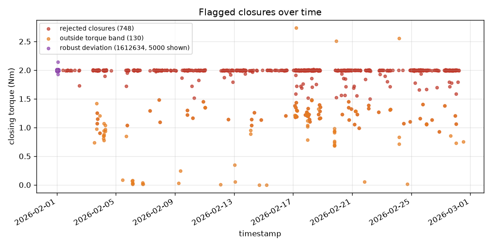

# Anomaly report for 2026-02.

*Generated 2026-08-11T11:00:12Z — narrative source: template, plan source: router.*

## Goal

Anomaly report for 2026-02.

## Data used

- Store: `events_3mo.duckdb`, machine `MCC`
- Torque band: 1.5–2.5 Nm; robust band k = 3.0; idle threshold 300s
- Rows scanned across all steps: 58,767,316

## Analyses executed

1. `anomalies(method='both', period='2026-02')` — Threshold hits, robust per-head deviation, and rejected closures. → **ok**
2. `overview(period='2026-02')` — Denominator for every count above, plus data-quality flags. → **ok**
3. `success_rates(by='day', period='2026-02')` — Daily rates, to place any abnormal interval in context. → **ok**

## Findings

- **Anomalies.** 748 rejected closures, 130 outside the torque band, 1,612,634 beyond their head's robust band.
- **Scope.** 14,824,304 capping operations across heads 1-36, from 2026-02-01 00:00:09 to 2026-02-28 23:59:59. 7,141,531 no-load cycles are excluded from every rate below.
- **Data quality.** 130 closures carry torque outside the configured band; 0 carry no torque reading at all.
- **Counter resets.** 145 reset markers in scope.
- **Weakest day.** 2026-02-05 at 99.9851% over 94,248 capping operations.

### Anomalies Over Time

## Confidence and limits

- **No model was used to plan this report.** The tool calls below are a fixed plan; the numbers would be identical either way.
- `anomalies`: 21,971,506 rows scanned; filters: method=both, band=[1.5, 2.5], mad_k=3.0
- `overview`: 21,971,506 rows scanned; filters: period=2026-02
- `success_rates`: 14,824,304 rows scanned; filters: app_torque > 0 (capping operations only)
- **Assumption.** a capping operation is a closure with torque > 0; no-load cycles (status 2, torque 0) are excluded from success denominators.
- **Assumption.** counts are exact; the itemised lists are capped at 5000 per category (see `listed`).
- **Assumption.** deviation uses median +/- k*MAD (robust); mean/sigma would let extreme outliers inflate the band and hide themselves.

## Next checks

- Correlate the rejected closures against the cap supplier lot running at those timestamps.
- Confirm the configured torque band matches the product currently running on the line.
- Inspect day 2026-02-05 mechanically before the next changeover.

## Tool-call trace

Every call this report is built from, in order. The full record is in
`trace.json` alongside this file.

| # | tool | arguments | status | rows scanned |
|---|---|---|---|---|
| 1 | `anomalies` | `method='both', period='2026-02'` | ok | 21,971,506 |
| 2 | `overview` | `period='2026-02'` | ok | 21,971,506 |
| 3 | `success_rates` | `by='day', period='2026-02'` | ok | 14,824,304 |
