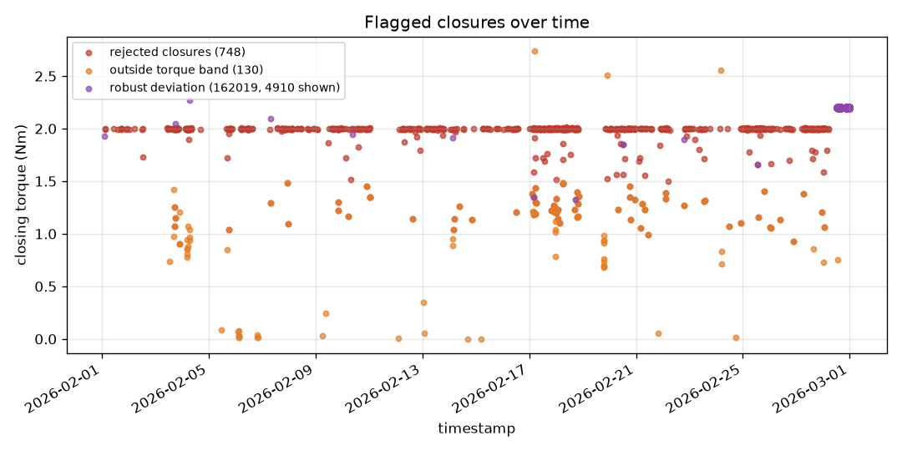
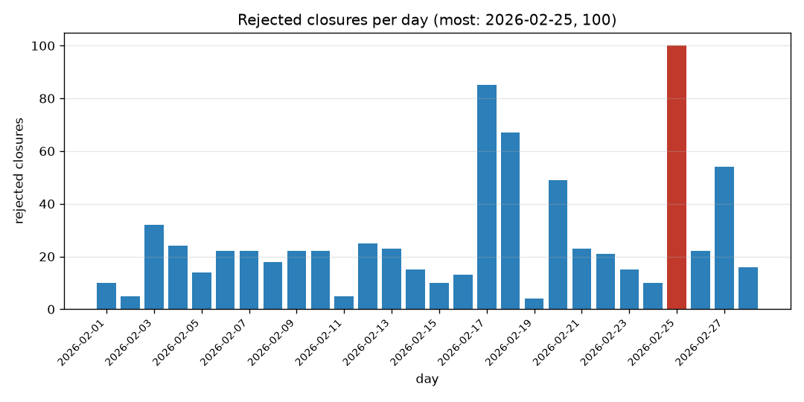

# Anomaly report for 2026-02.

*Generated 2026-10-09T20:21:26Z — narrative source: template, plan source: router, model: none (deterministic template and router).*

## Goal

Anomaly report for 2026-02.

## Data used

- Store: `events_3mo.duckdb`, machine `MCC`
- Store fingerprint: 55,132,433 rows, 36 heads, 2026-01-31 16:00:06 → 2026-04-30 16:59:59
- Torque band: 1.5–2.5 Nm; robust band k = 3.0; idle threshold 300s
- Rows scanned across all steps: 58,767,316

## Analyses executed

1. `anomalies(method='both', period='2026-02')` — Threshold hits, robust per-head deviation, and rejected closures. → **ok**
2. `overview(period='2026-02')` — Denominator for every count above, plus data-quality flags. → **ok**
3. `success_rates(by='day', period='2026-02')` — Daily rates, to place any abnormal interval in context. → **ok**

## Findings

- **Anomalies.** 748 rejected closures, 130 outside the torque band (0.0009% of capping operations), 162,019 beyond their head's robust band (1.0929% of capping operations).
  Most readings outside the torque band: head 22 (18), head 35 (10), head 7 (8); 34 head(s) have at least one.
  Rejects by condition: Bad Closure 732, No InTorque 16.
  The robust band is held at its floor on all 36 heads, so it is a fixed distance from each head's median, not the head's own spread: read the share against another period, since a step in it is a step in torque level.
- **Scope.** 14,824,304 capping operations across 36 heads, from 2026-02-01 00:00:09 to 2026-02-28 23:59:59. 7,141,531 no-load cycles are excluded from every rate below.
- **Outcomes.** 14,817,976 successful and 748 rejected closures, and 5,580 carry no pass/fail verdict.
- **Data quality.** 130 closures carry torque outside the configured band; 0 carry no torque reading at all.
- **Counter resets.** 145 reset markers in scope.
- **Weakest day.** 2026-02-05 at 99.9851% over 94,248 capping operations (14 rejected, 1.9% of all 748 rejects; the median day has 22). Median across 28 days: 99.9962%; best: 2026-02-02 at 99.9992%. Most rejects: day 2026-02-25 (100), day 2026-02-17 (85), day 2026-02-18 (67).

### Success rate per day (table)

| Day | Closures | Successful | Rejected | Success rate |
|---|---|---|---|---|
| 2026-02-01 | 646,354 | 646,136 | 10 | 99.9985% |
| 2026-02-02 | 615,906 | 615,786 | 5 | 99.9992% |
| 2026-02-03 | 217,299 | 217,148 | 32 | 99.9853% |
| 2026-02-04 | 171,730 | 171,631 | 24 | 99.9860% |
| 2026-02-05 | 94,248 | 94,197 | 14 | 99.9851% |
| 2026-02-06 | 218,594 | 218,517 | 22 | 99.9899% |
| 2026-02-07 | 387,308 | 387,148 | 22 | 99.9943% |
| 2026-02-08 | 800,666 | 800,411 | 18 | 99.9978% |
| 2026-02-09 | 619,228 | 619,060 | 22 | 99.9964% |
| 2026-02-10 | 904,037 | 903,861 | 22 | 99.9976% |
| 2026-02-11 | 49,685 | 49,672 | 5 | 99.9899% |
| 2026-02-12 | 818,685 | 818,480 | 25 | 99.9969% |
| 2026-02-13 | 603,238 | 603,054 | 23 | 99.9962% |
| 2026-02-14 | 580,455 | 580,250 | 15 | 99.9974% |
| 2026-02-15 | 629,749 | 628,565 | 10 | 99.9984% |
| 2026-02-16 | 628,099 | 628,012 | 13 | 99.9979% |
| 2026-02-17 | 959,621 | 959,340 | 85 | 99.9911% |
| 2026-02-18 | 840,749 | 840,156 | 67 | 99.9920% |
| 2026-02-19 | 137,438 | 137,351 | 4 | 99.9971% |
| 2026-02-20 | 781,681 | 781,435 | 49 | 99.9937% |
| 2026-02-21 | 627,875 | 627,605 | 23 | 99.9963% |
| 2026-02-22 | 507,817 | 507,678 | 21 | 99.9959% |
| 2026-02-23 | 584,914 | 584,674 | 15 | 99.9974% |
| 2026-02-24 | 262,583 | 262,250 | 10 | 99.9962% |
| 2026-02-25 | 683,458 | 683,250 | 100 | 99.9854% |
| 2026-02-26 | 579,856 | 579,691 | 22 | 99.9962% |
| 2026-02-27 | 526,648 | 526,365 | 54 | 99.9897% |
| 2026-02-28 | 346,383 | 346,253 | 16 | 99.9954% |

### Anomalies Over Time

### Failed Closures Per Day

## Confidence and limits

- **No model was used to plan this report.** The tool calls below are a fixed plan; the numbers would be identical either way.
- `anomalies`: 21,971,506 rows scanned; filters: method=both, band=[1.5, 2.5], mad_k=3.0, mad_floor=0.01
- `overview`: 21,971,506 rows scanned; filters: period=2026-02
- `success_rates`: 14,824,304 rows scanned; filters: app_torque > 0 (capping operations only)
- **`anomalies` does not measure.** Not causes: the data holds no operator, cap lot, supplier or maintenance record, so a flag says when and where, never why.
- **`overview` does not measure.** Not a rate or a trend: it counts the period as a whole, and says nothing about when within it anything happened.
- **`success_rates` does not measure.** Not why a closure was rejected, nor production volume: no-load cycles and closures without a verdict are outside the rate.
- **Assumption.** a capping operation is a closure with torque > 0; no-load cycles (status 2, torque 0) are excluded from success denominators.
- **Assumption.** a head with MAD = 0 (readings mostly identical) falls back to a half-IQR band, and to exact-median comparison when the IQR is 0 too; affected heads are listed in `deviation_fallbacks`.
- **Assumption.** counts are exact; the itemised lists are capped at 5000 per category (see `listed`).
- **Assumption.** counts are rows, i.e. polls at which a head's counter advanced; a poll that caught up on several caps (delta > 1) counts once. Measured undercount on real data: 0.0017% of caps.
- **Assumption.** deviation uses median +/- k*(1.4826*MAD), the sigma-consistent robust band (raw MAD is ~0.6745 sigma, so k would otherwise overstate the band's width); mean/sigma would let extreme outliers inflate the band and hide themselves.
- **Assumption.** the deviation scale has a floor of 0.01 Nm so a quantised sensor cannot collapse the band to noise.

## Next checks

- Confirm the configured torque band matches the product currently running on the line.

## Tool-call trace

Every call this report is built from, in order. The full record is in
`trace.json` alongside this file.

| # | tool | arguments | status | rows scanned |
|---|---|---|---|---|
| 1 | `anomalies` | `method='both', period='2026-02'` | ok | 21,971,506 |
| 2 | `overview` | `period='2026-02'` | ok | 21,971,506 |
| 3 | `success_rates` | `by='day', period='2026-02'` | ok | 14,824,304 |
