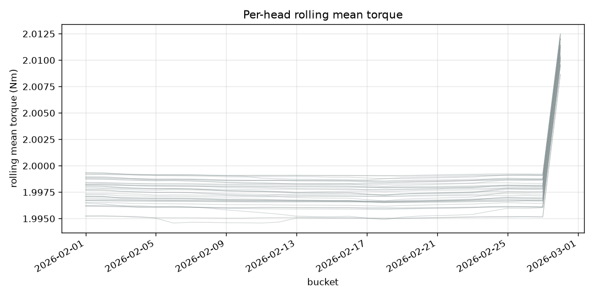
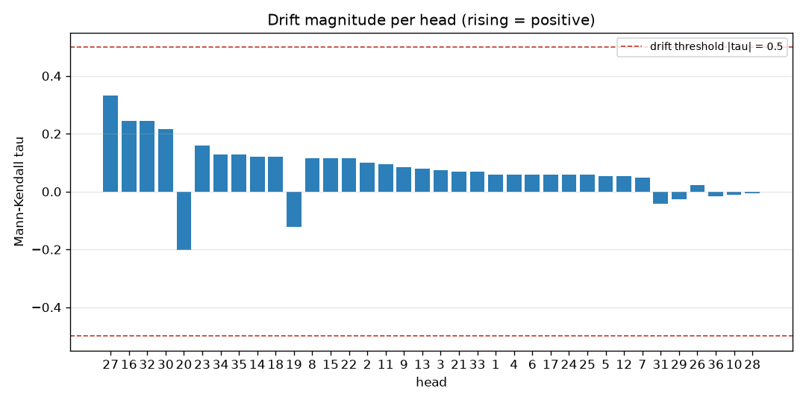

# Identify an unusual head and provide a rationale.

> **Stale.** The head-agreement sentence below predates `baa4819`: correlation
> over these series measures shared shape, so it cannot support "none is out of
> step", which is a claim about level. See [`../README.md`](../README.md).

*Generated 2026-08-16T21:58:46Z — narrative source: template, plan source: llm, model: ollama:qwen2.5:7b.*

## Goal

Identify an unusual head and provide a rationale.

## Data used

- Store: `events_3mo.duckdb`, machine `MCC`
- Store fingerprint: 55,132,433 rows, 36 heads, 2026-01-31 16:00:06 → 2026-04-30 16:59:59
- Torque band: 1.5–2.5 Nm; robust band k = 3.0; idle threshold 300s
- Rows scanned across all steps: 29,648,608

## Analyses executed

1. `head_correlation(by='day', period='2026-02')` — Determine the pairwise correlation between heads to identify any that behave differently. → **ok**
2. `trend(by='day', period='2026-02', signal='torque', window=7)` — Analyze torque trends to see if any head shows a different pattern over time. → **ok**

## Findings

- **Head agreement.** All 36 heads track each other closely (mean correlation 0.9994-0.9999); none is out of step.
- **Drift (torque).** No head exceeds the Mann-Kendall drift threshold in this period.

### Torque Rolling Mean

### Drift Ranking

## Confidence and limits

- **Narration.** the model's findings carried no bullet; it announced findings rather than stating them.
- `head_correlation`: 14,824,304 rows scanned; filters: heads=[1, 2, 3, 4, 5, 6, 7, 8, 9, 10, 11, 12, 13, 14, 15, 16, 17, 18, 19, 20, 21, 22, 23, 24, 25, 26, 27, 28, 29, 30, 31, 32, 33, 34, 35, 36], by=day
- `trend`: 14,824,304 rows scanned; filters: signal=torque, by=day, window=7
- **Assumption.** 3 buckets is a floor, not power: treat correlations over few buckets as suggestive only.
- **Assumption.** a head with no defined correlation to any peer (constant torque, zero variance, or fewer than 3 shared buckets) is omitted from outliers and shown as None in the matrix.
- **Assumption.** drift is Mann-Kendall |tau| >= 0.5 AND p < 0.05 (tie-corrected normal approximation) over the per-head day series (non-parametric: assumes neither linearity nor Gaussian noise).
- **Assumption.** heads correlate on their bucketed mean torque series; the head with the lowest mean correlation to its peers is the one out of step.
- **Assumption.** heads with fewer than 8 day buckets get no drift verdict (insufficient=true): the significance approximation is invalid there and tau alone is not evidence.

## Next checks

- Re-run this report next period and compare the numbers.

## Tool-call trace

Every call this report is built from, in order. The full record is in
`trace.json` alongside this file.

| # | tool | arguments | status | rows scanned |
|---|---|---|---|---|
| 1 | `head_correlation` | `by='day', period='2026-02'` | ok | 14,824,304 |
| 2 | `trend` | `by='day', period='2026-02', signal='torque', window=7` | ok | 14,824,304 |
