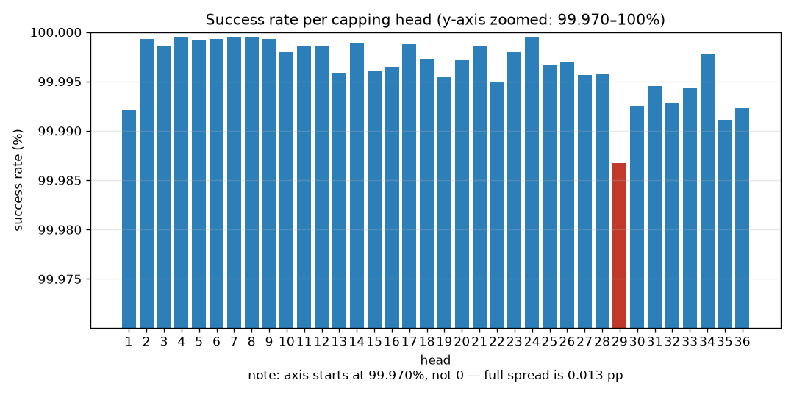

# Is there a head with an unusual number of failed closures?

*Generated 2026-10-09T20:22:18Z — narrative source: llm, plan source: llm, model: ollama:qwen3:14b.*

## Goal

Is there a head with an unusual number of failed closures?

## Data used

- Store: `events_3mo.duckdb`, machine `MCC`
- Store fingerprint: 55,132,433 rows, 36 heads, 2026-01-31 16:00:06 → 2026-04-30 16:59:59
- Torque band: 1.5–2.5 Nm; robust band k = 3.0; idle threshold 300s
- Rows scanned across all steps: 31,669,822

## Analyses executed

1. `success_rates(by='head')` — To identify which head has the lowest success rate, which may indicate an unusual number of failed closures. → **ok**
2. `torque_stats(by='head', outcome='failed')` — To examine the distribution of torque for failed closures per head, which can help identify if a head has an unusual pattern of failures. → **ok**

## Findings

- **Answer.** Head 29 has an unusual number of failed closures (117 rejected, 99.9867% success rate).
  - Head 35 also has a notably high number of failed closures (78 rejected, 99.9911% success rate).
  - Head 1 has 69 rejected closures, which is higher than most but not as high as heads 29 and 35.
- **Weakest head.** 29 at 99.9867% over 879,911 capping operations (117 rejected, 10.7% of all 1,095 rejects; the median head has 24.5). Median across 36 heads: 99.9972%; best: 24 at 99.9995%. Most rejects: head 29 (117), head 35 (78), head 1 (69).
- **Torque variability.** Head 7 is the most variable over failed closures (sigma = 0.5274 Nm about a median of 0.905 Nm, 102.8% above the median sigma of the other heads); the other 35 heads run from 0.0026 to 0.4108 Nm. It stands out from the other heads.

### Success rate per head (table)

| Head | Closures | Successful | Rejected | Success rate |
|---|---|---|---|---|
| 1 | 879,523 | 879,067 | 69 | 99.9922% |
| 2 | 879,839 | 879,485 | 6 | 99.9993% |
| 3 | 879,701 | 879,344 | 12 | 99.9986% |
| 4 | 879,587 | 879,236 | 4 | 99.9995% |
| 5 | 879,655 | 879,295 | 7 | 99.9992% |
| 6 | 879,640 | 879,297 | 6 | 99.9993% |
| 7 | 879,705 | 879,387 | 5 | 99.9994% |
| 8 | 879,618 | 879,278 | 4 | 99.9995% |
| 9 | 879,608 | 879,241 | 6 | 99.9993% |
| 10 | 879,638 | 879,304 | 18 | 99.9980% |
| 11 | 879,552 | 879,140 | 13 | 99.9985% |
| 12 | 879,641 | 879,263 | 13 | 99.9985% |
| 13 | 879,213 | 878,763 | 36 | 99.9959% |
| 14 | 879,310 | 878,908 | 10 | 99.9989% |
| 15 | 879,824 | 879,430 | 34 | 99.9961% |
| 16 | 879,510 | 879,106 | 31 | 99.9965% |
| 17 | 879,348 | 878,987 | 11 | 99.9987% |
| 18 | 879,700 | 879,358 | 24 | 99.9973% |
| 19 | 879,697 | 879,317 | 40 | 99.9955% |
| 20 | 879,939 | 879,567 | 25 | 99.9972% |
| 21 | 879,644 | 879,295 | 13 | 99.9985% |
| 22 | 879,694 | 879,293 | 44 | 99.9950% |
| 23 | 879,703 | 879,329 | 18 | 99.9980% |
| 24 | 879,677 | 879,329 | 4 | 99.9995% |
| 25 | 879,852 | 879,480 | 30 | 99.9966% |
| 26 | 879,533 | 879,175 | 27 | 99.9969% |
| 27 | 879,957 | 879,587 | 38 | 99.9957% |
| 28 | 880,042 | 879,691 | 37 | 99.9958% |
| 29 | 879,911 | 879,463 | 117 | 99.9867% |
| 30 | 879,612 | 879,242 | 66 | 99.9925% |
| 31 | 879,599 | 879,203 | 48 | 99.9945% |
| 32 | 879,714 | 879,317 | 63 | 99.9928% |
| 33 | 880,141 | 879,764 | 50 | 99.9943% |
| 34 | 879,972 | 879,617 | 20 | 99.9977% |
| 35 | 879,889 | 879,465 | 78 | 99.9911% |
| 36 | 879,539 | 879,138 | 68 | 99.9923% |

### Torque per head (failed closures) (table)

| Head | Closures | Mean (Nm) | Min | Max | Sigma | Median |
|---|---|---|---|---|---|---|
| 7 | 5 | 0.9260 | 0.173 | 1.506 | 0.5274 | 0.905 |
| 25 | 30 | 1.7325 | 0.687 | 2.004 | 0.4108 | 1.996 |
| 15 | 34 | 1.7366 | 1.042 | 2.007 | 0.3766 | 1.995 |
| 11 | 13 | 1.7792 | 0.847 | 2.000 | 0.3644 | 1.995 |
| 14 | 10 | 1.7636 | 1.105 | 2.007 | 0.3505 | 1.993 |
| 24 | 4 | 1.7830 | 1.279 | 1.995 | 0.3413 | 1.929 |
| 2 | 6 | 1.8602 | 1.164 | 2.002 | 0.3411 | 2.000 |
| 21 | 13 | 1.8162 | 1.094 | 2.005 | 0.3323 | 1.996 |
| 26 | 27 | 1.8503 | 1.140 | 2.201 | 0.3148 | 1.998 |
| 16 | 31 | 1.8481 | 1.036 | 2.009 | 0.3139 | 1.997 |
| 17 | 11 | 1.8233 | 1.300 | 2.003 | 0.3005 | 1.997 |
| 10 | 18 | 1.8229 | 1.135 | 2.001 | 0.2957 | 1.995 |
| 12 | 13 | 1.7932 | 1.253 | 2.003 | 0.2930 | 1.992 |
| 23 | 18 | 1.8584 | 1.130 | 2.013 | 0.2850 | 1.995 |
| 27 | 38 | 1.8640 | 1.146 | 2.004 | 0.2837 | 1.997 |
| 20 | 25 | 1.8565 | 1.175 | 2.005 | 0.2785 | 1.997 |
| 30 | 66 | 1.9005 | 0.997 | 2.197 | 0.2773 | 1.998 |
| 34 | 20 | 1.8761 | 1.229 | 2.004 | 0.2668 | 1.998 |
| 35 | 78 | 1.8984 | 0.982 | 2.200 | 0.2600 | 2.000 |
| 13 | 36 | 1.8785 | 1.053 | 2.003 | 0.2573 | 1.998 |
| 18 | 24 | 1.8893 | 0.992 | 2.007 | 0.2560 | 1.997 |
| 1 | 69 | 1.9084 | 1.096 | 2.196 | 0.2560 | 1.997 |
| 28 | 37 | 1.9064 | 1.042 | 2.196 | 0.2387 | 1.996 |
| 32 | 63 | 1.9175 | 0.986 | 2.199 | 0.2322 | 1.997 |
| 36 | 68 | 1.9082 | 1.193 | 2.193 | 0.2247 | 1.999 |
| 3 | 12 | 1.8955 | 1.256 | 2.005 | 0.2213 | 1.992 |
| 33 | 50 | 1.9196 | 1.136 | 2.200 | 0.2202 | 1.995 |
| 29 | 117 | 1.9300 | 1.102 | 2.199 | 0.2116 | 1.999 |
| 19 | 40 | 1.9236 | 1.243 | 2.008 | 0.1982 | 1.998 |
| 5 | 7 | 1.9216 | 1.477 | 2.000 | 0.1960 | 1.994 |
| 22 | 44 | 1.9647 | 1.063 | 2.198 | 0.1710 | 1.995 |
| 6 | 6 | 1.8905 | 1.664 | 2.001 | 0.1345 | 1.928 |
| 31 | 48 | 1.9667 | 1.345 | 2.191 | 0.1193 | 1.996 |
| 4 | 4 | 1.9988 | 1.996 | 2.005 | 0.0042 | 1.997 |
| 8 | 4 | 1.9950 | 1.992 | 1.999 | 0.0032 | 1.995 |
| 9 | 6 | 1.9962 | 1.992 | 1.998 | 0.0026 | 1.997 |

### Success Rate Per Head

## Confidence and limits

- `success_rates`: 31,668,727 rows scanned; filters: app_torque > 0 (capping operations only)
- `torque_stats`: 1,095 rows scanned; filters: outcome=failed, app_torque > 0 (no-load excluded)
- **`success_rates` does not measure.** Not why a closure was rejected, nor production volume: no-load cycles and closures without a verdict are outside the rate.
- **`torque_stats` does not measure.** Not change over time (that is trend), not whether a closure passed, and not how many readings fall outside the band (anomalies counts those): a statistic over the whole period.
- **Assumption.** a capping operation is a closure with torque > 0; no-load cycles (status 2, torque 0) are excluded from success denominators.

## Next checks

- Inspect head 29 mechanically before the next changeover.

## Tool-call trace

Every call this report is built from, in order. The full record is in
`trace.json` alongside this file.

| # | tool | arguments | status | rows scanned |
|---|---|---|---|---|
| 1 | `success_rates` | `by='head'` | ok | 31,668,727 |
| 2 | `torque_stats` | `by='head', outcome='failed'` | ok | 1,095 |
