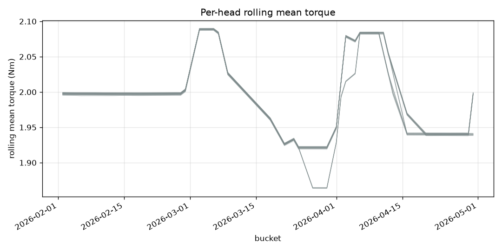
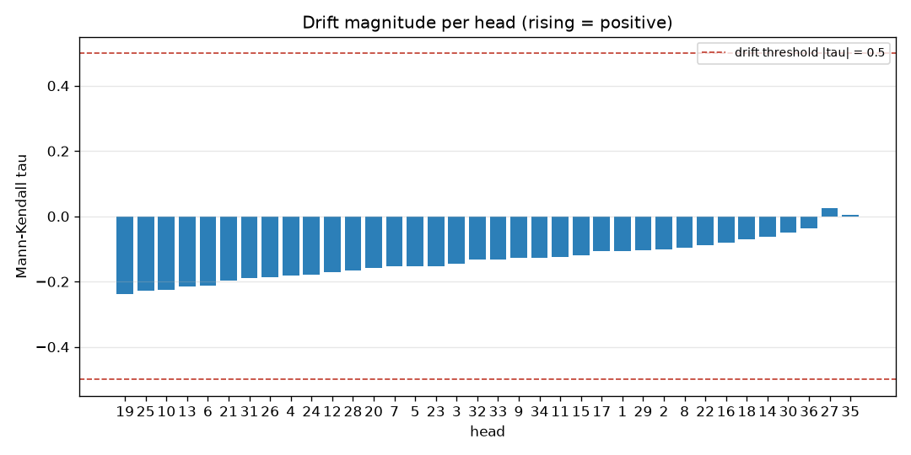

# Torque drift report for 2026-02..2026-04.

> **Stale.** The head-agreement sentence below predates `baa4819`: correlation
> over these series measures shared shape, so it cannot support "none is out of
> step", which is a claim about level. See [`../README.md`](../README.md).

*Generated 2026-08-16T21:52:52Z — narrative source: template, plan source: router, model: none (deterministic template and router).*

## Goal

Torque drift report for 2026-02..2026-04.

## Data used

- Store: `events_3mo.duckdb`, machine `MCC`
- Store fingerprint: 55,132,433 rows, 36 heads, 2026-01-31 16:00:06 → 2026-04-30 16:59:59
- Torque band: 1.5–2.5 Nm; robust band k = 3.0; idle threshold 300s
- Rows scanned across all steps: 126,578,096

## Analyses executed

1. `trend(by='day', period='2026-02..2026-04', signal='torque', window=7)` — Rolling mean/sigma of torque per head, with Mann-Kendall drift. → **ok**
2. `trend(by='day', period='2026-02..2026-04', signal='success_rate', window=7)` — Whether quality moved with torque, or independently of it. → **ok**
3. `torque_stats(by='head', outcome='successful', period='2026-02..2026-04')` — Variability ranking, to separate a drifting head from a noisy one. → **ok**
4. `head_correlation(by='day', period='2026-02..2026-04')` — Which head is out of step with the rest of the machine. → **ok**

## Findings

- **Drift (torque).** No head exceeds the Mann-Kendall drift threshold in this period.
- **Drift (success_rate).** No head exceeds the Mann-Kendall drift threshold in this period.
- **Torque variability.** Head 9 is the most variable (sigma = 0.0729 Nm about a median of 1.997 Nm).
- **Head agreement.** All 36 heads track each other closely (mean correlation 0.9999-1.0000); none is out of step.

### Torque Rolling Mean

### Drift Ranking

## Confidence and limits

- **No model was used to plan this report.** The tool calls below are a fixed plan; the numbers would be identical either way.
- `trend`: 31,647,915 rows scanned; filters: signal=torque, by=day, window=7
- `trend`: 31,647,915 rows scanned; filters: signal=success_rate, by=day, window=7
- `torque_stats`: 31,634,351 rows scanned; filters: outcome=successful, app_torque > 0 (no-load excluded)
- `head_correlation`: 31,647,915 rows scanned; filters: heads=[1, 2, 3, 4, 5, 6, 7, 8, 9, 10, 11, 12, 13, 14, 15, 16, 17, 18, 19, 20, 21, 22, 23, 24, 25, 26, 27, 28, 29, 30, 31, 32, 33, 34, 35, 36], by=day
- **Assumption.** 3 buckets is a floor, not power: treat correlations over few buckets as suggestive only.
- **Assumption.** a capping operation is a closure with torque > 0; no-load cycles (status 2, torque 0) are excluded from success denominators.
- **Assumption.** a head with no defined correlation to any peer (constant torque, zero variance, or fewer than 3 shared buckets) is omitted from outliers and shown as None in the matrix.
- **Assumption.** drift is Mann-Kendall |tau| >= 0.5 AND p < 0.05 (tie-corrected normal approximation) over the per-head day series (non-parametric: assumes neither linearity nor Gaussian noise).
- **Assumption.** heads correlate on their bucketed mean torque series; the head with the lowest mean correlation to its peers is the one out of step.
- **Assumption.** heads with fewer than 8 day buckets get no drift verdict (insufficient=true): the significance approximation is invalid there and tau alone is not evidence.

## Next checks

- Re-run this report next period and compare the numbers.

## Tool-call trace

Every call this report is built from, in order. The full record is in
`trace.json` alongside this file.

| # | tool | arguments | status | rows scanned |
|---|---|---|---|---|
| 1 | `trend` | `by='day', period='2026-02..2026-04', signal='torque', window=7` | ok | 31,647,915 |
| 2 | `trend` | `by='day', period='2026-02..2026-04', signal='success_rate', window=7` | ok | 31,647,915 |
| 3 | `torque_stats` | `by='head', outcome='successful', period='2026-02..2026-04'` | ok | 31,634,351 |
| 4 | `head_correlation` | `by='day', period='2026-02..2026-04'` | ok | 31,647,915 |
