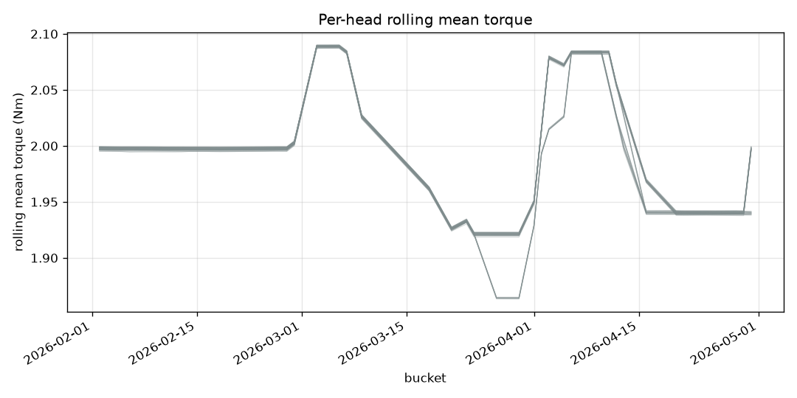
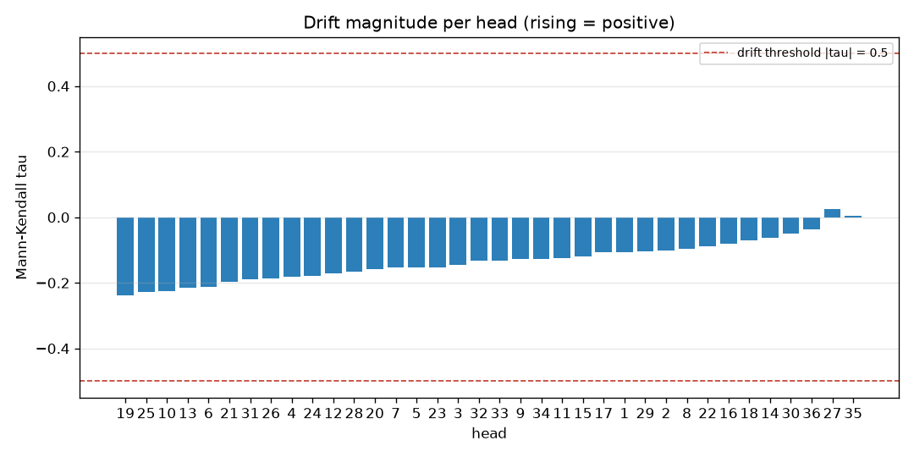

# Torque drift report for 2026-02..2026-04.

*Generated 2026-10-09T20:21:24Z — narrative source: template, plan source: router, model: none (deterministic template and router).*

## Goal

Torque drift report for 2026-02..2026-04.

## Data used

- Store: `events_3mo.duckdb`, machine `MCC`
- Store fingerprint: 55,132,433 rows, 36 heads, 2026-01-31 16:00:06 → 2026-04-30 16:59:59
- Torque band: 1.5–2.5 Nm; robust band k = 3.0; idle threshold 300s
- Rows scanned across all steps: 126,578,096

## Analyses executed

1. `trend(by='day', period='2026-02..2026-04', signal='torque', window=7)` — Rolling mean/sigma of torque per head, with Mann-Kendall drift. → **ok**
2. `trend(by='day', period='2026-02..2026-04', signal='success_rate', window=7)` — Whether quality moved with torque, or independently of it. → **ok**
3. `torque_stats(by='head', outcome='successful', period='2026-02..2026-04')` — Variability ranking, to separate a drifting head from a noisy one. → **ok**
4. `head_correlation(by='day', period='2026-02..2026-04')` — Which head is out of step with the rest of the machine. → **ok**

## Findings

- **Drift (torque).** No head exceeds the Mann-Kendall drift threshold in this period.
- **Drift (success_rate).** No head exceeds the Mann-Kendall drift threshold in this period.
- **Torque variability.** Head 9 is the most variable over successful closures (sigma = 0.0729 Nm about a median of 1.997 Nm, 1.1% above the median sigma of the other heads); the other 35 heads run from 0.0714 to 0.0726 Nm. No head stands out.
- **Head agreement.** All 36 heads move together (mean correlation 0.9999-1.0000), so none is out of step in shape. This says nothing about level: Pearson is invariant to a per-head offset, and a head running steadily below the others scores the same.

### Torque per head (successful closures) (table)

| Head | Closures | Mean (Nm) | Min | Max | Sigma | Median |
|---|---|---|---|---|---|---|
| 9 | 878,661 | 2.0130 | 1.582 | 2.286 | 0.0729 | 1.997 |
| 5 | 878,717 | 2.0138 | 1.584 | 2.229 | 0.0726 | 1.996 |
| 8 | 878,701 | 2.0145 | 1.583 | 2.231 | 0.0725 | 1.998 |
| 14 | 878,326 | 2.0143 | 1.583 | 2.208 | 0.0724 | 1.996 |
| 23 | 878,749 | 2.0140 | 1.581 | 2.326 | 0.0724 | 1.996 |
| 21 | 878,716 | 2.0141 | 1.523 | 2.205 | 0.0724 | 1.996 |
| 22 | 878,712 | 2.0126 | 1.584 | 2.229 | 0.0724 | 1.995 |
| 17 | 878,406 | 2.0148 | 1.583 | 2.284 | 0.0723 | 1.997 |
| 24 | 878,749 | 2.0125 | 1.584 | 2.278 | 0.0723 | 1.995 |
| 28 | 879,116 | 2.0140 | 1.583 | 2.206 | 0.0723 | 1.996 |
| 25 | 878,902 | 2.0134 | 1.584 | 2.218 | 0.0723 | 1.996 |
| 3 | 878,769 | 2.0141 | 1.586 | 2.211 | 0.0722 | 1.997 |
| 10 | 878,724 | 2.0141 | 1.587 | 2.212 | 0.0722 | 1.996 |
| 18 | 878,776 | 2.0148 | 1.583 | 2.290 | 0.0722 | 1.997 |
| 7 | 878,809 | 2.0134 | 1.582 | 3.126 | 0.0722 | 1.996 |
| 33 | 879,188 | 2.0133 | 1.583 | 2.206 | 0.0721 | 1.995 |
| 15 | 878,848 | 2.0144 | 1.583 | 2.204 | 0.0721 | 1.998 |
| 27 | 879,006 | 2.0150 | 1.583 | 2.393 | 0.0721 | 1.997 |
| 1 | 878,491 | 2.0147 | 1.583 | 2.231 | 0.0720 | 1.997 |
| 20 | 878,989 | 2.0152 | 1.582 | 2.278 | 0.0720 | 1.997 |
| 2 | 878,908 | 2.0156 | 1.585 | 2.740 | 0.0720 | 1.999 |
| 4 | 878,658 | 2.0151 | 1.582 | 2.323 | 0.0720 | 1.997 |
| 13 | 878,186 | 2.0155 | 1.282 | 2.317 | 0.0720 | 1.998 |
| 12 | 878,683 | 2.0162 | 1.583 | 2.556 | 0.0720 | 2.000 |
| 26 | 878,594 | 2.0163 | 1.304 | 2.242 | 0.0719 | 1.998 |
| 31 | 878,627 | 2.0139 | 1.584 | 2.210 | 0.0719 | 1.996 |
| 19 | 878,739 | 2.0151 | 1.582 | 2.427 | 0.0719 | 1.998 |
| 30 | 878,668 | 2.0157 | 1.584 | 2.335 | 0.0719 | 1.998 |
| 16 | 878,525 | 2.0163 | 1.586 | 2.340 | 0.0719 | 1.999 |
| 29 | 878,886 | 2.0158 | 1.584 | 2.464 | 0.0718 | 1.999 |
| 34 | 879,044 | 2.0149 | 1.430 | 2.210 | 0.0718 | 1.998 |
| 6 | 878,718 | 2.0156 | 1.584 | 2.218 | 0.0718 | 1.998 |
| 35 | 878,893 | 2.0159 | 1.329 | 2.509 | 0.0718 | 1.999 |
| 11 | 878,563 | 2.0152 | 1.587 | 2.205 | 0.0718 | 1.998 |
| 32 | 878,740 | 2.0143 | 1.585 | 2.390 | 0.0717 | 1.997 |
| 36 | 878,564 | 2.0161 | 1.588 | 2.214 | 0.0714 | 1.999 |

### Torque Rolling Mean

### Drift Ranking

## Confidence and limits

- **No model was used to plan this report.** The tool calls below are a fixed plan; the numbers would be identical either way.
- `trend`: 31,647,915 rows scanned; filters: signal=torque, by=day, window=7
- `trend`: 31,647,915 rows scanned; filters: signal=success_rate, by=day, window=7
- `torque_stats`: 31,634,351 rows scanned; filters: outcome=successful, app_torque > 0 (no-load excluded)
- `head_correlation`: 31,647,915 rows scanned; filters: heads=[1, 2, 3, 4, 5, 6, 7, 8, 9, 10, 11, 12, 13, 14, 15, 16, 17, 18, 19, 20, 21, 22, 23, 24, 25, 26, 27, 28, 29, 30, 31, 32, 33, 34, 35, 36], by=day
- **`trend` does not measure.** Not production volume or downtime: a drift is a monotone trend in one head's torque or success rate.
- **`torque_stats` does not measure.** Not change over time (that is trend), not whether a closure passed, and not how many readings fall outside the band (anomalies counts those): a statistic over the whole period.
- **`head_correlation` does not measure.** Not level: correlation ignores a per-head offset, so a head running steadily lower than the rest scores as normal.
- **Assumption.** 3 buckets is a floor, not power: treat correlations over few buckets as suggestive only.
- **Assumption.** Pearson correlation is invariant to a per-head affine shift, so this ranking cannot see a level offset: a head running consistently below the others while moving with them scores ~1 and is reported as tracking. Compare per-head median torque (torque_stats by head) to rule that out.
- **Assumption.** a capping operation is a closure with torque > 0; no-load cycles (status 2, torque 0) are excluded from success denominators.
- **Assumption.** a head with no defined correlation to any peer (constant torque, zero variance, or fewer than 3 shared buckets) is omitted from outliers and shown as None in the matrix.
- **Assumption.** drift is Mann-Kendall |tau| >= 0.5 AND p < 0.05 (tie-corrected normal approximation) over the per-head day series (non-parametric: assumes neither linearity nor Gaussian noise).
- **Assumption.** heads correlate on their bucketed mean torque series; the head with the lowest mean correlation to its peers is the one out of step *in shape*.
- **Assumption.** heads with fewer than 8 day buckets get no drift verdict (insufficient=true): the significance approximation is invalid there and tau alone is not evidence.

## Next checks

- Compare per-head median torque (torque_stats by head) — the correlation ranking cannot see a head that tracks the pack at a lower level.

## Tool-call trace

Every call this report is built from, in order. The full record is in
`trace.json` alongside this file.

| # | tool | arguments | status | rows scanned |
|---|---|---|---|---|
| 1 | `trend` | `by='day', period='2026-02..2026-04', signal='torque', window=7` | ok | 31,647,915 |
| 2 | `trend` | `by='day', period='2026-02..2026-04', signal='success_rate', window=7` | ok | 31,647,915 |
| 3 | `torque_stats` | `by='head', outcome='successful', period='2026-02..2026-04'` | ok | 31,634,351 |
| 4 | `head_correlation` | `by='day', period='2026-02..2026-04'` | ok | 31,647,915 |
