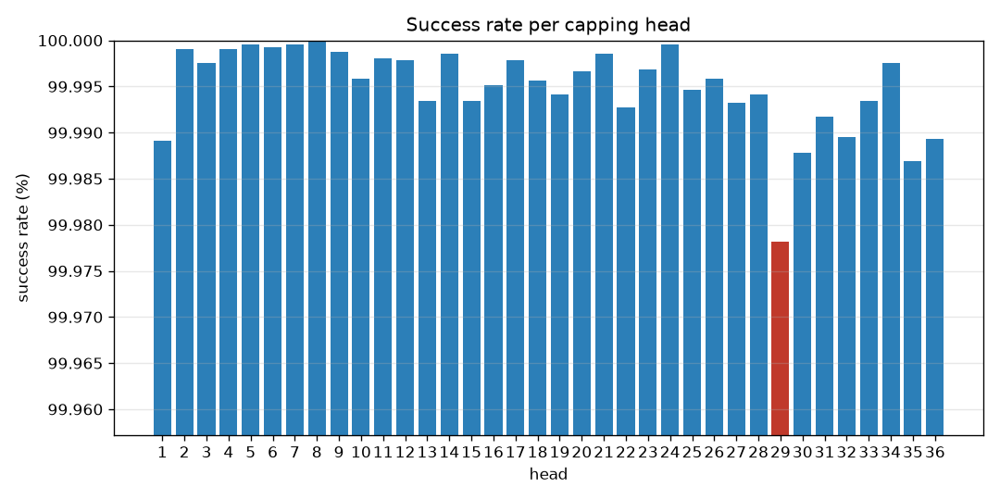
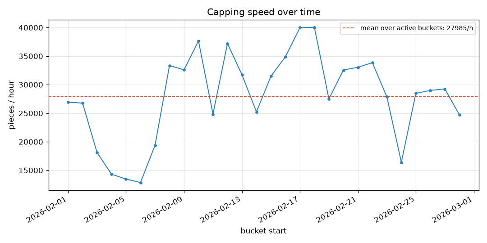

# Capping KPI report for 2026-02.

> **Stale.** The idle head-hours below predate `6e1b9be`, which stops a hole in
> the data from being counted as an idle run; they are an overstatement. See
> [`../README.md`](../README.md) for what changes on regeneration.

*Generated 2026-08-16T21:52:46Z — narrative source: template, plan source: router, model: none (deterministic template and router).*

## Goal

Capping KPI report for 2026-02.

## Data used

- Store: `events_3mo.duckdb`, machine `MCC`
- Store fingerprint: 55,132,433 rows, 36 heads, 2026-01-31 16:00:06 → 2026-04-30 16:59:59
- Torque band: 1.5–2.5 Nm; robust band k = 3.0; idle threshold 300s
- Rows scanned across all steps: 88,415,924

## Analyses executed

1. `overview(period='2026-02')` — Establish the scope: counts, heads, time range, data-quality flags. → **ok**
2. `success_rates(by='overall', period='2026-02')` — The headline KPI the brief asks for first. → **ok**
3. `success_rates(by='head', period='2026-02')` — Per-head breakdown, to name the weakest head. → **ok**
4. `capping_speed(bucket='day', period='2026-02')` — Production rate in pieces/hour, day by day. → **ok**
5. `idle_periods(period='2026-02')` — Sustained No-Load runs, to separate downtime from failure. → **ok**

## Findings

- **Scope.** 14,824,304 capping operations across 36 heads, from 2026-02-01 00:00:09 to 2026-02-28 23:59:59. 7,141,531 no-load cycles are excluded from every rate below.
- **Data quality.** 130 closures carry torque outside the configured band; 0 carry no torque reading at all.
- **Counter resets.** 145 reset markers in scope.
- **Success rate.** 99.9950% (14,817,976 successful, 748 rejected). Lowest head: 29. A further 5,580 closures carry no pass/fail verdict and are outside the rate.
- **Weakest head.** 29 at 99.9781% over 411,776 capping operations.
- **Throughput.** 27,984.7704 pieces/hour, averaged over 28 active buckets.
- **Idle time.** 22,459 sustained no-load periods, 11,551.3 head-hours in total.

### Success Rate Per Head

### Capping Speed

## Confidence and limits

- **No model was used to plan this report.** The tool calls below are a fixed plan; the numbers would be identical either way.
- `overview`: 21,971,506 rows scanned; filters: period=2026-02
- `success_rates`: 14,824,304 rows scanned; filters: app_torque > 0 (capping operations only)
- `success_rates`: 14,824,304 rows scanned; filters: app_torque > 0 (capping operations only)
- `capping_speed`: 14,824,304 rows scanned; filters: bucket=day, app_torque > 0 (only real caps produce pieces)
- `idle_periods`: 21,971,506 rows scanned; filters: min_seconds=300
- **Assumption.** a capping operation is a closure with torque > 0; no-load cycles (status 2, torque 0) are excluded from success denominators.
- **Assumption.** an idle period is a sustained run of no-load cycles (status 2.0, torque 0).
- **Assumption.** buckets with zero capping operations are never emitted, so a fully idle hour or day does not pull the mean down.
- **Assumption.** counts are rows, i.e. polls at which a head's counter advanced; a poll that caught up on several caps (delta > 1) counts once. Measured undercount on real data: 0.0017% of caps.
- **Assumption.** rate = closures / hours that actually saw a closure in the bucket, not / the bucket's calendar length; a day with 10 productive hours is not divided by 24.

## Next checks

- Confirm the configured torque band matches the product currently running on the line.
- Inspect head 29 mechanically before the next changeover.

## Tool-call trace

Every call this report is built from, in order. The full record is in
`trace.json` alongside this file.

| # | tool | arguments | status | rows scanned |
|---|---|---|---|---|
| 1 | `overview` | `period='2026-02'` | ok | 21,971,506 |
| 2 | `success_rates` | `by='overall', period='2026-02'` | ok | 14,824,304 |
| 3 | `success_rates` | `by='head', period='2026-02'` | ok | 14,824,304 |
| 4 | `capping_speed` | `bucket='day', period='2026-02'` | ok | 14,824,304 |
| 5 | `idle_periods` | `period='2026-02'` | ok | 21,971,506 |
