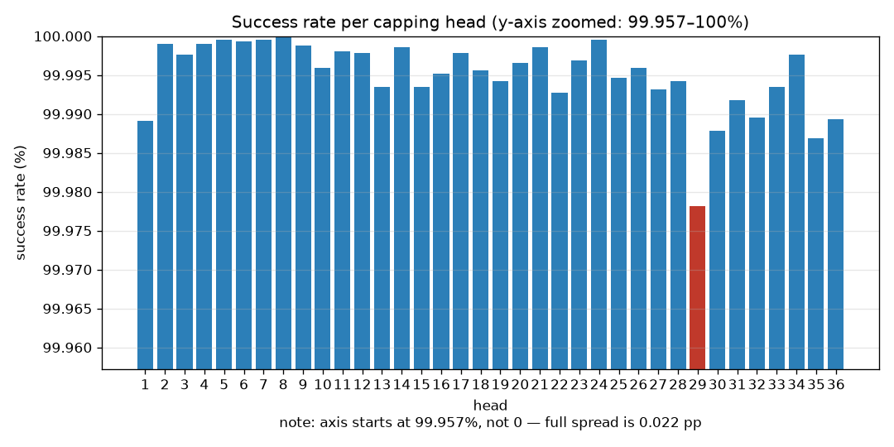
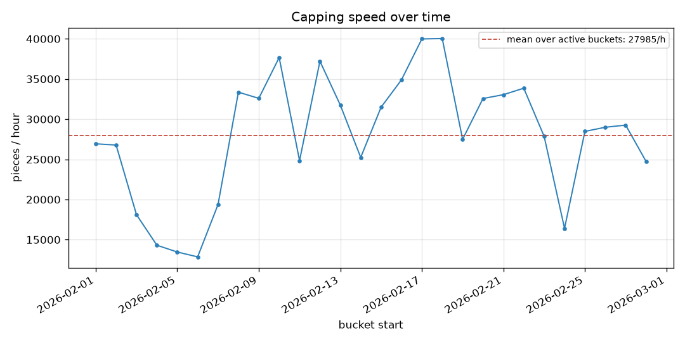

# Capping KPI report for 2026-02.

*Generated 2026-10-09T20:21:23Z — narrative source: template, plan source: router, model: none (deterministic template and router).*

## Goal

Capping KPI report for 2026-02.

## Data used

- Store: `events_3mo.duckdb`, machine `MCC`
- Store fingerprint: 55,132,433 rows, 36 heads, 2026-01-31 16:00:06 → 2026-04-30 16:59:59
- Torque band: 1.5–2.5 Nm; robust band k = 3.0; idle threshold 300s
- Rows scanned across all steps: 88,415,924

## Analyses executed

1. `overview(period='2026-02')` — Establish the scope: counts, heads, time range, data-quality flags. → **ok**
2. `success_rates(by='overall', period='2026-02')` — The headline KPI the brief asks for first. → **ok**
3. `success_rates(by='head', period='2026-02')` — Per-head breakdown, to name the weakest head. → **ok**
4. `capping_speed(bucket='day', period='2026-02')` — Production rate in pieces/hour, day by day. → **ok**
5. `idle_periods(period='2026-02')` — Sustained No-Load runs, to separate downtime from failure. → **ok**

## Findings

- **Scope.** 14,824,304 capping operations across 36 heads, from 2026-02-01 00:00:09 to 2026-02-28 23:59:59. 7,141,531 no-load cycles are excluded from every rate below.
- **Data quality.** 130 closures carry torque outside the configured band; 0 carry no torque reading at all.
- **Counter resets.** 145 reset markers in scope.
- **Success rate.** 99.9950% (14,817,976 successful, 748 rejected). Lowest head: 29. A further 5,580 closures carry no pass/fail verdict and are outside the rate.
- **Weakest head.** 29 at 99.9781% over 411,776 capping operations (90 rejected, 12.0% of all 748 rejects; the median head has 17). Median across 36 heads: 99.9959%; best: 8 at 100.0000%. Most rejects: head 29 (90), head 35 (54), head 30 (50).
- **Throughput.** 27,984.7704 pieces/hour, averaged over 28 active buckets.
- **Idle time.** 25,046 sustained no-load periods of at least 300s, 7,228.1 head-hours in total. This is heads cycling without a cap, not machine downtime. Longest: 3.6 h on head 32, 2026-02-06 18:35:57 to 2026-02-06 22:13:23. Per head the totals run from 199.1 h (head 2) to 202.4 h (head 13).

### Success rate per head (table)

| Head | Closures | Successful | Rejected | Success rate |
|---|---|---|---|---|
| 1 | 411,810 | 411,588 | 45 | 99.9891% |
| 2 | 411,903 | 411,743 | 4 | 99.9990% |
| 3 | 411,830 | 411,672 | 10 | 99.9976% |
| 4 | 411,726 | 411,568 | 4 | 99.9990% |
| 5 | 411,731 | 411,582 | 2 | 99.9995% |
| 6 | 411,716 | 411,568 | 3 | 99.9993% |
| 7 | 411,807 | 411,659 | 2 | 99.9995% |
| 8 | 411,718 | 411,562 | 0 | 100.0000% |
| 9 | 411,868 | 411,701 | 5 | 99.9988% |
| 10 | 411,888 | 411,732 | 17 | 99.9959% |
| 11 | 411,850 | 411,652 | 8 | 99.9981% |
| 12 | 411,769 | 411,601 | 9 | 99.9978% |
| 13 | 411,557 | 411,327 | 27 | 99.9934% |
| 14 | 411,633 | 411,449 | 6 | 99.9985% |
| 15 | 411,883 | 411,695 | 27 | 99.9934% |
| 16 | 411,771 | 411,582 | 20 | 99.9951% |
| 17 | 411,656 | 411,485 | 9 | 99.9978% |
| 18 | 411,853 | 411,690 | 18 | 99.9956% |
| 19 | 411,808 | 411,627 | 24 | 99.9942% |
| 20 | 411,861 | 411,691 | 14 | 99.9966% |
| 21 | 411,888 | 411,736 | 6 | 99.9985% |
| 22 | 411,871 | 411,674 | 30 | 99.9927% |
| 23 | 411,799 | 411,626 | 13 | 99.9968% |
| 24 | 411,722 | 411,565 | 2 | 99.9995% |
| 25 | 411,845 | 411,679 | 22 | 99.9947% |
| 26 | 411,781 | 411,622 | 17 | 99.9959% |
| 27 | 411,885 | 411,707 | 28 | 99.9932% |
| 28 | 411,831 | 411,681 | 24 | 99.9942% |
| 29 | 411,776 | 411,534 | 90 | 99.9781% |
| 30 | 411,752 | 411,558 | 50 | 99.9879% |
| 31 | 411,562 | 411,381 | 34 | 99.9917% |
| 32 | 411,568 | 411,374 | 43 | 99.9895% |
| 33 | 412,008 | 411,846 | 27 | 99.9934% |
| 34 | 411,806 | 411,651 | 10 | 99.9976% |
| 35 | 411,811 | 411,601 | 54 | 99.9869% |
| 36 | 411,761 | 411,567 | 44 | 99.9893% |

### Success Rate Per Head

### Capping Speed

## Confidence and limits

- **No model was used to plan this report.** The tool calls below are a fixed plan; the numbers would be identical either way.
- `overview`: 21,971,506 rows scanned; filters: period=2026-02
- `success_rates`: 14,824,304 rows scanned; filters: app_torque > 0 (capping operations only)
- `success_rates`: 14,824,304 rows scanned; filters: app_torque > 0 (capping operations only)
- `capping_speed`: 14,824,304 rows scanned; filters: bucket=day, app_torque > 0 (only real caps produce pieces)
- `idle_periods`: 21,971,506 rows scanned; filters: min_seconds=300
- **`overview` does not measure.** Not a rate or a trend: it counts the period as a whole, and says nothing about when within it anything happened.
- **`success_rates` does not measure.** Not why a closure was rejected, nor production volume: no-load cycles and closures without a verdict are outside the rate.
- **`capping_speed` does not measure.** Not downtime: hours with no closure are skipped, so the rate is how fast the machine ran while it ran.
- **`idle_periods` does not measure.** Not machine downtime: a stopped machine emits no events and cannot appear here (event_gaps measures that).
- **Assumption.** a capping operation is a closure with torque > 0; no-load cycles (status 2, torque 0) are excluded from success denominators.
- **Assumption.** a gap of more than 600s between no-load cycles ends the run: the store holds no rows for a stopped machine, so an unbounded run would report downtime as idling.
- **Assumption.** an idle period is a sustained run of no-load cycles (status 2.0, torque 0).
- **Assumption.** buckets with zero capping operations are never emitted, so a fully idle hour or day does not pull the mean down.
- **Assumption.** counts are rows, i.e. polls at which a head's counter advanced; a poll that caught up on several caps (delta > 1) counts once. Measured undercount on real data: 0.0017% of caps.
- **Assumption.** rate = closures / hours that actually saw a closure in the bucket, not / the bucket's calendar length; a day with 10 productive hours is not divided by 24.

## Next checks

- Confirm the configured torque band matches the product currently running on the line.
- Inspect head 29 mechanically before the next changeover.

## Tool-call trace

Every call this report is built from, in order. The full record is in
`trace.json` alongside this file.

| # | tool | arguments | status | rows scanned |
|---|---|---|---|---|
| 1 | `overview` | `period='2026-02'` | ok | 21,971,506 |
| 2 | `success_rates` | `by='overall', period='2026-02'` | ok | 14,824,304 |
| 3 | `success_rates` | `by='head', period='2026-02'` | ok | 14,824,304 |
| 4 | `capping_speed` | `bucket='day', period='2026-02'` | ok | 14,824,304 |
| 5 | `idle_periods` | `period='2026-02'` | ok | 21,971,506 |
