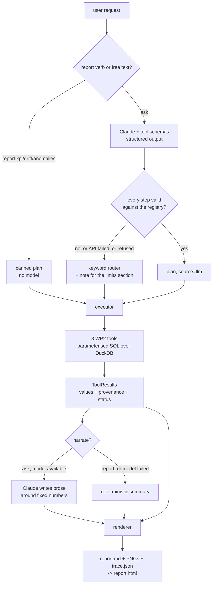

# Agent & BOT — Implementation Plan (Plan 7)

> **For agentic workers:** REQUIRED SUB-SKILL: Use superpowers:subagent-driven-development (recommended) or superpowers:executing-plans to implement this plan task-by-task. Steps use checkbox (`- [ ]`) syntax for tracking.

**Goal:** Build WP3 (report agent), WP4 (CLI/BOT), the three report templates with plots, and the end-to-end demo — so that the AROL brief's deliverables are complete and every number in every report still originates in Plan 6's deterministic SQL.

**Architecture:** A `analytics/agent/` package turns a user request into a *plan* (an ordered list of typed tool calls) and executes it in-process against Plan 6's eight WP2 tools. The plan comes from either a keyword router (no LLM, deterministic — this is what `report kpi|drift|anomalies` uses) or from Claude via a structured-output call (`arol ask`). A `analytics/report/` package renders the collected `ToolResult`s into a Markdown report following the brief's mandated `goal → data used → analyses executed → findings → confidence/limits → next checks` structure, with matplotlib PNGs alongside and a machine-readable tool-call trace appended. The LLM plans and narrates; it never computes a number.

**Tech Stack:** Python 3.12 (duckdb, pandas, numpy, matplotlib, markdown-it-py, anthropic, pytest), C++20 (existing core, one predicate change), DuckDB.

**Spec:** `docs/superpowers/specs/2026-07-11-agentic-analytics-reporting-design.md` — read §6 (report agent), §7 (CLI + config), §8 (error handling), §9 (reports and plots), §10 (testing) before starting. Plan 6 (`docs/superpowers/plans/2026-07-12-analytics-foundation.md`) defines the `ToolResult` contract this plan consumes.

**Brief:** `AROL-presentation-project-Q3.pdf` — slides 6 (closure-status table), 7 (WP3), 8 (WP4), 9 (WP5), 11 (deliverables), 13–15 (example queries).

## Global Constraints

- **Branch:** `feat/agent-and-bot`, branched from `main` after PR #5 merges. If PR #5 is still open, branch from `feat/agentic-analytics`.
- **The LLM never computes a number.** Every figure in every report comes from a `ToolResult.values` produced by `analytics/tools/*.py`. The model receives results and writes prose around them. A task that lets the model emit a statistic is a bug.
- **Tool errors are values, not exceptions (spec §8).** The executor converts *any* exception raised by a tool into `ToolResult.error(...)`. Nothing below the CLI is allowed to propagate an exception to the user.
- **No LLM in the `report` verbs.** `arol report kpi|drift|anomalies` run fixed plans with no network call. This is the reproducible demo path and the offline fallback.
- **Never hard-code paths, bands, thresholds, or the model ID (WP5).** Everything comes from `Config`.
- **Never hard-code 36 heads (spec §3.5).** Head count is discovered from the store.
- **Reports are committed deliverables**, not by-products. A report directory is self-contained: `report.md` + `*.png` + `trace.json`.
- **Python style:** match `python/analytics/tools/*.py` — module docstring explaining the *why*, stdlib-first, no classes where a function does.
- **Tests:** `cd python && ../.venv/bin/python -m pytest -q` must be green at every commit (90 tests at the start of this plan). C++ `cd build && ctest` must stay green (72 tests).
- **Commits:** conventional style, each ending with:
  `Co-Authored-By: Claude Opus 5 <noreply@anthropic.com>`
- **Anthropic API:** model, effort, and max_tokens come from config; defaults `claude-opus-5`, `effort="high"`, `max_tokens=16000`. Use `thinking={"type": "adaptive"}` explicitly. Never pass `temperature`, `top_p`, `top_k`, or `budget_tokens` — all return 400 on Claude Opus 5. No assistant prefill.

## Amendment to spec §11 (deliberate, flagged for approval)

Spec §11 scopes Plan 7 to "WP3 report agent (§6), WP4 CLI and config (§7), report templates, plots, sample reports, and the end-to-end demo (§9)." **Task 1 adds one item outside that scope: correcting the closure-status model to the bitmask the brief documents on slide 6.**

Rationale: every report prints a failed-closure count and a success rate. Spec §12 open question 4 records statuses 4 and 9 as "unknown", but slide 6 of the brief decodes them — the status byte is a bitmask (`bit0 = reject signal`, `bit1 = No Load`, `bit2 = No Closure`, `bit3 = No InTorque`, `bit4 = No CapTurns`, `bit5 = Following Error`, `bit6 = Bad Closure`), and the table's 14 rows are 7 conditions × reject/no-reject. Shipping reports built on `failed := status == 65` would print numbers we already know are under-counted, and would leave the toolkit unable to classify 10 of the brief's 14 documented codes on a dataset that happened to contain them.

Measured impact on the three-month store is small but real: 15 status-9 events (No InTorque + reject) currently counted as neither success nor failure, and 7 status-4 events (No Closure, no reject). If the reviewer prefers to keep §3.2 frozen, drop Task 1 and start at Task 2 — nothing downstream depends on it beyond the numbers in the sample reports.

## Deviation from spec §9 (deliberate)

Spec §9 says "Markdown is the source of truth; HTML and PDF are exports." This plan ships **Markdown → HTML** (Task 7), self-contained with plots inlined as base64 data URIs. **PDF is best-effort**: `--pdf` uses WeasyPrint if it is installed and prints an actionable message if not. WeasyPrint pulls native Cairo/Pango dependencies that would make `pip install -r requirements.txt` fail on a clean marker machine, and the brief's deliverable list says "Markdown/HTML/PDF export" with an "e.g." Document this in the README (Task 11).

## File Structure

| File | Change | Responsibility |
|---|---|---|
| `core/include/mas/domain/CapEvent.hpp` | modify | `is_fault_status` → reject-bit predicate; document the bitmask |
| `tests/test_cap_event.cpp` | modify | pin the bitmask semantics across all 14 documented codes |
| `python/analytics/status.py` | create | `REJECT_SQL`, `CONDITIONS`, `decode()` — the one place status bits are named |
| `python/analytics/config.py` | modify | drop `fault_status`; add agent/report fields |
| `python/analytics/tools/{overview,success,torque,anomaly,trend}.py` | modify | filter failures on the reject bit, not `status == 65` |
| `python/analytics/log.py` | create | `configure()` — WP5 logging, one place |
| `python/analytics/agent/__init__.py` | create | package marker |
| `python/analytics/agent/plan.py` | create | `PlanStep` / `Plan` types |
| `python/analytics/agent/registry.py` | create | tool registry: callable + JSON schema per tool, `validate_step()` |
| `python/analytics/agent/router.py` | create | keyword → canned plan (no LLM) |
| `python/analytics/agent/executor.py` | create | run a `Plan` → results + trace; converts every exception to a value |
| `python/analytics/agent/planner.py` | create | Claude structured-output → `Plan`, falls back to router |
| `python/analytics/agent/narrator.py` | create | Claude prose around fixed numbers, falls back to a template |
| `python/analytics/report/__init__.py` | create | package marker |
| `python/analytics/report/plots.py` | create | matplotlib PNGs from `ToolResult`s |
| `python/analytics/report/render.py` | create | Markdown per spec §6.1 + trace appendix |
| `python/analytics/report/export.py` | create | Markdown → self-contained HTML; optional PDF |
| `python/analytics/cli.py` | create | `report kpi\|drift\|anomalies`, `ask` |
| `scripts/arol` | create | shell wrapper so the brief's `arol report kpi` works verbatim |
| `python/requirements.txt` | modify | add `anthropic`, `markdown-it-py` |
| `python/tests/test_status.py` | create | bitmask decoder |
| `python/tests/test_registry.py` | create | registry ↔ toolkit consistency |
| `python/tests/test_router.py` | create | keyword routing + canned plans |
| `python/tests/test_executor.py` | create | errors-as-values, trace shape |
| `python/tests/test_plots.py` | create | plot functions on degenerate input |
| `python/tests/test_render.py` | create | golden-file report |
| `python/tests/test_export.py` | create | HTML self-containment |
| `python/tests/test_planner.py` | create | mocked LLM: valid plan, hallucinated tool, no API key |
| `python/tests/test_narrator.py` | create | mocked LLM + fallback |
| `python/tests/test_cli.py` | create | end-to-end on `tiny_store` |
| `python/tests/regen_golden.py` | create | deliberate golden regeneration (never run by a test) |
| `python/tests/fixtures/golden_kpi_report.md` | create | golden report |
| `docs/reports/` | create | committed sample reports (Task 11) |
| `docs/analytics-methods.md` | create | brief deliverable: analytics methods |
| `docs/agent-decision-flow.md` | create | brief deliverable: agent decision flow |
| `docs/presentation/outline.md` | create | brief deliverable: 13-slide final presentation outline |
| `docs/validation-log.md` | modify | Plan 7 real-data run |
| `README.md` | modify | build/run for the CLI, reports, and the demo |
| `docs/superpowers/specs/2026-07-11-agentic-analytics-reporting-design.md` | modify | reconcile §3.2, §9, §12 |

---

### Task 1: Correct the closure-status model to the brief's bitmask

The brief's slide-6 table is a bitmask, not an enum. Fixing it here means every downstream report counts failures the way AROL's own documentation defines them, and it closes spec §12 open question 4.

**Files:**
- Create: `python/analytics/status.py`
- Create: `python/tests/test_status.py`
- Modify: `python/analytics/config.py`
- Modify: `python/analytics/tools/overview.py`, `success.py`, `torque.py`, `anomaly.py`, `trend.py`
- Modify: `core/include/mas/domain/CapEvent.hpp`
- Modify: `tests/test_cap_event.cpp`
- Modify: `python/tests/conftest.py`

**Interfaces:**
- Consumes: `Config` (Plan 6, Task 2), `ToolResult` (Plan 6, Task 3).
- Produces:
  - `analytics.status.REJECT_SQL: str` — `"CAST(status AS BIGINT) % 2 = 1"`, spliced into WHERE clauses (a constant, never user input).
  - `analytics.status.CONDITIONS: dict[int, str]` — bit value → condition name.
  - `analytics.status.decode(status: float) -> dict` — `{"reject": bool, "conditions": list[str]}`.
  - `Config` **loses** `fault_status`. Every later task reads failures through `REJECT_SQL`.

- [ ] **Step 1: Write the failing test for the decoder**

Create `python/tests/test_status.py`:

```python
"""The status byte is a bitmask, per the brief's slide-6 table.

The table's 14 rows are 7 conditions x reject/no-reject, and bit 0 is the reject
signal. This is what lets us classify the statuses the three-month store actually
carries (0, 2, 4, 9, 65) instead of treating 4 and 9 as unknown.
"""
from analytics.status import CONDITIONS, decode


def test_zero_is_a_clean_closure():
    assert decode(0.0) == {"reject": False, "conditions": []}


def test_two_is_no_load_without_reject():
    assert decode(2.0) == {"reject": False, "conditions": ["No Load"]}


def test_three_is_no_load_with_reject():
    assert decode(3.0) == {"reject": True, "conditions": ["No Load"]}


def test_sixty_five_is_bad_closure_with_reject():
    assert decode(65.0) == {"reject": True, "conditions": ["Bad Closure"]}


def test_nine_is_no_intorque_with_reject():
    # 15 of these exist in the three-month store; spec 12 called them "unknown".
    assert decode(9.0) == {"reject": True, "conditions": ["No InTorque"]}


def test_four_is_no_closure_without_reject():
    assert decode(4.0) == {"reject": False, "conditions": ["No Closure"]}


def test_every_row_of_the_brief_table_decodes():
    # The brief lists 7 conditions; each appears with and without the reject bit.
    for bit, name in CONDITIONS.items():
        assert decode(float(bit)) == {"reject": False, "conditions": [name]}
        assert decode(float(bit | 1)) == {"reject": True, "conditions": [name]}


def test_multiple_conditions_are_all_reported():
    # 2 | 64 | 1 = No Load + Bad Closure, rejected.
    assert decode(67.0) == {"reject": True,
                            "conditions": ["No Load", "Bad Closure"]}
```

- [ ] **Step 2: Run it to confirm it fails**

Run: `cd python && ../.venv/bin/python -m pytest tests/test_status.py -q`
Expected: FAIL with `ModuleNotFoundError: No module named 'analytics.status'`

- [ ] **Step 3: Write the decoder**

Create `python/analytics/status.py`:

```python
"""Closure-status decoding, per the brief's slide-6 table.

The table is a bitmask, not an enum: its 14 rows are 7 error conditions crossed
with a reject signal. Bit 0 is that reject signal, which is why every "Reject
Signal = YES" row has an odd status. Reading it as a flat enum is what left
statuses 4 and 9 unexplained in the three-month store (spec 12, OQ4).

    bit 0 (1)  reject signal
    bit 1 (2)  No Load          - first torque threshold not reached (SlowTorque)
    bit 2 (4)  No Closure       - final torque threshold not reached (ClosureTorque)
    bit 3 (8)  No InTorque      - head raised before TimeInTorque elapsed
    bit 4 (16) No CapTurns      - cap closed with fewer degrees than CapTurns
    bit 5 (32) Following Error  - tracking error between real and controlled position
    bit 6 (64) Bad Closure      - ClosureTorque reached but cap still rotating

A *failed* capping operation is one whose reject bit is set. That is AROL's own
definition of a reject, and it is broader than the old `status == 65`: it also
catches 3, 5, 9, 17, and 33.
"""

# Bit value -> condition name, in bit order.
CONDITIONS = {
    2: "No Load",
    4: "No Closure",
    8: "No InTorque",
    16: "No CapTurns",
    32: "Following Error",
    64: "Bad Closure",
}

# A constant, spliced into WHERE clauses. Never built from user input.
REJECT_SQL = "CAST(status AS BIGINT) % 2 = 1"


def decode(status):
    """Split a status byte into its reject flag and its condition names."""
    bits = int(status)
    return {
        "reject": bool(bits & 1),
        "conditions": [name for bit, name in CONDITIONS.items() if bits & bit],
    }
```

- [ ] **Step 4: Run the test to confirm it passes**

Run: `cd python && ../.venv/bin/python -m pytest tests/test_status.py -q`
Expected: PASS, 8 tests.

- [ ] **Step 5: Drop `fault_status` from Config**

In `python/analytics/config.py`, delete the `fault_status` field and extend the docstring. Replace:

```python
    # Status semantics, measured at closure (spec §3.1).
    success_status: float = 0.0    # + torque > 0  -> a real cap
    no_load_status: float = 2.0    # + torque == 0 -> No-Load cycle
    fault_status: float = 65.0
```

with:

```python
    # Status semantics. A clean closure is status 0; a No-Load cycle is status 2
    # with zero torque. A *failure* is not a single code -- it is any status whose
    # reject bit is set (analytics.status.REJECT_SQL), per the brief's slide-6
    # bitmask. `fault_status` was removed in Plan 7: `status == 65` named only one
    # of the six documented reject codes.
    success_status: float = 0.0    # + torque > 0  -> a real cap
    no_load_status: float = 2.0    # + torque == 0 -> No-Load cycle
```

Config already rejects unknown keys, so an old config file carrying `fault_status` now fails loudly at startup with the list of known keys — which is the behaviour we want.

- [ ] **Step 6: Switch the five tools to the reject predicate**

**All five files need `from analytics.status import REJECT_SQL` added to their
imports** (`anomaly.py` additionally needs `decode`). Each query below becomes an
f-string if it was not one already.

`python/analytics/tools/overview.py` — in the `SELECT`, replace
`COUNT(*) FILTER (WHERE status = ?)                          AS failed,`
with
`COUNT(*) FILTER (WHERE {REJECT_SQL})                        AS failed,`
using an f-string, and drop `cfg.fault_status` from the params list so it reads
`[cfg.success_status, cfg.no_load_status, cfg.torque_min, cfg.torque_max] + params`.
Add `from analytics.status import REJECT_SQL` to the imports.

`python/analytics/tools/success.py` — replace the `select` block and `sem`:

```python
    con = connect(cfg)
    where, params = scope_clause(cfg, period)
    sem = [cfg.success_status]

    # Only closures WITH load are capping operations (spec §3.2). A failure is any
    # closure whose reject bit is set (brief slide 6), not just status 65.
    select = f"""
        COUNT(*)                                  AS total,
        COUNT(*) FILTER (WHERE status = ?)        AS successful,
        COUNT(*) FILTER (WHERE {REJECT_SQL})      AS failed
    """
```

Add the import. The `_success_rate` docstring should now read "a capping operation whose status is neither 0 nor a reject (real data carries status 2 with torque, and status 4) is not a pass/fail verdict".

`python/analytics/tools/torque.py` — replace the `outcome == "failed"` branch:

```python
    cond, sem = "app_torque > 0", []
    if outcome == "successful":
        cond, sem = "app_torque > 0 AND status = ?", [cfg.success_status]
    elif outcome == "failed":
        cond, sem = REJECT_SQL, []
```

`python/analytics/tools/anomaly.py` — replace the `faults` query:

```python
    faults = [
        {"head_id": int(r[0]), "ts": r[1], "app_torque": r[2],
         "reason": "reject: " + ", ".join(decode(r[3])["conditions"] or ["unspecified"])}
        for r in con.execute(
            f"""SELECT head_id, ts, app_torque, status FROM cap_events
                WHERE {REJECT_SQL} AND {where} ORDER BY ts, cap_seq""",
            params,
        ).fetchall()
    ]
```

with `from analytics.status import REJECT_SQL, decode`. The reason string now names the condition, which is what the anomaly report prints.

`python/analytics/tools/trend.py` — replace the `success_rate` expression and `sem`:

```python
    expr = ("AVG(app_torque)" if signal == "torque"
            else "COUNT(*) FILTER (WHERE status = ?) * 1.0 "
                 f"/ NULLIF(COUNT(*) FILTER (WHERE status = ? OR {REJECT_SQL}), 0)")
    sem = ([] if signal == "torque"
           else [cfg.success_status, cfg.success_status])
```

- [ ] **Step 7: Extend the fixture so a reject that is not 65 exists**

In `python/tests/conftest.py`, add one row to `ROWS` and update the docstring:

```python
    ("MCC", 2, "2026-02-01 00:00:40", 3, 1.95, 9.0),    # reject: No InTorque
```

and change the header comment for head 2 to `Head 2: 1 successful, 2 rejects (status 65 Bad Closure, status 9 No InTorque)`. Also change the `is_fault` insert expression from `st == 65.0` to `int(st) % 2 == 1` so the stored column matches the new predicate.

- [ ] **Step 8: Run the full Python suite and fix the expectation drift**

> **Authorised deviation.** Plan 6's progress ledger carries the invariant
> "tiny_store must not change: 7 later tasks pin counts to it". That invariant
> protected Plan 6's in-flight tasks; Plan 6 is complete and the human explicitly
> approved changing the shared fixture here (2026-07-25) so that every tool's
> tests exercise a reject that is not status 65.

Run: `cd python && ../.venv/bin/python -m pytest -q`
Expected: failures in `test_overview.py`, `test_success.py`, `test_torque.py`, `test_anomaly.py`, `test_trend.py` — each because head 2 now has 2 rejects rather than 1.

Expected new values, derived from the fixture's rows (head 1: 3 successful; head 2: 1 successful + status 65 + status 9; head 3: 2 no-load):

| test file | expectation | before | after |
|---|---|---|---|
| `test_overview.py` | `failed` | 1 | 2 |
| `test_success.py` | head 2 `success_rate` | 1/2 | 1/3 |
| `test_success.py` | overall `success_rate` | 3/4 | 4/6 |
| `test_torque.py` | `outcome="failed"` `n` | 1 | 2 |
| `test_anomaly.py` | `counts["faults"]` | 1 | 2 |
| `test_trend.py` | head 2 `success_rate` | 0.5 | 1/3 |

**Recompute every changed number from the fixture rows by hand and show the arithmetic in your report.** Do not relax an assertion (no `>=`, no `pytest.approx` widening, no deleted assert) to make a test pass — if a number does not match the table above, the production change is wrong, not the test. Report any expectation that drifted which is *not* in this table; that is a signal the predicate change reached further than intended.

Re-run until green.

- [ ] **Step 9: Correct the C++ predicate**

In `core/include/mas/domain/CapEvent.hpp`, replace `is_fault_status` and its comment:

```cpp
// AROL Equatorque closure status, per the brief's slide-6 table: a bitmask, not
// an enum. Bit 0 is the reject signal; bits 1..6 are the error conditions
// (No Load, No Closure, No InTorque, No CapTurns, Following Error, Bad Closure).
// The table's 14 rows are those 6 conditions plus "Closure OK", each with and
// without the reject bit.
//
// Measured over 2026-02-01 (765,711 closures), and confirmed across the full
// three-month store:
//   status 0,  torque > 0   -> real capping operation, with load
//   status 2,  torque == 0  -> "No Load" cycle: counter advances, no cap applied
//   status 65, torque > 0   -> Bad Closure, rejected
//   status 9,  torque > 0   -> No InTorque, rejected
//   status 4,  torque >= 0  -> No Closure, not rejected
inline bool is_reject(double status) {
    return (static_cast<long long>(status) % 2) == 1;
}
```

Keep `is_successful_cap` and `is_no_load` unchanged. Then update every call site of `is_fault_status` (grep the tree: `Pipeline.cpp`, `CapEventExtractor.cpp`) to `is_reject`.

- [ ] **Step 10: Pin the C++ semantics**

In `tests/test_cap_event.cpp`, add:

```cpp
TEST(CapEvent, RejectBitIsBitZeroNotStatus65) {
    // Every "Reject Signal = YES" row of the brief's table has an odd status.
    for (double s : {3.0, 5.0, 9.0, 17.0, 33.0, 65.0}) {
        EXPECT_TRUE(mas::is_reject(s)) << "status " << s;
    }
    // Every "NO" row is even.
    for (double s : {0.0, 2.0, 4.0, 8.0, 16.0, 32.0, 64.0}) {
        EXPECT_FALSE(mas::is_reject(s)) << "status " << s;
    }
}
```

- [ ] **Step 11: Rebuild and run both suites**

Run:
```bash
cd build && cmake --build . -j8 && ctest --output-on-failure
cd ../python && ../.venv/bin/python -m pytest -q
```
Expected: C++ 73 tests pass, Python 97 pass (90 + 8 new − 1 renamed).

- [ ] **Step 12: Commit**

```bash
git add python/analytics/status.py python/analytics/config.py \
        python/analytics/tools/ python/tests/ \
        core/include/mas/domain/CapEvent.hpp core/src tests/test_cap_event.cpp
git commit -m "fix(semantics): closure status is a bitmask, per the brief's slide-6 table

A failure is any status whose reject bit (bit 0) is set, not just status 65.
This resolves spec §12 OQ4: statuses 4 and 9 were never unknown -- the brief
documents them as No Closure and No InTorque. Recovers 15 rejected closures the
old predicate silently excluded from the success-rate denominator.

Co-Authored-By: Claude Opus 5 <noreply@anthropic.com>"
```

---

### Task 2: Tool registry — the one contract the agent and the CLI share

The registry is what makes "the agent physically cannot call a tool that does not exist" true. The same entries generate the LLM's schema, validate its output, and dispatch the call.

**Files:**
- Create: `python/analytics/agent/__init__.py`, `python/analytics/agent/plan.py`, `python/analytics/agent/registry.py`
- Create: `python/tests/test_registry.py`

**Interfaces:**
- Consumes: the eight tool functions from `analytics.tools.*`.
- Produces:
  - `PlanStep(tool: str, args: dict, rationale: str)` and `Plan(goal: str, steps: list, source: str, note: str)`, both frozen dataclasses.
  - `registry.TOOLS: dict[str, ToolSpec]` where `ToolSpec` has `.name`, `.fn`, `.description`, `.params` (name → JSON-schema fragment).
  - `registry.tool_schemas() -> list[dict]` — Anthropic tool definitions.
  - `registry.plan_json_schema() -> dict` — the structured-output schema Task 8 uses.
  - `registry.validate_step(step) -> str | None` — `None` if valid, else a human-readable reason.

- [ ] **Step 1: Write the failing test**

Create `python/tests/test_registry.py`:

```python
"""The registry is the load-bearing interface: WP2 and WP3 cannot drift apart.

If a tool exists in analytics.tools but not here, the agent can never call it.
If it exists here with the wrong signature, the executor blows up at run time
instead of at import time. Both are pinned below.
"""
import inspect

import pytest

from analytics.agent import registry
from analytics.agent.plan import PlanStep


def test_every_wp2_tool_is_registered():
    assert set(registry.TOOLS) == {
        "overview", "success_rates", "torque_stats", "capping_speed",
        "idle_periods", "anomalies", "trend", "head_correlation",
    }


def test_every_registered_param_exists_on_the_callable():
    for name, spec in registry.TOOLS.items():
        sig = inspect.signature(spec.fn)
        for param in spec.params:
            assert param in sig.parameters, f"{name}.{param} is not a real argument"


def test_every_optional_callable_arg_is_registered():
    # cfg is positional and supplied by the executor; everything else the agent
    # may set must be describable, or the agent can never reach it.
    for name, spec in registry.TOOLS.items():
        sig = inspect.signature(spec.fn)
        settable = [p for p in sig.parameters if p != "cfg"]
        assert set(settable) == set(spec.params), f"{name} params drifted"


def test_tool_schemas_are_well_formed():
    schemas = registry.tool_schemas()
    assert len(schemas) == len(registry.TOOLS)
    for s in schemas:
        assert s["name"] in registry.TOOLS
        assert s["description"]
        assert s["input_schema"]["type"] == "object"
        assert s["input_schema"]["additionalProperties"] is False


def test_validate_step_accepts_a_good_step():
    step = PlanStep(tool="success_rates", args={"by": "head"}, rationale="per-head KPI")
    assert registry.validate_step(step) is None


def test_validate_step_rejects_an_unknown_tool():
    step = PlanStep(tool="predict_the_future", args={}, rationale="")
    reason = registry.validate_step(step)
    assert reason is not None and "predict_the_future" in reason


def test_validate_step_rejects_an_unknown_argument():
    step = PlanStep(tool="overview", args={"by": "head"}, rationale="")
    reason = registry.validate_step(step)
    assert reason is not None and "by" in reason


def test_validate_step_rejects_a_bad_enum_value():
    step = PlanStep(tool="success_rates", args={"by": "sideways"}, rationale="")
    reason = registry.validate_step(step)
    assert reason is not None and "sideways" in reason


def test_plan_json_schema_lists_every_tool_in_its_enum():
    schema = registry.plan_json_schema()
    enum = schema["properties"]["steps"]["items"]["properties"]["tool"]["enum"]
    assert set(enum) == set(registry.TOOLS)


def test_plan_schema_unions_enums_that_clash_across_tools():
    # `by` means head|day|overall to success_rates, head to torque_stats, and
    # day|hour to trend/head_correlation. If the flat schema let one tool win,
    # the model could never legally emit the KPI report's success_rates(by="head").
    args = (registry.plan_json_schema()["properties"]["steps"]["items"]
            ["properties"]["args"]["properties"])
    assert set(args["by"]["enum"]) == {"head", "day", "overall", "hour", None}


def test_plan_schema_requires_every_argument_key():
    # Structured outputs need a closed object: every property must be required,
    # which is why the model emits explicit nulls and the executor drops them.
    items = registry.plan_json_schema()["properties"]["steps"]["items"]
    args = items["properties"]["args"]
    assert set(args["required"]) == set(args["properties"])
    assert args["additionalProperties"] is False


def test_strict_validation_still_rejects_a_value_the_union_allows():
    # The permissive schema is not the gate -- validate_step is.
    step = PlanStep(tool="success_rates", args={"by": "hour"}, rationale="")
    assert registry.validate_step(step) is not None
```

- [ ] **Step 2: Run it to confirm it fails**

Run: `cd python && ../.venv/bin/python -m pytest tests/test_registry.py -q`
Expected: FAIL with `ModuleNotFoundError: No module named 'analytics.agent'`

- [ ] **Step 3: Write the plan types**

Create `python/analytics/agent/__init__.py`:

```python
"""WP3: the report agent. Plans tool calls, executes them, narrates the results.

The rule that makes this tier safe is one sentence long: the model plans and
narrates, and never computes. Every number it writes about was produced by a WP2
tool and is carried, unaltered, through the plan -> execute -> render pipeline.
"""
```

Create `python/analytics/agent/plan.py`:

```python
"""What the agent decides, before anything is executed.

A Plan is data, not behaviour: it can come from the keyword router or from the
model, it can be printed, logged, diffed in a test, and replayed. That is what
makes `arol report kpi` reproducible and `arol ask` auditable.
"""
from dataclasses import dataclass, field


@dataclass(frozen=True)
class PlanStep:
    tool: str
    args: dict = field(default_factory=dict)
    rationale: str = ""


@dataclass(frozen=True)
class Plan:
    goal: str
    steps: list = field(default_factory=list)
    source: str = "router"   # "router" | "llm"
    note: str = ""           # why the router was used, if it was
```

- [ ] **Step 4: Write the registry**

Create `python/analytics/agent/registry.py`:

```python
"""The tool contract, in one place.

The same entries do three jobs: they generate the schema the model plans against,
they validate what it plans, and they dispatch the call. That is deliberate -- a
tool the model can name is by construction a tool that exists with those exact
arguments, and adding a WP2 tool without registering it fails a test rather than
silently making it unreachable.
"""
from dataclasses import dataclass

from analytics.tools.anomaly import anomalies
from analytics.tools.correlation import head_correlation
from analytics.tools.idle import idle_periods
from analytics.tools.overview import overview
from analytics.tools.speed import capping_speed
from analytics.tools.success import success_rates
from analytics.tools.torque import torque_stats
from analytics.tools.trend import trend

_PERIOD = {
    "type": ["string", "null"],
    "description": "'YYYY-MM', or 'YYYY-MM..YYYY-MM' for a range. null = whole store.",
}


def _enum(values, description, nullable=True):
    return {
        "type": ["string", "null"] if nullable else "string",
        "enum": list(values) + ([None] if nullable else []),
        "description": description,
    }


@dataclass(frozen=True)
class ToolSpec:
    name: str
    fn: object
    description: str
    params: dict          # param name -> JSON-schema fragment


TOOLS = {
    spec.name: spec
    for spec in [
        ToolSpec(
            "overview", overview,
            "Dataset exploration and WP1 validation: how many capping operations, "
            "how many succeeded/failed/no-load, which heads fired, the time range "
            "covered, and counts of null torque, out-of-band torque, and counter resets.",
            {"period": _PERIOD},
        ),
        ToolSpec(
            "success_rates", success_rates,
            "Success rate = successful / (successful + failed), grouped per head, "
            "per day, or overall. Answers 'what percentage succeeded', 'which head "
            "is lowest', 'show a daily breakdown'.",
            {"period": _PERIOD,
             "by": _enum(["head", "day", "overall"], "grouping; default 'head'")},
        ),
        ToolSpec(
            "torque_stats", torque_stats,
            "Closing-torque statistics (n, mean, min, max, stddev, median) for "
            "successful, failed, or all closures, optionally per head. Answers "
            "'average torque', 'distribution', 'which head is most variable'.",
            {"period": _PERIOD,
             "outcome": _enum(["successful", "failed", "all"],
                              "which closures to measure; default 'successful'"),
             "by": _enum(["head"], "set to 'head' for per-head breakdown; null = overall")},
        ),
        ToolSpec(
            "capping_speed", capping_speed,
            "Production rate in pieces/hour, bucketed by hour or day, plus the mean "
            "over active buckets. Answers 'how fast is the machine running'.",
            {"period": _PERIOD,
             "bucket": _enum(["hour", "day"], "bucket size; default 'hour'")},
        ),
        ToolSpec(
            "idle_periods", idle_periods,
            "Machine idle state: sustained runs of No-Load cycles per head, longer "
            "than a threshold. Answers 'when was the machine idle', 'how much idle time'.",
            {"period": _PERIOD,
             "min_seconds": {"type": ["integer", "null"],
                             "description": "minimum run length in seconds; null = config default"}},
        ),
        ToolSpec(
            "anomalies", anomalies,
            "Deterministic anomaly detection: rejected closures, torque outside the "
            "configured operating band, and per-head robust deviation (median +/- k*MAD). "
            "Answers 'any torque outside the expected range', 'abnormal intervals'.",
            {"period": _PERIOD,
             "method": _enum(["threshold", "deviation", "both"],
                             "detection method; default 'both'")},
        ),
        ToolSpec(
            "trend", trend,
            "Moving averages and drift detection on a per-head time series. Signal is "
            "torque or success_rate; drift is Mann-Kendall tau. Answers 'did torque "
            "change over the month', 'how did success evolve', 'which head is drifting'.",
            {"period": _PERIOD,
             "signal": _enum(["torque", "success_rate"], "series to analyse; default 'torque'"),
             "by": _enum(["day", "hour"], "bucket size; default 'day'"),
             "window": {"type": ["integer", "null"],
                        "description": "rolling window in buckets; null = 7"}},
        ),
        ToolSpec(
            "head_correlation", head_correlation,
            "Pairwise correlation of per-head bucketed torque series, plus a ranking "
            "of heads by mean correlation to their peers. Answers 'compare head 1 and "
            "head 5', 'which head behaves differently from the others'.",
            {"period": _PERIOD,
             "heads": {"type": ["array", "null"], "items": {"type": "integer"},
                       "description": "heads to compare; null = every head in the store"},
             "by": _enum(["day", "hour"], "bucket size; default 'day'")},
        ),
    ]
}

def _merge_params(specs):
    """Union every tool's arguments into one flat schema for the plan.

    Structured outputs need a single closed object, but several tools share an
    argument NAME with a different set of legal values -- `by` is
    head|day|overall for success_rates, head for torque_stats, and day|hour for
    trend and head_correlation. A plain dict update would let the last tool win
    and make `by="head"` structurally unemittable, so the enums are UNIONED here.

    That makes the schema deliberately permissive: it constrains shape, not
    per-tool legality. `validate_step()` is the strict gate -- it checks each
    argument against the enum of the tool actually named, so a model that plans
    success_rates(by="hour") is rejected there and the request falls back to the
    router. Schema permissive, validation strict; never the other way round.
    """
    merged = {}
    for spec in specs:
        for name, schema in spec.params.items():
            if name not in merged:
                merged[name] = dict(schema)
                continue
            known, incoming = merged[name].get("enum"), schema.get("enum")
            if known and incoming:
                # Preserve order, drop duplicates, keep None last.
                values = [v for v in known if v is not None]
                values += [v for v in incoming if v is not None and v not in values]
                merged[name]["enum"] = values + [None]
                merged[name]["description"] = "varies by tool; see the tool list"
    return merged


# Every argument any tool accepts, unioned. The executor drops nulls; the
# registry rejects arguments and values the named tool does not accept.
_ALL_ARGS = _merge_params(TOOLS.values())


def tool_schemas():
    """Anthropic tool definitions, one per WP2 tool."""
    return [
        {
            "name": spec.name,
            "description": spec.description,
            "input_schema": {
                "type": "object",
                "properties": dict(spec.params),
                "required": [],
                "additionalProperties": False,
            },
        }
        for spec in TOOLS.values()
    ]


def plan_json_schema():
    """The structured-output schema the planner constrains the model to."""
    return {
        "type": "object",
        "properties": {
            "goal": {
                "type": "string",
                "description": "One sentence restating what the user asked for.",
            },
            "steps": {
                "type": "array",
                "description": "Tool calls to run, in order.",
                "items": {
                    "type": "object",
                    "properties": {
                        "tool": {"type": "string", "enum": sorted(TOOLS)},
                        "args": {
                            "type": "object",
                            "properties": dict(_ALL_ARGS),
                            "required": sorted(_ALL_ARGS),
                            "additionalProperties": False,
                        },
                        "rationale": {
                            "type": "string",
                            "description": "One line: why this call answers the question.",
                        },
                    },
                    "required": ["tool", "args", "rationale"],
                    "additionalProperties": False,
                },
            },
        },
        "required": ["goal", "steps"],
        "additionalProperties": False,
    }


def validate_step(step):
    """None if the step is callable as written, else why it is not."""
    spec = TOOLS.get(step.tool)
    if spec is None:
        return f"unknown tool {step.tool!r}; known tools: {sorted(TOOLS)}"
    for key, value in step.args.items():
        if key not in spec.params:
            return (f"tool {step.tool!r} takes no argument {key!r}; "
                    f"it accepts {sorted(spec.params)}")
        allowed = spec.params[key].get("enum")
        if allowed is not None and value not in allowed:
            return (f"{step.tool}.{key} must be one of "
                    f"{[a for a in allowed if a is not None]}, got {value!r}")
    return None
```

- [ ] **Step 5: Run the test to confirm it passes**

Run: `cd python && ../.venv/bin/python -m pytest tests/test_registry.py -q`
Expected: PASS, 9 tests.

- [ ] **Step 6: Commit**

```bash
git add python/analytics/agent/ python/tests/test_registry.py
git commit -m "feat(agent): tool registry -- the contract WP2 and WP3 share

One dict generates the model's schema, validates its output, and dispatches the
call, so a tool the agent can name is by construction a tool that exists with
those exact arguments.

Co-Authored-By: Claude Opus 5 <noreply@anthropic.com>"
```

---

### Task 3: Keyword router and the three canned plans

This is what `report kpi|drift|anomalies` actually runs, and what `ask` degrades to when the model is unavailable. No network, no model, fully deterministic.

**Files:**
- Create: `python/analytics/agent/router.py`
- Create: `python/tests/test_router.py`

**Interfaces:**
- Consumes: `Plan`, `PlanStep` (Task 2).
- Produces:
  - `router.REPORT_TYPES: tuple` — `("kpi", "drift", "anomalies")`.
  - `router.canned_plan(report_type: str, period) -> Plan` — raises `ValueError` on an unknown type (a CLI-argument error, caught at the boundary, not a tool error).
  - `router.route(question: str, period) -> Plan` — keyword-scores the question, returns the nearest canned plan with `source="router"` and a populated `note`.

- [ ] **Step 1: Write the failing test**

Create `python/tests/test_router.py`:

```python
"""The router is the offline fallback and the reproducible demo path.

Its plans are what `report kpi|drift|anomalies` run, so they are pinned exactly:
a change here changes a committed deliverable.
"""
import pytest

from analytics.agent import router


def test_kpi_plan_is_pinned():
    plan = router.canned_plan("kpi", "2026-02")
    assert [s.tool for s in plan.steps] == [
        "overview", "success_rates", "success_rates", "capping_speed", "idle_periods",
    ]
    assert plan.steps[1].args["by"] == "overall"
    assert plan.steps[2].args["by"] == "head"
    assert all(s.args["period"] == "2026-02" for s in plan.steps)
    assert plan.source == "router"


def test_drift_plan_is_pinned():
    plan = router.canned_plan("drift", "2026-02..2026-04")
    assert [s.tool for s in plan.steps] == [
        "trend", "trend", "torque_stats", "head_correlation",
    ]
    assert plan.steps[0].args["signal"] == "torque"
    assert plan.steps[1].args["signal"] == "success_rate"


def test_anomaly_plan_is_pinned():
    plan = router.canned_plan("anomalies", None)
    assert [s.tool for s in plan.steps] == ["anomalies", "overview", "success_rates"]
    assert plan.steps[0].args["method"] == "both"
    assert all(s.args["period"] is None for s in plan.steps)


def test_every_step_of_every_canned_plan_validates():
    from analytics.agent import registry
    for report_type in router.REPORT_TYPES:
        for step in router.canned_plan(report_type, "2026-02").steps:
            assert registry.validate_step(step) is None, f"{report_type}: {step}"


def test_every_canned_plan_carries_a_rationale():
    for report_type in router.REPORT_TYPES:
        for step in router.canned_plan(report_type, None).steps:
            assert step.rationale, f"{report_type}.{step.tool} has no rationale"


def test_unknown_report_type_raises():
    with pytest.raises(ValueError, match="quarterly"):
        router.canned_plan("quarterly", None)


@pytest.mark.parametrize("question,expected", [
    ("is head 4 drifting?", "drift"),
    ("did the average torque change over the month?", "drift"),
    ("are there torque values outside the expected range?", "anomalies"),
    ("which closures were rejected?", "anomalies"),
    ("what percentage of capping operations were successful?", "kpi"),
    ("how many closure events were performed by each head?", "kpi"),
])
def test_routing_picks_the_nearest_plan(question, expected):
    plan = router.route(question, "2026-02")
    assert plan.steps == router.canned_plan(expected, "2026-02").steps


def test_routing_defaults_to_kpi_and_says_so():
    plan = router.route("hello there", None)
    assert plan.steps == router.canned_plan("kpi", None).steps
    assert "no keyword" in plan.note.lower()


def test_routed_plan_keeps_the_users_question_as_the_goal():
    plan = router.route("which head is worst?", None)
    assert "which head is worst?" in plan.goal
```

- [ ] **Step 2: Run it to confirm it fails**

Run: `cd python && ../.venv/bin/python -m pytest tests/test_router.py -q`
Expected: FAIL with `ImportError: cannot import name 'router'`

- [ ] **Step 3: Write the router**

Create `python/analytics/agent/router.py`:

```python
"""Deterministic plans: the demo path, and the fallback when the model is not there.

The three `report` verbs are the brief's own examples (report anomalies, report
drift, report kpi) and they run these plans with no model in the loop. That is
what makes the demo byte-reproducible: same store, same period, same report.

`route()` exists for one reason -- when the model cannot be reached, `arol ask`
still has to answer with real numbers rather than an error page. It picks the
nearest canned plan and the report's limits section says the model was not used.
"""
from analytics.agent.plan import Plan, PlanStep

REPORT_TYPES = ("kpi", "drift", "anomalies")

_TITLES = {
    "kpi": "Capping KPI report",
    "drift": "Torque drift report",
    "anomalies": "Anomaly report",
}

# Keyword -> report type. Deliberately small and readable: this is a fallback,
# not a natural-language understanding layer.
_KEYWORDS = {
    "drift": ("drift", "drifting", "trend", "over time", "evolve", "evolved",
              "change over", "changed over", "moving average", "walking",
              "correlate", "correlation", "differently", "compare head"),
    "anomalies": ("anomaly", "anomalies", "anomalous", "abnormal", "outlier",
                  "outside", "threshold", "fault", "faults", "reject", "rejected",
                  "deviation", "unusual", "spike"),
    "kpi": ("kpi", "success", "successful", "rate", "how many", "percentage",
            "throughput", "speed", "pieces", "idle", "count", "overview",
            "summary", "performed"),
}


def _steps(report_type, period):
    if report_type == "kpi":
        return [
            PlanStep("overview", {"period": period},
                     "Establish the scope: counts, heads, time range, data-quality flags."),
            PlanStep("success_rates", {"period": period, "by": "overall"},
                     "The headline KPI the brief asks for first."),
            PlanStep("success_rates", {"period": period, "by": "head"},
                     "Per-head breakdown, to name the weakest head."),
            PlanStep("capping_speed", {"period": period, "bucket": "day"},
                     "Production rate in pieces/hour, day by day."),
            PlanStep("idle_periods", {"period": period},
                     "Sustained No-Load runs, to separate downtime from failure."),
        ]
    if report_type == "drift":
        return [
            PlanStep("trend", {"period": period, "signal": "torque",
                               "by": "day", "window": 7},
                     "Rolling mean/sigma of torque per head, with Mann-Kendall drift."),
            PlanStep("trend", {"period": period, "signal": "success_rate",
                               "by": "day", "window": 7},
                     "Whether quality moved with torque, or independently of it."),
            PlanStep("torque_stats", {"period": period, "outcome": "successful",
                                      "by": "head"},
                     "Variability ranking, to separate a drifting head from a noisy one."),
            PlanStep("head_correlation", {"period": period, "by": "day"},
                     "Which head is out of step with the rest of the machine."),
        ]
    if report_type == "anomalies":
        return [
            PlanStep("anomalies", {"period": period, "method": "both"},
                     "Threshold hits, robust per-head deviation, and rejected closures."),
            PlanStep("overview", {"period": period},
                     "Denominator for every count above, plus data-quality flags."),
            PlanStep("success_rates", {"period": period, "by": "day"},
                     "Daily rates, to place any abnormal interval in context."),
        ]
    raise ValueError(f"unknown report type {report_type!r}; known: {list(REPORT_TYPES)}")


def canned_plan(report_type, period):
    """The fixed plan behind one of the brief's three `report` verbs."""
    steps = _steps(report_type, period)
    scope = period or "the whole store"
    return Plan(
        goal=f"{_TITLES[report_type]} for {scope}.",
        steps=steps,
        source="router",
    )


def route(question, period):
    """Nearest canned plan for a free-text question, with no model in the loop."""
    lowered = question.lower()
    scores = {
        rtype: sum(1 for kw in words if kw in lowered)
        for rtype, words in _KEYWORDS.items()
    }
    best = max(REPORT_TYPES, key=lambda r: (scores[r], -REPORT_TYPES.index(r)))
    if scores[best] == 0:
        best, note = "kpi", ("no keyword matched the question, so the default KPI "
                             "plan was used")
    else:
        note = (f"the keyword router selected the {best} plan "
                f"({scores[best]} keyword match(es))")
    plan = canned_plan(best, period)
    return Plan(goal=f"Answer: {question}", steps=plan.steps,
                source="router", note=note)
```

- [ ] **Step 4: Run the test to confirm it passes**

Run: `cd python && ../.venv/bin/python -m pytest tests/test_router.py -q`
Expected: PASS, 15 tests.

- [ ] **Step 5: Commit**

```bash
git add python/analytics/agent/router.py python/tests/test_router.py
git commit -m "feat(agent): keyword router and the three canned report plans

The brief's own report verbs (kpi, drift, anomalies) run fixed plans with no
model in the loop -- reproducible demo, and the offline fallback for ask.

Co-Authored-By: Claude Opus 5 <noreply@anthropic.com>"
```

---

### Task 4: Plan executor — errors become values here

This is where the deferred gate from Plan 6 closes: a malformed period raises `ValueError` inside `store.py`, and the agent is about to start feeding model-generated periods to the tools.

**Files:**
- Create: `python/analytics/agent/executor.py`, `python/analytics/log.py`
- Create: `python/tests/test_executor.py`

**Interfaces:**
- Consumes: `Plan` (Task 2), `registry` (Task 2), `ToolResult` (Plan 6).
- Produces:
  - `executor.Execution` — frozen dataclass with `.plan`, `.results: list[ToolResult]`, `.trace: list[dict]`.
  - `executor.execute(cfg, plan) -> Execution`.
  - `log.configure(verbose: bool) -> None`.

- [ ] **Step 1: Write the failing test**

Create `python/tests/test_executor.py`:

```python
"""Nothing below the CLI raises. That is the whole contract of this module.

Plan 6 deferred one gap: a malformed period raises ValueError out of store.py
rather than returning a ToolResult.error. That was tolerable while a human typed
the period; it is not tolerable now that a language model produces it. The
executor closes it uniformly, for all eight tools at once.
"""
from analytics.agent.executor import execute
from analytics.agent.plan import Plan, PlanStep


def _plan(*steps):
    return Plan(goal="test", steps=list(steps))


def test_a_good_plan_produces_one_ok_result_per_step(tiny_cfg):
    ex = execute(tiny_cfg, _plan(
        PlanStep("overview", {"period": "2026-02"}, "scope"),
        PlanStep("success_rates", {"period": "2026-02", "by": "head"}, "per head"),
    ))
    assert [r.status for r in ex.results] == ["ok", "ok"]
    assert [r.tool for r in ex.results] == ["overview", "success_rates"]


def test_a_malformed_period_becomes_an_error_value_not_an_exception(tiny_cfg):
    ex = execute(tiny_cfg, _plan(
        PlanStep("overview", {"period": "February"}, "scope")))
    assert ex.results[0].status == "error"
    assert "February" in ex.results[0].message


def test_a_later_step_still_runs_after_an_earlier_one_errors(tiny_cfg):
    ex = execute(tiny_cfg, _plan(
        PlanStep("overview", {"period": "nonsense"}, "will fail"),
        PlanStep("overview", {"period": "2026-02"}, "will work"),
    ))
    assert [r.status for r in ex.results] == ["error", "ok"]


def test_an_invalid_step_is_rejected_without_calling_the_tool(tiny_cfg):
    ex = execute(tiny_cfg, _plan(
        PlanStep("success_rates", {"by": "sideways"}, "bad enum")))
    assert ex.results[0].status == "error"
    assert "sideways" in ex.results[0].message


def test_an_unknown_tool_is_rejected(tiny_cfg):
    ex = execute(tiny_cfg, _plan(PlanStep("summon_daemon", {}, "no")))
    assert ex.results[0].status == "error"
    assert "summon_daemon" in ex.results[0].message


def test_null_args_are_dropped_so_tool_defaults_apply(tiny_cfg):
    # The plan schema is flat and requires every key, so the model always emits
    # nulls for arguments it does not care about. Those must not shadow defaults.
    ex = execute(tiny_cfg, _plan(
        PlanStep("success_rates",
                 {"period": "2026-02", "by": None, "outcome": None}, "defaults")))
    assert ex.results[0].status == "ok"
    assert "head_id" in ex.results[0].values[0]      # by="head" default applied


def test_insufficient_data_is_preserved_not_converted(tiny_cfg):
    ex = execute(tiny_cfg, _plan(
        PlanStep("overview", {"period": "2026-07"}, "empty month")))
    assert ex.results[0].status == "insufficient_data"


def test_the_trace_records_every_call_with_its_arguments(tiny_cfg):
    ex = execute(tiny_cfg, _plan(
        PlanStep("overview", {"period": "2026-02"}, "scope"),
        PlanStep("summon_daemon", {}, "no"),
    ))
    assert len(ex.trace) == 2
    assert ex.trace[0] == {
        "step": 1, "tool": "overview", "args": {"period": "2026-02"},
        "rationale": "scope", "status": "ok", "rows_scanned": ex.results[0].provenance.rows_scanned,
        "message": "",
    }
    assert ex.trace[1]["status"] == "error"
    assert ex.trace[1]["tool"] == "summon_daemon"


def test_the_trace_is_json_serialisable(tiny_cfg):
    import json
    ex = execute(tiny_cfg, _plan(PlanStep("overview", {"period": "2026-02"}, "scope")))
    json.dumps(ex.trace)   # must not raise
```

- [ ] **Step 2: Run it to confirm it fails**

Run: `cd python && ../.venv/bin/python -m pytest tests/test_executor.py -q`
Expected: FAIL with `ModuleNotFoundError: No module named 'analytics.agent.executor'`

- [ ] **Step 3: Write the logging helper**

Create `python/analytics/log.py`:

```python
"""Logging, configured once at the CLI boundary (WP5).

Library modules call logging.getLogger(__name__) and nothing else -- they never
configure handlers, so importing the toolkit from a notebook or a test does not
hijack the root logger.
"""
import logging
import sys


def configure(verbose=False):
    logging.basicConfig(
        level=logging.DEBUG if verbose else logging.INFO,
        format="%(asctime)s %(levelname)-7s %(name)s: %(message)s",
        datefmt="%H:%M:%S",
        stream=sys.stderr,
        force=True,
    )
```

- [ ] **Step 4: Write the executor**

Create `python/analytics/agent/executor.py`:

```python
"""Run a plan. Return values, never raise.

Two things happen here that happen nowhere else:

1. Every exception a tool can raise becomes a ToolResult.error. Plan 6 left one
   real gap -- store.period_clause raises ValueError on an unparseable period --
   and deferred it because a human typed the period. A language model types it
   now, so the gap is closed here, once, for all eight tools rather than eight
   times inside them.

2. Nulls are stripped from the arguments. The plan schema is a closed object that
   requires every key, so the model emits `"by": null` for arguments it does not
   care about; passing those through would shadow each tool's own default.
"""
import logging
from dataclasses import dataclass, field

from analytics.agent.registry import TOOLS, validate_step
from analytics.result import ToolResult

log = logging.getLogger(__name__)


@dataclass(frozen=True)
class Execution:
    plan: object
    results: list = field(default_factory=list)
    trace: list = field(default_factory=list)


def execute(cfg, plan):
    """Run every step. A failing step is recorded and the plan continues."""
    results, trace = [], []
    for index, step in enumerate(plan.steps, start=1):
        args = {k: v for k, v in step.args.items() if v is not None}
        reason = validate_step(step)
        if reason is not None:
            log.warning("step %d rejected: %s", index, reason)
            result = ToolResult.error(step.tool, reason, filters=[f"args={args}"])
        else:
            log.info("step %d: %s(%s)", index, step.tool,
                     ", ".join(f"{k}={v!r}" for k, v in sorted(args.items())))
            try:
                result = TOOLS[step.tool].fn(cfg, **args)
            except Exception as exc:                      # noqa: BLE001 -- deliberate
                # A tool that raises is a tool that cannot report its own gap. The
                # agent must still be able to read the failure and route around it.
                log.warning("step %d raised %s: %s", index, type(exc).__name__, exc)
                result = ToolResult.error(
                    step.tool, f"{type(exc).__name__}: {exc}",
                    period=args.get("period"), filters=[f"args={args}"],
                )
        results.append(result)
        trace.append({
            "step": index,
            "tool": step.tool,
            "args": args,
            "rationale": step.rationale,
            "status": result.status,
            "rows_scanned": result.provenance.rows_scanned,
            "message": result.message,
        })
    return Execution(plan=plan, results=results, trace=trace)
```

- [ ] **Step 5: Run the test to confirm it passes**

Run: `cd python && ../.venv/bin/python -m pytest tests/test_executor.py -q`
Expected: PASS, 9 tests.

- [ ] **Step 6: Commit**

```bash
git add python/analytics/agent/executor.py python/analytics/log.py \
        python/tests/test_executor.py
git commit -m "feat(agent): plan executor -- every tool failure becomes a value

Closes the gate Plan 6 deferred: store.period_clause raises ValueError on an
unparseable period, and the planner is about to start generating periods. The
executor converts any exception from any tool into ToolResult.error, once,
rather than eight times inside the tools.

Co-Authored-By: Claude Opus 5 <noreply@anthropic.com>"
```

---

### Task 5: Plots

Plots read `ToolResult`s only. A plot function that needs data no tool returns is a signal to change the plan, not to add a second query path.

**Files:**
- Create: `python/analytics/report/__init__.py`, `python/analytics/report/plots.py`
- Create: `python/tests/test_plots.py`

**Interfaces:**
- Consumes: `ToolResult` (Plan 6).
- Produces: five functions, each `(result, out_dir) -> str | None` returning the PNG's filename (not full path), or `None` when the result carries no plottable data:
  - `success_rate_per_head(result, out_dir)`
  - `capping_speed_over_time(result, out_dir)`
  - `torque_rolling_mean(result, out_dir)`
  - `drift_ranking(result, out_dir)`
  - `anomalies_over_time(result, out_dir)`

- [ ] **Step 1: Write the failing test**

Create `python/tests/test_plots.py`:

```python
"""Plots must survive degenerate data, because reports are generated unattended.

A tool that returns insufficient_data must produce no plot and no exception --
the report then simply omits the figure and says why in confidence/limits.
"""
from analytics.report import plots
from analytics.result import ToolResult
from analytics.tools.anomaly import anomalies
from analytics.tools.speed import capping_speed
from analytics.tools.success import success_rates
from analytics.tools.trend import trend


def test_success_rate_per_head_writes_a_png(tiny_cfg, tmp_path):
    result = success_rates(tiny_cfg, period="2026-02", by="head")
    name = plots.success_rate_per_head(result, tmp_path)
    assert name and (tmp_path / name).stat().st_size > 0


def test_capping_speed_writes_a_png(tiny_cfg, tmp_path):
    result = capping_speed(tiny_cfg, period="2026-02", bucket="hour")
    name = plots.capping_speed_over_time(result, tmp_path)
    assert name and (tmp_path / name).stat().st_size > 0


def test_torque_rolling_mean_writes_a_png(tiny_cfg, tmp_path):
    result = trend(tiny_cfg, period="2026-02", signal="torque", by="hour", window=2)
    name = plots.torque_rolling_mean(result, tmp_path)
    assert name and (tmp_path / name).stat().st_size > 0


def test_drift_ranking_writes_a_png(tiny_cfg, tmp_path):
    result = trend(tiny_cfg, period="2026-02", signal="torque", by="hour", window=2)
    name = plots.drift_ranking(result, tmp_path)
    assert name and (tmp_path / name).stat().st_size > 0


def test_anomalies_over_time_writes_a_png(tiny_cfg, tmp_path):
    result = anomalies(tiny_cfg, period="2026-02", method="both")
    name = plots.anomalies_over_time(result, tmp_path)
    assert name and (tmp_path / name).stat().st_size > 0


def test_every_plot_returns_none_on_an_error_result(tmp_path):
    bad = ToolResult.error("whatever", "boom")
    for fn in (plots.success_rate_per_head, plots.capping_speed_over_time,
               plots.torque_rolling_mean, plots.drift_ranking,
               plots.anomalies_over_time):
        assert fn(bad, tmp_path) is None
    assert not list(tmp_path.iterdir())


def test_every_plot_returns_none_on_insufficient_data(tmp_path):
    empty = ToolResult.insufficient("whatever", "no rows")
    for fn in (plots.success_rate_per_head, plots.capping_speed_over_time,
               plots.torque_rolling_mean, plots.drift_ranking,
               plots.anomalies_over_time):
        assert fn(empty, tmp_path) is None


def test_anomalies_plot_returns_none_when_nothing_was_flagged(tiny_cfg, tmp_path):
    # tiny_store's torque band excludes nothing and MAD is degenerate, so a store
    # with no hits at all must not produce an empty axes.
    result = anomalies(tiny_cfg, period="2026-07", method="both")
    assert plots.anomalies_over_time(result, tmp_path) is None
```

- [ ] **Step 2: Run it to confirm it fails**

Run: `cd python && ../.venv/bin/python -m pytest tests/test_plots.py -q`
Expected: FAIL with `ModuleNotFoundError: No module named 'analytics.report'`

- [ ] **Step 3: Write the plots**

Create `python/analytics/report/__init__.py`:

```python
"""Rendering: ToolResults in, a self-contained report directory out.

Nothing in this package queries the store. Every figure and every number is read
from a ToolResult, which is what keeps the report auditable back to a row count.
"""
```

Create `python/analytics/report/plots.py`:

```python
"""Matplotlib figures, one per question the reader will actually ask.

Every function takes a ToolResult and returns the PNG's filename, or None when
there is nothing to draw. Returning None rather than drawing an empty axes is
deliberate: an empty chart in a report reads as "zero", and zero is not the same
claim as "the tool could not answer".
"""
import logging
from collections import defaultdict

import matplotlib

matplotlib.use("Agg")           # no display on a build machine
import matplotlib.pyplot as plt  # noqa: E402

log = logging.getLogger(__name__)

_FIGSIZE = (9, 4.5)
_DPI = 120


def _usable(result):
    return result.status == "ok" and result.values


def _save(fig, out_dir, name):
    fig.tight_layout()
    fig.savefig(str(out_dir) + "/" + name, dpi=_DPI)
    plt.close(fig)
    log.debug("wrote %s", name)
    return name


def success_rate_per_head(result, out_dir):
    """Bar chart: success rate per head, with the weakest head highlighted."""
    if not _usable(result) or not isinstance(result.values, list):
        return None
    rows = [r for r in result.values if r.get("success_rate") is not None]
    if not rows:
        return None
    heads = [r["head_id"] for r in rows]
    rates = [r["success_rate"] * 100 for r in rows]
    worst = min(range(len(rates)), key=lambda i: rates[i])
    colors = ["#c0392b" if i == worst else "#2c7fb8" for i in range(len(rates))]

    fig, ax = plt.subplots(figsize=_FIGSIZE)
    ax.bar([str(h) for h in heads], rates, color=colors)
    ax.set_xlabel("head")
    ax.set_ylabel("success rate (%)")
    ax.set_title("Success rate per capping head")
    # A machine at 99.99% needs a zoomed axis or every bar looks identical.
    low = min(rates)
    ax.set_ylim(max(0.0, low - (100 - low) * 0.5 - 0.01), 100.0)
    ax.grid(axis="y", alpha=0.3)
    return _save(fig, out_dir, "success_rate_per_head.png")


def capping_speed_over_time(result, out_dir):
    """Line chart: pieces/hour per bucket, with the mean over active buckets."""
    if not _usable(result) or not result.values.get("buckets"):
        return None
    buckets = result.values["buckets"]
    xs = [b["bucket_start"] for b in buckets]
    ys = [b["pieces_per_hour"] for b in buckets]

    fig, ax = plt.subplots(figsize=_FIGSIZE)
    ax.plot(xs, ys, marker="o", markersize=3, linewidth=1.2, color="#2c7fb8")
    ax.axhline(result.values["mean_pieces_per_hour"], color="#c0392b",
               linestyle="--", linewidth=1,
               label=f"mean over active buckets: "
                     f"{result.values['mean_pieces_per_hour']:.0f}/h")
    ax.set_xlabel("bucket start")
    ax.set_ylabel("pieces / hour")
    ax.set_title("Capping speed over time")
    ax.legend(loc="best", fontsize="small")
    ax.grid(alpha=0.3)
    fig.autofmt_xdate()
    return _save(fig, out_dir, "capping_speed.png")


def torque_rolling_mean(result, out_dir):
    """One line per head: rolling mean torque, so a walking head is visible."""
    if not _usable(result) or not result.values.get("series"):
        return None
    by_head = defaultdict(list)
    for point in result.values["series"]:
        if point["rolling_mean"] is not None:
            by_head[point["head_id"]].append((point["bucket"], point["rolling_mean"]))
    if not by_head:
        return None

    drifting = {d["head_id"] for d in result.values.get("drift", []) if d["drifting"]}
    fig, ax = plt.subplots(figsize=_FIGSIZE)
    for head, points in sorted(by_head.items()):
        xs = [p[0] for p in points]
        ys = [p[1] for p in points]
        if head in drifting:
            ax.plot(xs, ys, linewidth=2.0, color="#c0392b", label=f"head {head} (drifting)")
        else:
            ax.plot(xs, ys, linewidth=0.7, alpha=0.35, color="#7f8c8d")
    ax.set_xlabel("bucket")
    ax.set_ylabel("rolling mean torque (Nm)")
    ax.set_title("Per-head rolling mean torque")
    if drifting:
        ax.legend(loc="best", fontsize="small")
    ax.grid(alpha=0.3)
    fig.autofmt_xdate()
    return _save(fig, out_dir, "torque_rolling_mean.png")


def drift_ranking(result, out_dir):
    """Heads ranked by |Mann-Kendall tau|, with the drift threshold marked."""
    if not _usable(result) or not result.values.get("drift"):
        return None
    from analytics.tools.trend import DRIFT_TAU

    drift = result.values["drift"]
    heads = [str(d["head_id"]) for d in drift]
    taus = [d["tau"] for d in drift]
    colors = ["#c0392b" if d["drifting"] else "#2c7fb8" for d in drift]

    fig, ax = plt.subplots(figsize=_FIGSIZE)
    ax.bar(heads, taus, color=colors)
    ax.axhline(DRIFT_TAU, color="#c0392b", linestyle="--", linewidth=1)
    ax.axhline(-DRIFT_TAU, color="#c0392b", linestyle="--", linewidth=1,
               label=f"drift threshold |tau| = {DRIFT_TAU}")
    ax.set_xlabel("head")
    ax.set_ylabel("Mann-Kendall tau")
    ax.set_title("Drift magnitude per head (rising = positive)")
    ax.legend(loc="best", fontsize="small")
    ax.grid(axis="y", alpha=0.3)
    return _save(fig, out_dir, "drift_ranking.png")


def anomalies_over_time(result, out_dir):
    """Scatter of every flagged closure, coloured by why it was flagged."""
    if not _usable(result):
        return None
    groups = [
        ("rejected closures", result.values.get("faults", []), "#c0392b"),
        ("outside torque band", result.values.get("threshold_hits", []), "#e67e22"),
        ("robust deviation", result.values.get("deviation_hits", []), "#8e44ad"),
    ]
    if not any(items for _, items, _ in groups):
        return None

    fig, ax = plt.subplots(figsize=_FIGSIZE)
    for label, items, color in groups:
        if not items:
            continue
        ax.scatter([i["ts"] for i in items], [i["app_torque"] for i in items],
                   s=14, alpha=0.7, color=color, label=f"{label} ({len(items)})")
    ax.set_xlabel("timestamp")
    ax.set_ylabel("closing torque (Nm)")
    ax.set_title("Flagged closures over time")
    ax.legend(loc="best", fontsize="small")
    ax.grid(alpha=0.3)
    fig.autofmt_xdate()
    return _save(fig, out_dir, "anomalies_over_time.png")
```

- [ ] **Step 4: Run the test to confirm it passes**

Run: `cd python && ../.venv/bin/python -m pytest tests/test_plots.py -q`
Expected: PASS, 8 tests.

- [ ] **Step 5: Commit**

```bash
git add python/analytics/report/ python/tests/test_plots.py
git commit -m "feat(report): matplotlib figures, driven only by ToolResults

A tool that cannot answer produces no figure rather than an empty axes -- an
empty chart in a report reads as zero, and zero is a different claim.

Co-Authored-By: Claude Opus 5 <noreply@anthropic.com>"
```

---

### Task 6: Markdown renderer and the mandated report structure

Spec §6.1 and brief slide 7 mandate the six sections. The renderer owns them, and the golden test makes an analytics regression show up as a report diff.

**Files:**
- Create: `python/analytics/report/render.py`
- Create: `python/tests/test_render.py`, `python/tests/fixtures/golden_kpi_report.md`

**Interfaces:**
- Consumes: `Execution` (Task 4), `plots` (Task 5).
- Produces:
  - `render.Narrative` — frozen dataclass with `.findings: str`, `.next_checks: str`, `.source: str` (`"llm"` or `"template"`).
  - `render.summarise(execution) -> Narrative` — the deterministic, no-model narrative. Task 9 supplies the LLM variant behind the same type.
  - `render.render(execution, cfg, out_dir, narrative, generated_at) -> str` — writes `report.md`, `trace.json`, and PNGs into `out_dir`; returns the Markdown text.

- [ ] **Step 1: Write the failing test**

Create `python/tests/test_render.py`:

```python
"""The report structure is mandated by the brief (slide 7); it is pinned here.

The golden test is the regression net the spec asks for: a fixed store plus a
fixed plan must render byte-identical Markdown, so a change in any tool's SQL
shows up as a diff in a committed deliverable rather than as a silent shift in a
number nobody re-read.
"""
import json
from pathlib import Path

from analytics.agent.executor import execute
from analytics.agent.router import canned_plan
from analytics.report import render

GOLDEN = Path(__file__).parent / "fixtures" / "golden_kpi_report.md"
FIXED_TIME = "2026-07-24T12:00:00Z"


def _kpi(tiny_cfg, tmp_path):
    ex = execute(tiny_cfg, canned_plan("kpi", "2026-02"))
    narrative = render.summarise(ex)
    text = render.render(ex, tiny_cfg, tmp_path, narrative, generated_at=FIXED_TIME)
    return ex, text


def test_all_six_mandated_sections_are_present(tiny_cfg, tmp_path):
    _, text = _kpi(tiny_cfg, tmp_path)
    for heading in ("## Goal", "## Data used", "## Analyses executed",
                    "## Findings", "## Confidence and limits", "## Next checks"):
        assert heading in text, heading


def test_the_tool_call_trace_is_appended_and_machine_readable(tiny_cfg, tmp_path):
    ex, text = _kpi(tiny_cfg, tmp_path)
    assert "## Tool-call trace" in text
    trace = json.loads((tmp_path / "trace.json").read_text())
    assert trace == ex.trace


def test_report_md_is_written_to_disk(tiny_cfg, tmp_path):
    _, text = _kpi(tiny_cfg, tmp_path)
    assert (tmp_path / "report.md").read_text() == text


def test_plots_are_written_and_referenced(tiny_cfg, tmp_path):
    _, text = _kpi(tiny_cfg, tmp_path)
    for png in tmp_path.glob("*.png"):
        assert f"({png.name})" in text, f"{png.name} written but never referenced"
    assert list(tmp_path.glob("*.png")), "KPI report produced no figures at all"


def test_provenance_reaches_the_limits_section(tiny_cfg, tmp_path):
    _, text = _kpi(tiny_cfg, tmp_path)
    limits = text.split("## Confidence and limits")[1].split("##")[0]
    assert "rows scanned" in limits.lower()
    assert "no-load cycles" in limits.lower()   # the assumption every tool carries


def test_a_failed_step_is_named_in_limits_not_hidden(tiny_cfg, tmp_path):
    from analytics.agent.plan import Plan, PlanStep
    ex = execute(tiny_cfg, Plan(goal="broken", steps=[
        PlanStep("overview", {"period": "2026-02"}, "fine"),
        PlanStep("overview", {"period": "not-a-month"}, "broken"),
    ]))
    text = render.render(ex, tiny_cfg, tmp_path, render.summarise(ex),
                         generated_at=FIXED_TIME)
    limits = text.split("## Confidence and limits")[1].split("##")[0]
    assert "not-a-month" in limits or "error" in limits.lower()


def test_router_note_is_disclosed_in_limits(tiny_cfg, tmp_path):
    from analytics.agent.router import route
    ex = execute(tiny_cfg, route("hello", "2026-02"))
    text = render.render(ex, tiny_cfg, tmp_path, render.summarise(ex),
                         generated_at=FIXED_TIME)
    assert "keyword" in text.split("## Confidence and limits")[1].lower()


def test_golden_report_is_byte_stable(tiny_cfg, tmp_path):
    # The golden is a committed fixture, never written by the test: a test that
    # blesses its own expected output cannot fail, and would silently re-bless a
    # regression the moment someone deleted the file. Regenerate deliberately:
    #   python -m tests.regen_golden      (writes the fixture, then read the diff)
    assert GOLDEN.exists(), (
        f"missing golden fixture {GOLDEN}; regenerate with "
        "`../.venv/bin/python -m tests.regen_golden` and review the diff"
    )
    _, text = _kpi(tiny_cfg, tmp_path)
    assert text == GOLDEN.read_text(), (
        "The KPI report changed. If that is intentional, regenerate the golden "
        "with `../.venv/bin/python -m tests.regen_golden` -- then read the diff."
    )
```

- [ ] **Step 2: Run it to confirm it fails**

Run: `cd python && ../.venv/bin/python -m pytest tests/test_render.py -q`
Expected: FAIL with `ImportError: cannot import name 'render'`

- [ ] **Step 3: Write the renderer**

Create `python/analytics/report/render.py`:

```python
"""Markdown is the source of truth. Everything else is an export of it.

The six sections are mandated by the brief (slide 7) and are not negotiable:

    goal -> data used -> analyses executed -> findings -> confidence/limits -> next checks

Two of them do most of the honest work. "Confidence and limits" is populated from
provenance -- rows scanned, filters, assumptions, and any step that failed -- so a
gap in the analysis is stated rather than omitted. "Tool-call trace" is the
machine-readable record of every call and argument, which is both the rubric's
"clear tool-use flow" and the first place to look when a number surprises you.
"""
import json
import logging
from dataclasses import dataclass

from analytics.report import plots

log = logging.getLogger(__name__)

_PLOTTERS = {
    ("success_rates", "head"): plots.success_rate_per_head,
    ("capping_speed", None): plots.capping_speed_over_time,
    ("trend", "torque"): plots.torque_rolling_mean,
    ("trend", "drift"): plots.drift_ranking,
    ("anomalies", None): plots.anomalies_over_time,
}


@dataclass(frozen=True)
class Narrative:
    findings: str
    next_checks: str
    source: str = "template"   # "template" | "llm"


def _fmt(value):
    if value is None:
        return "n/a"
    if isinstance(value, float):
        return f"{value:,.4f}".rstrip("0").rstrip(".")
    if isinstance(value, int):
        return f"{value:,}"
    return str(value)


def summarise(execution):
    """A findings section written from the numbers alone, with no model involved.

    This is not a placeholder for the LLM narrative -- it is the fallback that
    keeps `arol report ...` working with no API key, and the reference the LLM
    narrative is checked against.
    """
    lines, checks = [], []
    for result in execution.results:
        if result.status != "ok":
            continue
        v = result.values
        if result.tool == "overview":
            lines.append(
                f"- **Scope.** {_fmt(v['capping_operations'])} capping operations "
                f"across heads {v['heads'][0]}-{v['heads'][-1]}, from {v['ts_min']} "
                f"to {v['ts_max']}. {_fmt(v['no_load_cycles'])} no-load cycles are "
                f"excluded from every rate below."
            )
            if v["invalid_torque"]:
                lines.append(
                    f"- **Data quality.** {_fmt(v['invalid_torque'])} closures carry "
                    f"torque outside the configured band; {_fmt(v['null_torque'])} "
                    f"carry no torque reading at all."
                )
                checks.append("Confirm the configured torque band matches the "
                              "product currently running on the line.")
            if v["counter_resets"]:
                lines.append(f"- **Counter resets.** {_fmt(v['counter_resets'])} "
                             f"reset markers in scope.")
        elif result.tool == "success_rates" and isinstance(v, dict):
            rate = v["success_rate"]
            lines.append(
                f"- **Success rate.** {rate * 100:.4f}% "
                f"({_fmt(v['successful'])} successful, {_fmt(v['failed'])} rejected). "
                f"Lowest head: {v['lowest_head']}."
                if rate is not None else
                "- **Success rate.** No pass/fail verdicts in scope."
            )
        elif result.tool == "success_rates" and isinstance(v, list):
            ranked = [r for r in v if r.get("success_rate") is not None]
            if ranked:
                worst = min(ranked, key=lambda r: r["success_rate"])
                label = "head_id" if "head_id" in worst else "day"
                lines.append(
                    f"- **Weakest {label.replace('_id', '')}.** {worst[label]} at "
                    f"{worst['success_rate'] * 100:.4f}% over {_fmt(worst['total'])} "
                    f"capping operations."
                )
                checks.append(f"Inspect {label.replace('_id', '')} {worst[label]} "
                              f"mechanically before the next changeover.")
        elif result.tool == "capping_speed":
            lines.append(
                f"- **Throughput.** {v['mean_pieces_per_hour']:,.0f} pieces/hour, "
                f"averaged over {len(v['buckets'])} active buckets."
            )
        elif result.tool == "idle_periods":
            hours = v["total_idle_seconds"] / 3600
            lines.append(
                f"- **Idle time.** {len(v['periods'])} sustained no-load periods, "
                f"{hours:,.1f} head-hours in total."
            )
        elif result.tool == "trend":
            drifting = [d for d in v["drift"] if d["drifting"]]
            if drifting:
                worst = drifting[0]
                lines.append(
                    f"- **Drift.** {len(drifting)} head(s) drifting; the strongest is "
                    f"head {worst['head_id']} ({worst['direction']}, tau = "
                    f"{worst['tau']:.2f})."
                )
                checks.append(f"Re-run drift on head {worst['head_id']} next month; "
                              f"a tau that keeps its sign is a maintenance trigger.")
            else:
                lines.append("- **Drift.** No head exceeds the Mann-Kendall drift "
                             "threshold in this period.")
        elif result.tool == "torque_stats" and isinstance(v, list) and v:
            worst = v[0]     # already ordered by stddev DESC
            lines.append(
                f"- **Torque variability.** Head {worst['head_id']} is the most "
                f"variable (sigma = {worst['stddev']:.4f} Nm about a median of "
                f"{worst['median']:.3f} Nm)."
            )
        elif result.tool == "head_correlation":
            outliers = v.get("outliers") or []
            if outliers:
                odd = outliers[0]
                lines.append(
                    f"- **Odd head out.** Head {odd['head_id']} has the lowest mean "
                    f"correlation to its peers ({odd['mean_correlation']:.3f})."
                )
        elif result.tool == "anomalies":
            c = v["counts"]
            lines.append(
                f"- **Anomalies.** {_fmt(c['faults'])} rejected closures, "
                f"{_fmt(c['threshold_hits'])} outside the torque band, "
                f"{_fmt(c['deviation_hits'])} beyond their head's robust band."
            )
            if c["faults"]:
                checks.append("Correlate the rejected closures against the cap "
                              "supplier lot running at those timestamps.")

    if not lines:
        lines.append("- No analysis in this plan returned usable data. "
                     "See *Confidence and limits* below.")
    if not checks:
        checks.append("Re-run this report next period and compare the numbers.")
    return Narrative(
        findings="\n".join(lines),
        next_checks="\n".join(f"- {c}" for c in checks),
        source="template",
    )


def _figures(execution, out_dir):
    """Draw whatever the results support. Returns [(caption, filename), ...]."""
    figures = []
    for step, result in zip(execution.plan.steps, execution.results):
        keys = []
        if result.tool == "success_rates" and step.args.get("by") == "head":
            keys = [("success_rates", "head")]
        elif result.tool == "capping_speed":
            keys = [("capping_speed", None)]
        elif result.tool == "trend" and step.args.get("signal", "torque") == "torque":
            keys = [("trend", "torque"), ("trend", "drift")]
        elif result.tool == "anomalies":
            keys = [("anomalies", None)]
        for key in keys:
            name = _PLOTTERS[key](result, out_dir)
            if name:
                figures.append((name.replace("_", " ").replace(".png", ""), name))
    return figures


def _limits(execution):
    lines = []
    if execution.plan.note:
        lines.append(f"- **Planning.** {execution.plan.note}.")
    if execution.plan.source == "router":
        lines.append("- **No model was used to plan this report.** The tool calls "
                     "below are a fixed plan; the numbers would be identical either way.")
    for result in execution.results:
        p = result.provenance
        if result.status == "ok":
            lines.append(
                f"- `{result.tool}`: {p.rows_scanned:,} rows scanned"
                + (f"; filters: {', '.join(p.filters)}" if p.filters else "")
            )
        else:
            lines.append(f"- `{result.tool}`: **{result.status}** — {result.message}")
    assumptions = sorted({a for r in execution.results for a in r.provenance.assumptions})
    for a in assumptions:
        lines.append(f"- **Assumption.** {a}.")
    return "\n".join(lines)


def render(execution, cfg, out_dir, narrative, generated_at):
    """Write report.md, trace.json, and the figures. Returns the Markdown."""
    out_dir = str(out_dir)
    figures = _figures(execution, out_dir)

    analyses = "\n".join(
        f"{t['step']}. `{t['tool']}({', '.join(f'{k}={v!r}' for k, v in sorted(t['args'].items()))})`"
        f" — {t['rationale']} → **{t['status']}**"
        for t in execution.trace
    )
    data_used = "\n".join([
        f"- Store: `{cfg.store_path}`, machine `{cfg.machine_id}`",
        f"- Torque band: {cfg.torque_min}–{cfg.torque_max} Nm; "
        f"robust band k = {cfg.mad_k}; idle threshold {cfg.idle_min_seconds}s",
        f"- Rows scanned across all steps: "
        f"{sum(r.provenance.rows_scanned for r in execution.results):,}",
    ])
    figure_block = "\n\n".join(
        f"### {caption.title()}\n\n" for caption, name in figures
    )

    text = f"""# {execution.plan.goal}

*Generated {generated_at} — narrative source: {narrative.source}, plan source: {execution.plan.source}.*

## Goal

{execution.plan.goal}

## Data used

{data_used}

## Analyses executed

{analyses}

## Findings

{narrative.findings}

{figure_block}

## Confidence and limits

{_limits(execution)}

## Next checks

{narrative.next_checks}

## Tool-call trace

Every call this report is built from, in order. The full record is in
`trace.json` alongside this file.

| # | tool | arguments | status | rows scanned |
|---|---|---|---|---|
""" + "\n".join(
        f"| {t['step']} | `{t['tool']}` | "
        f"`{', '.join(f'{k}={v!r}' for k, v in sorted(t['args'].items())) or '—'}` | "
        f"{t['status']} | {t['rows_scanned']:,} |"
        for t in execution.trace
    ) + "\n"

    with open(out_dir + "/report.md", "w") as fh:
        fh.write(text)
    with open(out_dir + "/trace.json", "w") as fh:
        json.dump(execution.trace, fh, indent=2, default=str)
    log.info("wrote %s/report.md (%d figures)", out_dir, len(figures))
    return text
```

- [ ] **Step 4: Write the deliberate regeneration entry point**

The golden is never written by a test. Create `python/tests/regen_golden.py`:

```python
"""Regenerate the golden KPI report. Run deliberately, then read the diff.

    cd python && ../.venv/bin/python -m tests.regen_golden

Kept out of the test itself on purpose: a test that writes its own expected
output cannot fail, and would re-bless a regression the moment the fixture was
deleted.
"""
import pathlib
import tempfile

import duckdb

from analytics.agent.executor import execute
from analytics.agent.router import canned_plan
from analytics.config import Config
from analytics.report import render
from tests.conftest import ROWS

GOLDEN = pathlib.Path(__file__).parent / "fixtures" / "golden_kpi_report.md"
FIXED_TIME = "2026-07-24T12:00:00Z"


def _build_store(path):
    con = duckdb.connect(path)
    con.execute("""
        CREATE TABLE cap_events (
            machine_id VARCHAR NOT NULL, head_id SMALLINT NOT NULL,
            ts TIMESTAMP, cap_seq BIGINT NOT NULL, app_torque REAL, status REAL,
            delta INTEGER, is_fault BOOLEAN, aggregated BOOLEAN, is_reset BOOLEAN,
            UNIQUE (machine_id, head_id, cap_seq))
    """)
    for m, h, ts, seq, tq, st in ROWS:
        con.execute("INSERT INTO cap_events VALUES (?,?,?,?,?,?,1,?,false,false)",
                    [m, h, ts, seq, tq, st, int(st) % 2 == 1])
    con.close()


def main():
    with tempfile.TemporaryDirectory() as tmp:
        store = tmp + "/tiny.duckdb"
        _build_store(store)
        cfg = Config(store_path=store, machine_id="MCC")
        ex = execute(cfg, canned_plan("kpi", "2026-02"))
        text = render.render(ex, cfg, tmp, render.summarise(ex),
                             generated_at=FIXED_TIME)
    GOLDEN.parent.mkdir(parents=True, exist_ok=True)
    GOLDEN.write_text(text)
    print(f"wrote {GOLDEN} ({len(text)} bytes) -- now read the diff")


if __name__ == "__main__":
    main()
```

The store-building duplicates `conftest.tiny_store`'s DDL because a pytest
fixture cannot be called outside a test run; the row data itself is imported, so
the two cannot drift on content.

- [ ] **Step 5: Generate the golden, then verify the test enforces it**

Run: `cd python && ../.venv/bin/python -m tests.regen_golden`
Expected: `wrote .../golden_kpi_report.md (N bytes)`

Run: `cd python && ../.venv/bin/python -m pytest tests/test_render.py -q`
Expected: PASS, 8 tests.

Now prove the test actually bites: `mv tests/fixtures/golden_kpi_report.md /tmp/`
then re-run. Expected: FAIL with the "missing golden fixture" message. Restore it
(`mv /tmp/golden_kpi_report.md tests/fixtures/`) and confirm green again.

Open `python/tests/fixtures/golden_kpi_report.md` and read it. Every number in it must be checkable by hand against `conftest.py`'s rows. If one is not, the renderer is wrong, not the golden.

- [ ] **Step 6: Commit**

```bash
git add python/analytics/report/render.py python/tests/test_render.py \
        python/tests/regen_golden.py python/tests/fixtures/golden_kpi_report.md
git commit -m "feat(report): Markdown renderer with the brief's mandated structure

goal -> data used -> analyses executed -> findings -> confidence/limits ->
next checks, plus a machine-readable tool-call trace. Provenance populates the
limits section, so a step that failed is named rather than omitted. A golden
file makes an analytics regression show up as a diff in a deliverable.

Co-Authored-By: Claude Opus 5 <noreply@anthropic.com>"
```

---

### Task 7: HTML export

**Files:**
- Create: `python/analytics/report/export.py`
- Create: `python/tests/test_export.py`
- Modify: `python/requirements.txt`

**Interfaces:**
- Consumes: a rendered report directory (Task 6).
- Produces:
  - `export.to_html(report_dir) -> str` — writes `report.html`, returns its path. Plots are inlined as base64 data URIs, so the file is a single self-contained artifact.
  - `export.to_pdf(report_dir) -> str | None` — returns the PDF path, or `None` with an actionable log message if WeasyPrint is not installed.

- [ ] **Step 1: Add the dependency**

Append to `python/requirements.txt`:

```
anthropic>=0.116
markdown-it-py>=3.0
```

Run: `cd python && ../.venv/bin/pip install -r requirements.txt`

- [ ] **Step 2: Write the failing test**

Create `python/tests/test_export.py`:

```python
"""The HTML export must be a single file, or it is not an export.

A report emailed to a service engineer that loses its plots on the way is worse
than no export at all, so the PNGs are inlined and the test asserts there is no
external reference left.
"""
from pathlib import Path

from analytics.agent.executor import execute
from analytics.agent.router import canned_plan
from analytics.report import export, render


def _report_dir(tiny_cfg, tmp_path):
    ex = execute(tiny_cfg, canned_plan("kpi", "2026-02"))
    render.render(ex, tiny_cfg, tmp_path, render.summarise(ex),
                  generated_at="2026-07-24T12:00:00Z")
    return tmp_path


def test_html_is_written(tiny_cfg, tmp_path):
    path = export.to_html(_report_dir(tiny_cfg, tmp_path))
    assert Path(path).exists() and Path(path).name == "report.html"


def test_html_inlines_every_plot(tiny_cfg, tmp_path):
    d = _report_dir(tiny_cfg, tmp_path)
    html = Path(export.to_html(d)).read_text()
    assert "data:image/png;base64," in html
    for png in Path(d).glob("*.png"):
        assert f'src="{png.name}"' not in html, f"{png.name} left as an external ref"


def test_html_keeps_the_six_mandated_headings(tiny_cfg, tmp_path):
    html = Path(export.to_html(_report_dir(tiny_cfg, tmp_path))).read_text()
    for heading in ("Goal", "Data used", "Analyses executed", "Findings",
                    "Confidence and limits", "Next checks"):
        assert f">{heading}<" in html, heading


def test_pdf_returns_none_rather_than_raising_when_weasyprint_is_absent(
        tiny_cfg, tmp_path, monkeypatch):
    monkeypatch.setattr(export, "_weasyprint", lambda: None)
    assert export.to_pdf(_report_dir(tiny_cfg, tmp_path)) is None
```

- [ ] **Step 3: Run it to confirm it fails**

Run: `cd python && ../.venv/bin/python -m pytest tests/test_export.py -q`
Expected: FAIL with `ImportError: cannot import name 'export'`

- [ ] **Step 4: Write the exporter**

Create `python/analytics/report/export.py`:

```python
"""Markdown -> one self-contained HTML file. PDF if the machine can do it.

Plots are inlined as base64 data URIs rather than referenced by filename: a
report that loses its figures when it is emailed or copied is not an export.

PDF is best-effort by design. WeasyPrint needs native Cairo/Pango libraries, and
making `pip install -r requirements.txt` fail on a clean machine to gain a third
output format is a bad trade. Markdown is the source of truth; HTML is the
portable artifact; PDF is a convenience when the toolchain happens to be there.
"""
import base64
import logging
import os

from markdown_it import MarkdownIt

log = logging.getLogger(__name__)

_CSS = """
body { font-family: -apple-system, Segoe UI, Roboto, sans-serif; line-height: 1.55;
       max-width: 52rem; margin: 2rem auto; padding: 0 1rem; color: #1a1a1a; }
h1 { border-bottom: 2px solid #2c7fb8; padding-bottom: .3rem; }
h2 { margin-top: 2.2rem; color: #2c7fb8; }
img { max-width: 100%; border: 1px solid #ddd; border-radius: 4px; }
table { border-collapse: collapse; width: 100%; font-size: .9rem; }
th, td { border: 1px solid #ddd; padding: .4rem .6rem; text-align: left; }
th { background: #f4f6f8; }
code { background: #f4f6f8; padding: .1rem .3rem; border-radius: 3px; }
em { color: #555; }
"""


def _inline_images(html, report_dir):
    for name in sorted(os.listdir(report_dir)):
        if not name.endswith(".png"):
            continue
        with open(os.path.join(report_dir, name), "rb") as fh:
            data = base64.b64encode(fh.read()).decode("ascii")
        html = html.replace(f'src="{name}"', f'src="data:image/png;base64,{data}"')
    return html


def to_html(report_dir):
    report_dir = str(report_dir)
    with open(os.path.join(report_dir, "report.md")) as fh:
        markdown = fh.read()
    body = MarkdownIt("commonmark", {"html": False}).enable("table").render(markdown)
    body = _inline_images(body, report_dir)
    page = (f"<!doctype html><html><head><meta charset='utf-8'>"
            f"<title>AROL capping report</title><style>{_CSS}</style></head>"
            f"<body>{body}</body></html>")
    path = os.path.join(report_dir, "report.html")
    with open(path, "w") as fh:
        fh.write(page)
    log.info("wrote %s", path)
    return path


def _weasyprint():
    """Import hook, isolated so the absence path is testable."""
    try:
        import weasyprint
        return weasyprint
    except Exception:                              # noqa: BLE001 -- native deps
        return None


def to_pdf(report_dir):
    """PDF export, or None with an actionable message."""
    wp = _weasyprint()
    if wp is None:
        log.warning(
            "PDF export skipped: WeasyPrint is not installed. Markdown and HTML "
            "were written. To enable PDF: pip install weasyprint (needs Cairo and "
            "Pango; on macOS: brew install cairo pango gdk-pixbuf libffi)."
        )
        return None
    html_path = to_html(report_dir)
    pdf_path = os.path.join(str(report_dir), "report.pdf")
    wp.HTML(filename=html_path).write_pdf(pdf_path)
    log.info("wrote %s", pdf_path)
    return pdf_path
```

- [ ] **Step 5: Run the test to confirm it passes**

Run: `cd python && ../.venv/bin/python -m pytest tests/test_export.py -q`
Expected: PASS, 4 tests.

- [ ] **Step 6: Commit**

```bash
git add python/analytics/report/export.py python/tests/test_export.py \
        python/requirements.txt
git commit -m "feat(report): self-contained HTML export, best-effort PDF

Plots are inlined as data URIs so the HTML survives being emailed. PDF needs
WeasyPrint's native deps, so it degrades to a message rather than failing the
install for everyone.

Co-Authored-By: Claude Opus 5 <noreply@anthropic.com>"
```

---

### Task 8: LLM planner

The model reads the tool schemas and returns a plan. It is constrained by structured outputs, validated against the registry, and falls back to the router on anything unexpected.

**Files:**
- Create: `python/analytics/agent/planner.py`
- Create: `python/tests/test_planner.py`
- Modify: `python/analytics/config.py`

**Interfaces:**
- Consumes: `registry.plan_json_schema()`, `router.route()`.
- Produces:
  - `Config` gains `model: str = "claude-opus-5"`, `effort: str = "high"`, `max_tokens: int = 16000`, `api_timeout_s: float = 120.0`.
  - `planner.plan(cfg, question, period, client=None) -> Plan` — `source="llm"` on success, otherwise the router's plan with `note` explaining why.

- [ ] **Step 1: Extend Config**

In `python/analytics/config.py`, add after `idle_min_seconds`:

```python
    # WP3: the model that plans and narrates. It never computes a number.
    model: str = "claude-opus-5"
    effort: str = "high"            # low | medium | high | xhigh | max
    max_tokens: int = 16000
    api_timeout_s: float = 120.0
```

and extend `__post_init__`:

```python
        if self.effort not in ("low", "medium", "high", "xhigh", "max"):
            raise ConfigError(
                f"effort must be one of low/medium/high/xhigh/max, got {self.effort!r}"
            )
        if self.max_tokens < 1024:
            raise ConfigError(f"max_tokens must be >= 1024, got {self.max_tokens}")
```

- [ ] **Step 2: Write the failing test**

Create `python/tests/test_planner.py`:

```python
"""Orchestration is tested with a mocked model: no tokens, no network.

The three cases that matter are a good plan, a hallucinated plan, and no API key
at all. In all three the user must end up with real numbers -- the difference is
only whether the limits section says a model was involved.
"""
import json

import pytest

from analytics.agent import planner, router


class _FakeBlock:
    def __init__(self, text):
        self.type, self.text = "text", text


class _FakeResponse:
    def __init__(self, payload):
        self.content = [_FakeBlock(json.dumps(payload))]
        self.stop_reason = "end_turn"


class _FakeMessages:
    def __init__(self, payload=None, raises=None):
        self._payload, self._raises = payload, raises
        self.calls = []

    def create(self, **kwargs):
        self.calls.append(kwargs)
        if self._raises:
            raise self._raises
        return _FakeResponse(self._payload)


class _FakeClient:
    def __init__(self, payload=None, raises=None):
        self.messages = _FakeMessages(payload, raises)


_GOOD = {
    "goal": "Find the head with the lowest success rate.",
    "steps": [
        {"tool": "success_rates",
         "args": {"period": "2026-02", "by": "head", "outcome": None,
                  "bucket": None, "method": None, "signal": None,
                  "window": None, "min_seconds": None, "heads": None},
         "rationale": "Per-head rates answer the question directly."},
    ],
}


def test_a_valid_model_plan_is_used(tiny_cfg):
    client = _FakeClient(_GOOD)
    plan = planner.plan(tiny_cfg, "which head is worst?", "2026-02", client=client)
    assert plan.source == "llm"
    assert [s.tool for s in plan.steps] == ["success_rates"]
    assert plan.steps[0].args["by"] == "head"


def test_nulls_survive_into_the_plan_for_the_executor_to_drop(tiny_cfg):
    plan = planner.plan(tiny_cfg, "q", "2026-02", client=_FakeClient(_GOOD))
    assert plan.steps[0].args["window"] is None


def test_the_request_carries_the_configured_model_and_effort(tiny_cfg):
    client = _FakeClient(_GOOD)
    planner.plan(tiny_cfg, "q", "2026-02", client=client)
    sent = client.messages.calls[0]
    assert sent["model"] == tiny_cfg.model
    assert sent["output_config"]["effort"] == tiny_cfg.effort
    assert sent["thinking"] == {"type": "adaptive"}
    assert "temperature" not in sent and "top_p" not in sent


def test_the_request_constrains_the_model_to_the_plan_schema(tiny_cfg):
    from analytics.agent import registry
    client = _FakeClient(_GOOD)
    planner.plan(tiny_cfg, "q", None, client=client)
    fmt = client.messages.calls[0]["output_config"]["format"]
    assert fmt["type"] == "json_schema"
    assert fmt["schema"] == registry.plan_json_schema()


def test_a_hallucinated_tool_falls_back_to_the_router(tiny_cfg):
    bad = {"goal": "g", "steps": [{"tool": "predict_failures",
                                   "args": {k: None for k in _GOOD["steps"][0]["args"]},
                                   "rationale": "invented"}]}
    plan = planner.plan(tiny_cfg, "any anomalies?", "2026-02",
                        client=_FakeClient(bad))
    assert plan.source == "router"
    assert "predict_failures" in plan.note
    assert plan.steps == router.canned_plan("anomalies", "2026-02").steps


def test_an_empty_plan_falls_back_to_the_router(tiny_cfg):
    plan = planner.plan(tiny_cfg, "is anything drifting?", None,
                        client=_FakeClient({"goal": "g", "steps": []}))
    assert plan.source == "router"
    assert plan.steps == router.canned_plan("drift", None).steps


def test_malformed_json_falls_back_to_the_router(tiny_cfg):
    client = _FakeClient(_GOOD)
    client.messages.create = lambda **kw: type(
        "R", (), {"content": [_FakeBlock("not json at all")], "stop_reason": "end_turn"}
    )()
    plan = planner.plan(tiny_cfg, "q", None, client=client)
    assert plan.source == "router"
    assert "json" in plan.note.lower()


def test_an_api_error_falls_back_to_the_router(tiny_cfg):
    plan = planner.plan(tiny_cfg, "any anomalies?", "2026-02",
                        client=_FakeClient(raises=RuntimeError("connection refused")))
    assert plan.source == "router"
    assert "connection refused" in plan.note


def test_a_refusal_falls_back_to_the_router(tiny_cfg):
    client = _FakeClient(_GOOD)
    client.messages.create = lambda **kw: type(
        "R", (), {"content": [], "stop_reason": "refusal"})()
    plan = planner.plan(tiny_cfg, "q", None, client=client)
    assert plan.source == "router"
    assert "refus" in plan.note.lower()


def test_no_api_key_falls_back_without_a_network_call(tiny_cfg, monkeypatch):
    monkeypatch.delenv("ANTHROPIC_API_KEY", raising=False)
    monkeypatch.setattr(planner, "_client", lambda cfg: None)
    plan = planner.plan(tiny_cfg, "which head is worst?", "2026-02")
    assert plan.source == "router"
    assert "no anthropic client" in plan.note.lower()
```

- [ ] **Step 3: Run it to confirm it fails**

Run: `cd python && ../.venv/bin/python -m pytest tests/test_planner.py -q`
Expected: FAIL with `ImportError: cannot import name 'planner'`

- [ ] **Step 4: Write the planner**

Create `python/analytics/agent/planner.py`:

```python
"""Interpret a question as a plan. The model chooses tools; it computes nothing.

The model is constrained three ways, so a bad plan degrades instead of breaking:

  1. Structured outputs pin the response to the plan schema, so it is JSON with
     the right shape or the API rejects it.
  2. Every step is validated against the registry, so a tool name the model
     invented, or an argument a tool does not take, is caught before execution.
  3. Any failure at all -- no API key, no network, a rate limit, a refusal,
     unparseable JSON, an invalid step -- falls back to the keyword router, and
     the report's limits section says so.

The numbers are identical on every one of those paths, because the tools produce
them.
"""
import json
import logging

from analytics.agent.plan import Plan, PlanStep
from analytics.agent.registry import plan_json_schema, tool_schemas, validate_step
from analytics.agent.router import route

log = logging.getLogger(__name__)

SYSTEM = """You plan analyses of AROL capping-machine telemetry. You do not \
compute or estimate any number: you choose which deterministic tools to run and \
in what order, and the system runs them.

Rules:
- Use only the tools listed. Never invent a tool name or an argument.
- Set `period` on every step to the period you were given, unless the question \
explicitly asks about a different one.
- Leave an argument null to accept that tool's default.
- Prefer the fewest steps that fully answer the question. Two to five is typical.
- Every step needs a one-line rationale naming what it contributes to the answer.
- If the question is about how something changed over time, plan a trend step. \
If it is about which head is unusual, plan head_correlation. If it is about \
whether values are out of range, plan anomalies. If it is about how much or how \
often, plan overview and success_rates."""


def _client(cfg):
    """The Anthropic client, or None if the SDK or credentials are absent."""
    try:
        import anthropic
        return anthropic.Anthropic(timeout=cfg.api_timeout_s)
    except Exception as exc:                       # noqa: BLE001
        log.info("no Anthropic client available (%s)", exc)
        return None


def _fallback(question, period, note):
    log.warning("falling back to the keyword router: %s", note)
    routed = route(question, period)
    return Plan(goal=routed.goal, steps=routed.steps, source="router",
                note=f"{note}; {routed.note}")


def plan(cfg, question, period, client=None):
    """A Plan for `question`. Never raises; degrades to the router."""
    client = client or _client(cfg)
    if client is None:
        return _fallback(question, period,
                         "no Anthropic client (missing SDK or ANTHROPIC_API_KEY)")

    tools = json.dumps(tool_schemas(), indent=2)
    prompt = (
        f"Available tools:\n{tools}\n\n"
        f"Period under analysis: {period!r} "
        f"(pass this as the `period` argument).\n\n"
        f"User question: {question}"
    )
    try:
        response = client.messages.create(
            model=cfg.model,
            max_tokens=cfg.max_tokens,
            thinking={"type": "adaptive"},
            output_config={
                "effort": cfg.effort,
                "format": {"type": "json_schema", "schema": plan_json_schema()},
            },
            system=SYSTEM,
            messages=[{"role": "user", "content": prompt}],
        )
    except Exception as exc:                       # noqa: BLE001
        return _fallback(question, period, f"the planning call failed: {exc}")

    if getattr(response, "stop_reason", None) == "refusal":
        return _fallback(question, period, "the model refused the planning request")

    text = next((b.text for b in response.content if getattr(b, "type", "") == "text"), "")
    try:
        payload = json.loads(text)
        steps = [PlanStep(tool=s["tool"], args=dict(s["args"]),
                          rationale=s.get("rationale", ""))
                 for s in payload["steps"]]
    except Exception as exc:                       # noqa: BLE001
        return _fallback(question, period,
                         f"the model's plan was not valid JSON ({exc})")

    if not steps:
        return _fallback(question, period, "the model returned an empty plan")
    for step in steps:
        reason = validate_step(step)
        if reason is not None:
            return _fallback(question, period, f"the model's plan was invalid: {reason}")

    log.info("model planned %d step(s): %s", len(steps), [s.tool for s in steps])
    return Plan(goal=payload.get("goal") or question, steps=steps, source="llm")
```

- [ ] **Step 5: Run the test to confirm it passes**

Run: `cd python && ../.venv/bin/python -m pytest tests/test_planner.py -q`
Expected: PASS, 10 tests.

- [ ] **Step 6: Commit**

```bash
git add python/analytics/agent/planner.py python/analytics/config.py \
        python/tests/test_planner.py
git commit -m "feat(agent): LLM planner constrained by the registry's own schema

Structured outputs pin the shape, registry validation catches invented tools and
arguments, and every failure path -- no key, no network, refusal, bad JSON,
invalid step -- degrades to the keyword router and says so in the report.

Co-Authored-By: Claude Opus 5 <noreply@anthropic.com>"
```

---

### Task 9: LLM narrator

The narrator writes prose *around* numbers it receives and cannot alter.

**Files:**
- Create: `python/analytics/agent/narrator.py`
- Create: `python/tests/test_narrator.py`

**Interfaces:**
- Consumes: `Execution` (Task 4), `render.Narrative` and `render.summarise` (Task 6).
- Produces: `narrator.narrate(cfg, execution, client=None) -> Narrative` — `source="llm"` on success, otherwise `render.summarise(execution)` unchanged.

- [ ] **Step 1: Write the failing test**

Create `python/tests/test_narrator.py`:

```python
"""The narrator writes prose around numbers it is handed. It cannot alter them.

The load-bearing test is the last one: whatever the model returns, the numbers in
the report still came from the tools, so a narrator failure costs readability and
nothing else.
"""
import json

from analytics.agent import narrator
from analytics.agent.executor import execute
from analytics.agent.router import canned_plan
from analytics.report import render


class _Block:
    def __init__(self, text):
        self.type, self.text = "text", text


class _Client:
    def __init__(self, payload=None, raises=None):
        self._payload, self._raises = payload, raises
        self.calls = []
        self.messages = self

    def create(self, **kwargs):
        self.calls.append(kwargs)
        if self._raises:
            raise self._raises
        return type("R", (), {"content": [_Block(json.dumps(self._payload))],
                              "stop_reason": "end_turn"})()


_GOOD = {"findings": "- The machine is healthy.",
         "next_checks": "- Re-run next month."}


def _execution(tiny_cfg):
    return execute(tiny_cfg, canned_plan("kpi", "2026-02"))


def test_a_good_model_narrative_is_used(tiny_cfg):
    n = narrator.narrate(tiny_cfg, _execution(tiny_cfg), client=_Client(_GOOD))
    assert n.source == "llm"
    assert n.findings == "- The machine is healthy."


def test_the_model_is_handed_the_results_it_must_narrate(tiny_cfg):
    client = _Client(_GOOD)
    narrator.narrate(tiny_cfg, _execution(tiny_cfg), client=client)
    prompt = client.calls[0]["messages"][0]["content"]
    assert "capping_operations" in prompt
    assert "success_rate" in prompt


def test_no_sampling_parameters_are_sent(tiny_cfg):
    client = _Client(_GOOD)
    narrator.narrate(tiny_cfg, _execution(tiny_cfg), client=client)
    sent = client.calls[0]
    for banned in ("temperature", "top_p", "top_k", "budget_tokens"):
        assert banned not in sent


def test_an_api_error_falls_back_to_the_template(tiny_cfg):
    ex = _execution(tiny_cfg)
    n = narrator.narrate(tiny_cfg, ex, client=_Client(raises=RuntimeError("429")))
    assert n.source == "template"
    assert n.findings == render.summarise(ex).findings


def test_malformed_json_falls_back_to_the_template(tiny_cfg):
    ex = _execution(tiny_cfg)
    client = _Client(_GOOD)
    client.create = lambda **kw: type(
        "R", (), {"content": [_Block("prose, not json")], "stop_reason": "end_turn"})()
    assert narrator.narrate(tiny_cfg, ex, client=client).source == "template"


def test_no_client_falls_back_without_a_network_call(tiny_cfg, monkeypatch):
    monkeypatch.setattr(narrator, "_client", lambda cfg: None)
    ex = _execution(tiny_cfg)
    assert narrator.narrate(tiny_cfg, ex).source == "template"


def test_the_numbers_in_the_report_come_from_the_tools_whatever_the_model_says(
        tiny_cfg, tmp_path):
    lying = {"findings": "- Success rate was 12%.", "next_checks": "- Panic."}
    ex = _execution(tiny_cfg)
    n = narrator.narrate(tiny_cfg, ex, client=_Client(lying))
    text = render.render(ex, tiny_cfg, tmp_path, n, generated_at="fixed")
    # The model's sentence is quoted in Findings, but the trace and the limits
    # section still carry the real provenance -- and the plot is drawn from the
    # ToolResult, not from the prose.
    assert "rows scanned" in text.lower()
    overall = next(r for r in ex.results
                   if r.tool == "success_rates" and isinstance(r.values, dict))
    assert overall.values["success_rate"] is not None
    assert (tmp_path / "success_rate_per_head.png").exists()
```

- [ ] **Step 2: Run it to confirm it fails**

Run: `cd python && ../.venv/bin/python -m pytest tests/test_narrator.py -q`
Expected: FAIL with `ImportError: cannot import name 'narrator'`

- [ ] **Step 3: Write the narrator**

Create `python/analytics/agent/narrator.py`:

```python
"""Turn results into prose. The numbers arrive fixed and leave fixed.

The model is given the tool results verbatim and asked to write the Findings and
Next checks sections around them. It cannot compute anything: it has no store
access, and the figures, the trace, and the limits section are all rendered from
the ToolResults regardless of what it writes. A narrator failure therefore costs
readability, never correctness -- which is why the fallback is the deterministic
summary rather than an error.
"""
import json
import logging
from dataclasses import asdict

from analytics.report.render import Narrative, summarise

log = logging.getLogger(__name__)

SYSTEM = """You write the Findings and Next checks sections of a technical report \
on AROL capping-machine telemetry, for engineers in R&D and Service.

You are given the exact output of deterministic analyses. Rules:
- Never state a number that is not present in the results you were given, and \
never round one into a different claim.
- Findings: Markdown bullets. Lead with what matters operationally. Name heads, \
periods, and magnitudes. If a result says insufficient_data or error, say the \
analysis could not answer rather than inferring anything.
- Next checks: Markdown bullets. Concrete, actionable, and tied to a finding \
above. No generic advice.
- Be direct. No preamble, no restating the question, no hedging."""

_SCHEMA = {
    "type": "object",
    "properties": {
        "findings": {"type": "string", "description": "Markdown bullet list."},
        "next_checks": {"type": "string", "description": "Markdown bullet list."},
    },
    "required": ["findings", "next_checks"],
    "additionalProperties": False,
}


def _client(cfg):
    try:
        import anthropic
        return anthropic.Anthropic(timeout=cfg.api_timeout_s)
    except Exception as exc:                       # noqa: BLE001
        log.info("no Anthropic client available (%s)", exc)
        return None


def _payload(execution):
    return json.dumps([
        {
            "tool": r.tool,
            "status": r.status,
            "message": r.message,
            "values": r.values,
            "provenance": asdict(r.provenance),
        }
        for r in execution.results
    ], indent=2, default=str)


def narrate(cfg, execution, client=None):
    """Model-written Findings and Next checks, or the deterministic summary."""
    client = client or _client(cfg)
    if client is None:
        return summarise(execution)

    prompt = (f"Goal: {execution.plan.goal}\n\n"
              f"Results:\n{_payload(execution)}")
    try:
        response = client.messages.create(
            model=cfg.model,
            max_tokens=cfg.max_tokens,
            thinking={"type": "adaptive"},
            output_config={"effort": cfg.effort,
                           "format": {"type": "json_schema", "schema": _SCHEMA}},
            system=SYSTEM,
            messages=[{"role": "user", "content": prompt}],
        )
        if getattr(response, "stop_reason", None) == "refusal":
            raise RuntimeError("the model refused the narration request")
        text = next(b.text for b in response.content
                    if getattr(b, "type", "") == "text")
        payload = json.loads(text)
        return Narrative(findings=payload["findings"],
                         next_checks=payload["next_checks"], source="llm")
    except Exception as exc:                       # noqa: BLE001
        log.warning("narration fell back to the deterministic summary: %s", exc)
        return summarise(execution)
```

- [ ] **Step 4: Run the test to confirm it passes**

Run: `cd python && ../.venv/bin/python -m pytest tests/test_narrator.py -q`
Expected: PASS, 7 tests.

- [ ] **Step 5: Commit**

```bash
git add python/analytics/agent/narrator.py python/tests/test_narrator.py
git commit -m "feat(agent): narrator writes prose around numbers it cannot alter

The model receives ToolResults and writes Findings and Next checks. Figures,
trace, and limits are rendered from the results regardless, so a narrator
failure costs readability and never correctness.

Co-Authored-By: Claude Opus 5 <noreply@anthropic.com>"
```

---

### Task 10: The CLI

WP4, in the brief's own words: `report anomalies`, `report drift`, `report kpi`, plus `ask` for the agentic path.

**Files:**
- Create: `python/analytics/cli.py`, `scripts/arol`
- Create: `python/tests/test_cli.py`

**Interfaces:**
- Consumes: everything above.
- Produces:
  - `cli.main(argv=None) -> int` — exit code 0 on success, 2 on a usage/config error.
  - `scripts/arol` — wrapper so `arol report kpi --period 2026-02` works verbatim.

- [ ] **Step 1: Write the failing test**

Create `python/tests/test_cli.py`:

```python
"""End to end through the CLI, on the tiny store, with no model in the loop.

This is the reproducible demo path the brief asks for, so it is tested as a whole
rather than as parts: config in, report directory out, exit code 0.
"""
import json
from pathlib import Path

import pytest

from analytics import cli


def _cfg_file(tmp_path, store_path):
    path = tmp_path / "config.json"
    path.write_text(json.dumps({"store_path": store_path, "machine_id": "MCC"}))
    return str(path)


@pytest.mark.parametrize("report_type", ["kpi", "drift", "anomalies"])
def test_each_report_verb_produces_a_self_contained_directory(
        tiny_store, tmp_path, report_type):
    out = tmp_path / "out"
    code = cli.main(["report", report_type,
                     "--period", "2026-02",
                     "--config", _cfg_file(tmp_path, tiny_store),
                     "--out", str(out)])
    assert code == 0
    d = out / report_type
    assert (d / "report.md").exists()
    assert (d / "report.html").exists()
    assert (d / "trace.json").exists()


def test_the_report_names_no_model_when_none_was_used(tiny_store, tmp_path):
    out = tmp_path / "out"
    cli.main(["report", "kpi", "--period", "2026-02",
              "--config", _cfg_file(tmp_path, tiny_store), "--out", str(out)])
    text = (out / "kpi" / "report.md").read_text()
    assert "No model was used to plan this report" in text


def test_ask_works_with_no_api_key(tiny_store, tmp_path, monkeypatch):
    monkeypatch.delenv("ANTHROPIC_API_KEY", raising=False)
    out = tmp_path / "out"
    code = cli.main(["ask", "which head has the lowest success rate?",
                     "--period", "2026-02",
                     "--config", _cfg_file(tmp_path, tiny_store),
                     "--out", str(out)])
    assert code == 0
    text = (out / "ask" / "report.md").read_text()
    assert "keyword router" in text.lower() or "no anthropic client" in text.lower()


def test_an_empty_period_produces_a_report_that_says_so(tiny_store, tmp_path):
    out = tmp_path / "out"
    code = cli.main(["report", "kpi", "--period", "2026-07",
                     "--config", _cfg_file(tmp_path, tiny_store), "--out", str(out)])
    assert code == 0
    text = (out / "kpi" / "report.md").read_text()
    assert "insufficient_data" in text


def test_a_malformed_period_exits_cleanly_not_with_a_traceback(tiny_store, tmp_path):
    out = tmp_path / "out"
    code = cli.main(["report", "kpi", "--period", "February",
                     "--config", _cfg_file(tmp_path, tiny_store), "--out", str(out)])
    assert code == 0                              # the report explains the failure
    assert "February" in (out / "kpi" / "report.md").read_text()


def test_a_bad_config_exits_2_with_a_usable_message(tmp_path, capsys):
    bad = tmp_path / "bad.json"
    bad.write_text(json.dumps({"torque_min": 3.0, "torque_max": 1.0}))
    assert cli.main(["report", "kpi", "--config", str(bad),
                     "--out", str(tmp_path / "o")]) == 2
    assert "torque_min" in capsys.readouterr().err


def test_a_missing_config_exits_2(tmp_path, capsys):
    assert cli.main(["report", "kpi", "--config", str(tmp_path / "nope.json"),
                     "--out", str(tmp_path / "o")]) == 2
    assert "not found" in capsys.readouterr().err


def test_an_unknown_report_type_exits_2(tiny_store, tmp_path):
    assert cli.main(["report", "quarterly",
                     "--config", _cfg_file(tmp_path, tiny_store),
                     "--out", str(tmp_path / "o")]) == 2
```

- [ ] **Step 2: Run it to confirm it fails**

Run: `cd python && ../.venv/bin/python -m pytest tests/test_cli.py -q`
Expected: FAIL with `ImportError: cannot import name 'cli'`

- [ ] **Step 3: Write the CLI**

Create `python/analytics/cli.py`:

```python
"""WP4: the BOT interface.

    arol report kpi        --period 2026-02
    arol report drift      --period 2026-02..2026-04
    arol report anomalies  --period 2026-02
    arol ask "which head behaves differently, and why?"

The three `report` verbs are the brief's own examples and run fixed plans with no
model in the loop -- that is what makes the demo reproducible and gives the
offline fallback. `ask` is where agentic behaviour lives.

Failure policy: a *configuration* problem (unreadable config, unknown report
type) is a usage error and exits 2 before any work starts. An *analysis* problem
(an empty period, a period the tools cannot parse) is not an error at all -- it
produces a report whose limits section names the gap, because that is the honest
output and because a report generated unattended must still land on disk.
"""
import argparse
import logging
import os
import sys
from datetime import datetime, timezone

from analytics.agent import narrator, planner, router
from analytics.agent.executor import execute
from analytics.config import ConfigError, load_config
from analytics.log import configure
from analytics.report import export, render

log = logging.getLogger("arol")


def _build_parser():
    parser = argparse.ArgumentParser(
        prog="arol",
        description="Generate analysis reports from AROL capping telemetry.",
    )
    parser.add_argument("--config", default=None,
                        help="JSON config file (defaults apply if omitted)")
    parser.add_argument("--out", default="reports",
                        help="directory to write report directories into")
    parser.add_argument("--period", default=None,
                        help="'YYYY-MM' or 'YYYY-MM..YYYY-MM'; omit for the whole store")
    parser.add_argument("--pdf", action="store_true", help="also export PDF if possible")
    parser.add_argument("-v", "--verbose", action="store_true")

    sub = parser.add_subparsers(dest="command", required=True)
    report = sub.add_parser("report", help="run a fixed analysis plan (no model)")
    report.add_argument("type", choices=list(router.REPORT_TYPES))
    ask = sub.add_parser("ask", help="let the model plan the analysis")
    ask.add_argument("question")
    return parser


def main(argv=None):
    args = _build_parser().parse_args(argv)
    configure(args.verbose)

    try:
        cfg = load_config(args.config)
    except ConfigError as exc:
        print(f"error: {exc}", file=sys.stderr)
        return 2

    if args.command == "report":
        plan = router.canned_plan(args.type, args.period)
        slug = args.type
    else:
        plan = planner.plan(cfg, args.question, args.period)
        slug = "ask"

    log.info("plan (%s): %s", plan.source, [s.tool for s in plan.steps])
    execution = execute(cfg, plan)
    narrative = (narrator.narrate(cfg, execution) if args.command == "ask"
                 else render.summarise(execution))

    out_dir = os.path.join(args.out, slug)
    os.makedirs(out_dir, exist_ok=True)
    render.render(execution, cfg, out_dir, narrative,
                  generated_at=datetime.now(timezone.utc)
                  .strftime("%Y-%m-%dT%H:%M:%SZ"))
    export.to_html(out_dir)
    if args.pdf:
        export.to_pdf(out_dir)

    ok = sum(1 for r in execution.results if r.status == "ok")
    log.info("%s/%d steps returned data; report written to %s",
             ok, len(execution.results), out_dir)
    print(out_dir)
    return 0


if __name__ == "__main__":
    raise SystemExit(main())
```

Note: `argparse` with `choices=` exits 2 by itself on an unknown report type, which is what the test asserts.

- [ ] **Step 4: Write the wrapper so the brief's command line works verbatim**

Create `scripts/arol`:

```bash
#!/usr/bin/env bash
# The brief's WP4 command line, verbatim: `arol report kpi --period 2026-02`.
# Resolves the repo's venv so the tool works from any directory.
set -euo pipefail
here="$(cd "$(dirname "${BASH_SOURCE[0]}")/.." && pwd)"
PYTHONPATH="$here/python${PYTHONPATH:+:$PYTHONPATH}" \
  exec "$here/.venv/bin/python" -m analytics.cli "$@"
```

Run: `chmod +x scripts/arol`

- [ ] **Step 5: Run the test to confirm it passes**

Run: `cd python && ../.venv/bin/python -m pytest tests/test_cli.py -q`
Expected: PASS, 10 tests.

Then run the whole suite: `cd python && ../.venv/bin/python -m pytest -q`
Expected: all green.

- [ ] **Step 6: Commit**

```bash
git add python/analytics/cli.py scripts/arol python/tests/test_cli.py
git commit -m "feat(cli): arol report kpi|drift|anomalies and arol ask

The three report verbs are the brief's own examples and run with no model in the
loop. A config problem exits 2 before any work; an analysis gap produces a report
that names it, because an unattended run must still land on disk.

Co-Authored-By: Claude Opus 5 <noreply@anthropic.com>"
```

---

### Task 11: The end-to-end demo on real data, and the committed sample reports

The brief's demo requirement: one end-to-end run that loads a dataset pool and generates at least two different report types. This task produces three, on the real three-month store, and commits them as deliverables.

**Files:**
- Create: `docs/reports/kpi-2026-02/`, `docs/reports/drift-2026-02_2026-04/`, `docs/reports/anomalies-2026-02/`
- Create: `scripts/demo.sh`
- Modify: `docs/validation-log.md`, `README.md`

**Interfaces:**
- Consumes: the CLI (Task 10).
- Produces: `scripts/demo.sh` — the one command a marker runs to reproduce every report.

- [ ] **Step 1: Write the demo script**

Create `scripts/demo.sh`:

```bash
#!/usr/bin/env bash
# One end-to-end run: load the cleaned store, generate three report types.
#
# Usage: scripts/demo.sh [store.duckdb] [out_dir]
# Defaults to the three-month store built by scripts/build_store.sh.
set -euo pipefail

here="$(cd "$(dirname "${BASH_SOURCE[0]}")/.." && pwd)"
store="${1:-$here/events_3mo.duckdb}"
out="${2:-$here/docs/reports}"

if [[ ! -f "$store" ]]; then
  echo "error: store not found at $store" >&2
  echo "build it first: scripts/build_store.sh $store telemetry_*.zip" >&2
  exit 1
fi

cfg="$(mktemp -t arol-demo-XXXXXX.json)"
trap 'rm -f "$cfg"' EXIT
cat > "$cfg" <<JSON
{
  "store_path": "$store",
  "machine_id": "MCC",
  "torque_min": 1.5,
  "torque_max": 2.5,
  "mad_k": 3.0,
  "idle_min_seconds": 300
}
JSON

run() {  # run <slug> <args...>
  local slug="$1"; shift
  echo "=== $slug ==="
  "$here/scripts/arol" "$@" --config "$cfg" --out "$out/.staging"
}

run kpi        report kpi       --period 2026-02
run drift      report drift     --period 2026-02..2026-04
run anomalies  report anomalies --period 2026-02

mkdir -p "$out"
rm -rf "$out/kpi-2026-02" "$out/drift-2026-02_2026-04" "$out/anomalies-2026-02"
mv "$out/.staging/kpi"       "$out/kpi-2026-02"
mv "$out/.staging/drift"     "$out/drift-2026-02_2026-04"
mv "$out/.staging/anomalies" "$out/anomalies-2026-02"
rmdir "$out/.staging"

echo
echo "Reports written under $out:"
ls -1 "$out"
```

Run: `chmod +x scripts/demo.sh`

- [ ] **Step 2: Run the demo on the real store**

Run: `scripts/demo.sh`
Expected: three report directories under `docs/reports/`, each with `report.md`, `report.html`, `trace.json`, and its PNGs. The command prints the three directory names.

- [ ] **Step 3: Read every number in every report and check it by hand**

This step is not optional and is not automatable. For each report:

```bash
.venv/bin/python -c "
import duckdb
con = duckdb.connect('events_3mo.duckdb', read_only=True)
print(con.execute('''
  SELECT COUNT(*) FILTER (WHERE status = 0 AND app_torque > 0) AS successful,
         COUNT(*) FILTER (WHERE CAST(status AS BIGINT) % 2 = 1) AS failed
  FROM cap_events
  WHERE machine_id = ? AND ts >= ? AND ts < ?
''', ['MCC', '2026-02-01', '2026-03-01']).fetchone())
"
```

Compare against the KPI report's success/failed counts. Do the same for the anomaly counts and the drift head list. If a number in a report does not reconcile against a hand-written query, stop and find out why before continuing — a committed report with an unexplained number is worse than no report.

Confirm specifically that the Task 1 bitmask change is visible. These are the
measured figures on `events_3mo.duckdb` (controller-verified 2026-07-25) — the
report must reproduce the **new** column exactly:

| period | successful | failed, `status == 65` (old) | failed, reject bit (new) |
|---|---|---|---|
| 2026-02 | 6,669,339 | 371 | **383** |
| 2026-02..2026-04 | 11,902,090 | 585 | **600** |

A KPI report for 2026-02 still printing 371 means Task 1 did not take effect in
`success_rates`. Success rate moves from 0.999944 to 0.999943 for February — the
point of the change is classification correctness, not the headline number.

- [ ] **Step 4: Confirm the agentic path works against the live API**

Run: `export ANTHROPIC_API_KEY=...` then

```bash
scripts/arol ask "which capping head behaves differently from the others, and is it drifting?" \
  --period 2026-02..2026-04 --out /tmp/arol-ask -v
```

Expected: the log shows `plan (llm): [...]` with a sensible tool list, and `/tmp/arol-ask/ask/report.md` is written with `narrative source: llm`. Read the Findings section and confirm every number it states appears in `trace.json` or in a `ToolResult`. If the model states a number that no tool produced, that is a bug in the narrator prompt — fix it before continuing.

Then run the same command with `ANTHROPIC_API_KEY` unset and confirm the report is still produced, with the limits section disclosing the router fallback. Do **not** commit the `ask` output — it is not reproducible.

- [ ] **Step 5: Record the run in the validation log**

Append to `docs/validation-log.md` a Plan 7 section recording: the store used and its row count, the three report directories, the hand-checked numbers from Step 3 with the query that produced each, the live-API `ask` run and its planned tool list, and the router-fallback run. State the date and the exact commands.

- [ ] **Step 6: Extend the README**

Add a `## Analytics CLI and reports` section to `README.md`, after `### Validation Against Python Oracle`, covering:

```markdown
### Build the analytics environment

    python3 -m venv .venv
    .venv/bin/pip install -r python/requirements.txt

### Generate a report

    scripts/arol report kpi       --period 2026-02          --config arol.json
    scripts/arol report drift     --period 2026-02..2026-04 --config arol.json
    scripts/arol report anomalies --period 2026-02          --config arol.json

Each writes a self-contained directory: `report.md` (source of truth),
`report.html` (portable, plots inlined), `trace.json` (every tool call), and PNGs.
These three verbs run fixed plans with **no model in the loop** — same store and
period gives the same report, every time.

### Ask a question

    export ANTHROPIC_API_KEY=...
    scripts/arol ask "which head behaves differently, and why?" --period 2026-02

Claude chooses which tools to run and writes the narrative. It never computes a
number: every figure comes from the same deterministic SQL the `report` verbs use.
With no API key, no network, or a malformed plan, `ask` falls back to a keyword
router and the report's *Confidence and limits* section says so.

### Configuration (WP5)

No path, band, or threshold is hard-coded. `arol.json`:

    {
      "store_path": "events_3mo.duckdb",
      "machine_id": "MCC",
      "torque_min": 1.5,
      "torque_max": 2.5,
      "mad_k": 3.0,
      "idle_min_seconds": 300,
      "model": "claude-opus-5",
      "effort": "high"
    }

### Reproduce the demo

    scripts/demo.sh

Loads the three-month store and generates all three report types into
`docs/reports/`. PDF export needs WeasyPrint (`pip install weasyprint`, plus
Cairo/Pango); without it, `--pdf` logs how to install it and writes Markdown and
HTML as normal.
```

Also update the Roadmap: tick "Python analytics agents".

- [ ] **Step 7: Commit the deliverables**

```bash
git add docs/reports/ scripts/demo.sh docs/validation-log.md README.md
git commit -m "docs(demo): end-to-end run on the three-month store, three report types

scripts/demo.sh reproduces all three from the cleaned store in one command. Every
number in the committed reports was reconciled by hand against a direct DuckDB
query; the reconciliation queries are in the validation log.

Co-Authored-By: Claude Opus 5 <noreply@anthropic.com>"
```

---

### Task 12: Technical documentation, spec reconciliation, and the presentation outline

The brief's deliverable list names four documentation artifacts. Architecture and data schema already exist in the README and the C4 diagrams; analytics methods and agent decision flow do not.

**Files:**
- Create: `docs/analytics-methods.md`, `docs/agent-decision-flow.md`, `docs/presentation/outline.md`
- Modify: `docs/superpowers/specs/2026-07-11-agentic-analytics-reporting-design.md`

- [ ] **Step 1: Write the analytics-methods document**

Create `docs/analytics-methods.md`. One section per WP2 tool, and for each: the question from the brief it answers, the exact definition it computes, the SQL shape, the degenerate cases it handles, and its assumptions. Specifically it must state:

- **Success rate** = `successful / (successful + failed)` where successful is `status == 0 AND torque > 0` and failed is any status with the reject bit set. No-load cycles are in neither. A group with no verdicts is `None`, never 0%.
- **Capping speed** — caps per time bucket, meaned over *active* buckets only; idle buckets are not emitted and do not lower the mean.
- **Idle detection** — gaps-and-islands over per-head no-load runs, tie-broken on `cap_seq` so duplicate timestamps do not fragment a run.
- **Anomaly detection** — threshold (configured band) and robust deviation (median ± k·MAD). Why MAD and not σ: a handful of outliers inflate σ enough to hide themselves.
- **Drift** — Mann-Kendall tau over the per-head daily series; non-parametric, assumes neither linearity nor Gaussian noise; `|tau| ≥ 0.5` flags drift.
- **Correlation** — Pearson on the per-head bucketed mean-torque series; the head with the lowest mean correlation to its peers is the odd one out; a constant-torque head has undefined correlation and is omitted rather than reported as 0.
- **Status semantics** — the slide-6 bitmask, with the table reproduced and the measured distribution from the three-month store beside it.

- [ ] **Step 2: Write the agent-decision-flow document**

Create `docs/agent-decision-flow.md` with a Mermaid diagram and prose:



Then explain, in prose: why the three `report` verbs bypass the model entirely; the three constraints on the planner (structured output, registry validation, router fallback); why the executor converts exceptions to values; and the single sentence that makes the whole design safe — *the LLM plans and narrates; it never computes*.

- [ ] **Step 3: Reconcile the spec**

In `docs/superpowers/specs/2026-07-11-agentic-analytics-reporting-design.md`:

- **§3.2** — replace `failed cap := status == 65` with `failed cap := reject bit set (status is odd), per the brief's slide-6 bitmask`. Add the bit table.
- **§9** — record the PDF deviation: Markdown and HTML ship; PDF is best-effort behind WeasyPrint.
- **§12 OQ1** — the status-encoding inference is now *confirmed* by the brief's own table, not merely consistent with it. Mark resolved, citing slide 6.
- **§12 OQ4** — mark **RESOLVED (Plan 7)**, striking the "unknown" language: status 2-with-torque is No Load (failing the *first* torque threshold, so sub-threshold torque is expected, not contradictory); status 9 is No InTorque with reject; status 4 is No Closure without reject.
- **§12 OQ3** — unchanged (48-head portability is still open). Note that Plan 7 does not touch it.
- Add **§13 — What Plan 7 shipped**, listing WP3, WP4, the three templates, the sample reports, and the demo script.

- [ ] **Step 4: Write the presentation outline**

Create `docs/presentation/outline.md` with 13 slides, each with a title and its bullets fully written — the deck itself is then a mechanical transcription:

1. **Title** — Agentic AI for Telemetry Analysis on AROL Capping Machines; team, course, date.
2. **The problem** — 89 day-files, 1 Hz polling, 36 heads; counters, not events. Reconstructing closures is the whole first tier.
3. **Architecture** — the four tiers; C4 container diagram; where each WP lives.
4. **WP1 — ingestion** — counter-delta closure detection, dedup, DuckDB store; 20.3M cap events across three months; validation checks.
5. **Performance** — the benchmark: single-file, monolith MT, distributed MAS; the merge bottleneck finding; the speedup chart.
6. **The data, measured** — the joint (status, torque) distribution; the slide-6 bitmask; what "success rate" actually means here and why no-load cycles are excluded.
7. **WP2 — the analytics toolkit** — eight pure functions, parameterised SQL in, typed result out; provenance on every result; the ToolResult contract.
8. **WP3 — the report agent** — the decision flowchart; the model plans and narrates, never computes; three constraints and the router fallback.
9. **WP4 — the BOT** — the four commands; why `report` has no model in it; a screenshot of a generated report.
10. **A finding** — the drift report on three months: which head is walking, its tau, and why that matters more than the 99.99% success rate.
11. **Engineering** — 100+ Python tests, 73 C++ tests, golden reports, mocked-LLM orchestration tests, independent oracle cross-check; config-driven, no hard-coded paths.
12. **Honest limits** — 36 heads compile-time (the brief's example shows 48); CSV-only ingestion; ~0.04% of caps carry statuses we can decode but have not seen AROL confirm; PDF export needs native deps.
13. **Demo** — `scripts/demo.sh`; live `arol ask`; where the committed reports live.

- [ ] **Step 5: Run everything once more**

Run:
```bash
cd build && ctest --output-on-failure
cd ../python && ../.venv/bin/python -m pytest -q
```
Expected: both green. Record the counts.

- [ ] **Step 6: Commit**

```bash
git add docs/analytics-methods.md docs/agent-decision-flow.md \
        docs/presentation/outline.md \
        docs/superpowers/specs/2026-07-11-agentic-analytics-reporting-design.md
git commit -m "docs: analytics methods, agent decision flow, spec reconciliation

Spec §12 OQ1 and OQ4 are resolved by the brief's own slide-6 table: the status
byte is a bitmask, statuses 4 and 9 were documented all along, and status
2-with-torque is No Load rather than a contradiction. Adds the two technical
documents the brief names as deliverables plus the 13-slide outline.

Co-Authored-By: Claude Opus 5 <noreply@anthropic.com>"
```

---

## Done when

- [ ] `arol report kpi|drift|anomalies` each produce a self-contained report directory with no model in the loop.
- [ ] `arol ask "<free text>"` plans with Claude, and produces the same-quality report with the router when the model is unavailable.
- [ ] Every number in every report traces to a `ToolResult` and appears in `trace.json`.
- [ ] Three sample reports are committed under `docs/reports/`, each reconciled by hand against a direct DuckDB query.
- [ ] `scripts/demo.sh` reproduces all three in one command.
- [ ] Python suite green (≈145 tests), C++ suite green (73 tests).
- [ ] The brief's status bitmask is what the toolkit computes; spec §12 OQ1 and OQ4 are closed.
- [ ] `docs/analytics-methods.md`, `docs/agent-decision-flow.md`, and `docs/presentation/outline.md` exist.
- [ ] README documents build, configuration, every command, and the PDF caveat.

## Not in this plan

- **The presentation deck itself** (`.pptx`/`.pdf`). Task 12 writes the full slide-by-slide outline; transcribing it into slides is a human step, and generating a deck is not something to TDD.
- **48-head portability** (spec §12 OQ3). `NUM_HEADS` is compile-time in the C++ tier and no 48-head data exists to test against. Task 12 states it as a known limit; it is a roadmap item.
- **JSON and Parquet ingestion.** The brief says "e.g., CSV/JSON/Parquet" and the provided pools are CSV. `DuckDbEventStore::export_parquet` already writes Parquet; reading other input formats is a `CsvRawReader` sibling, not agent work.
- **Timestamp-consistency validation and units metadata.** `overview()` surfaces missing and out-of-band torque and counter resets; monotonicity checks and a units column would need a schema change and a reprocess of the 89 day-files.
- **Replacing `std::cerr` in the C++ apps with a logging framework.** Task 4 adds Python logging, which is where the WP5 requirement bites; the C++ tier's stderr messages are adequate and touching them risks the shipped benchmark numbers.
