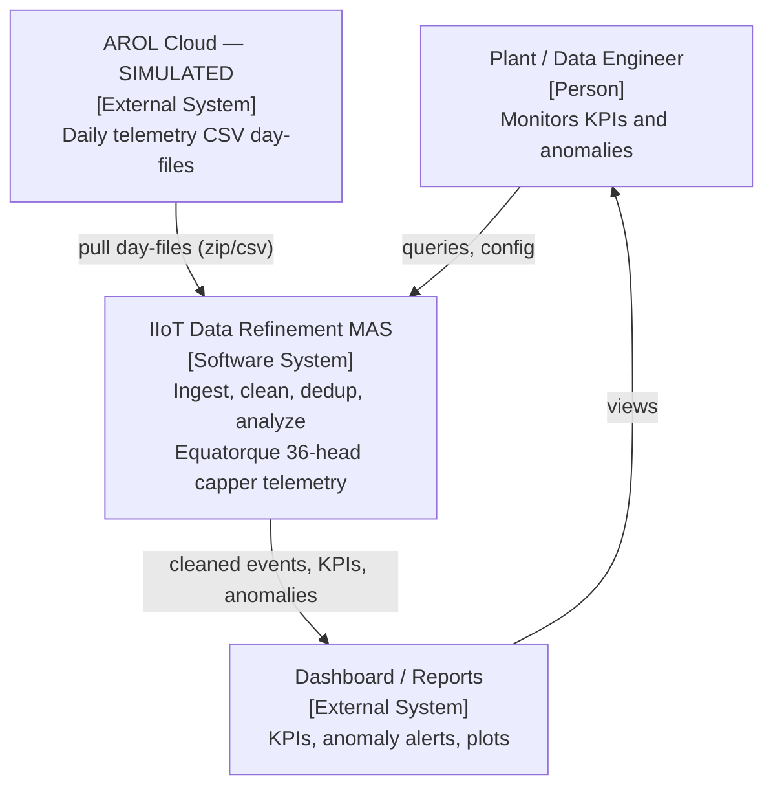
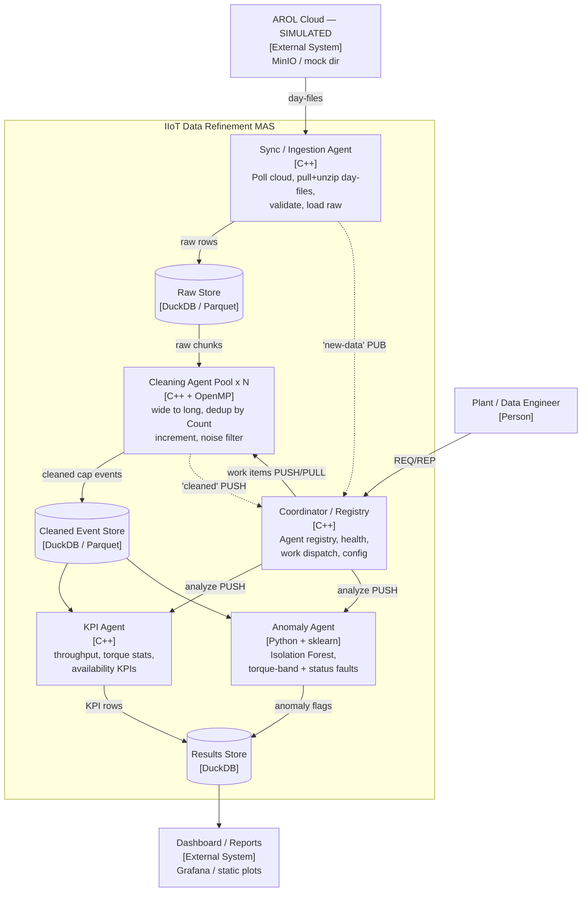
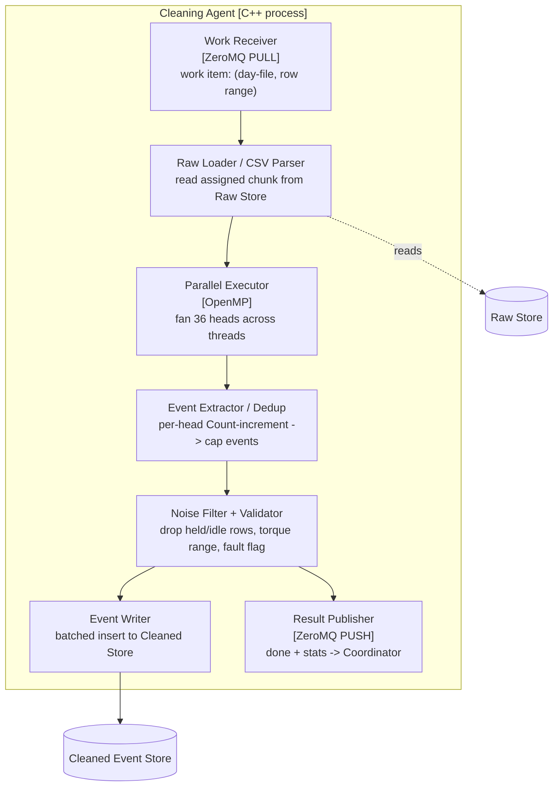
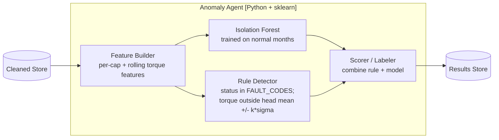
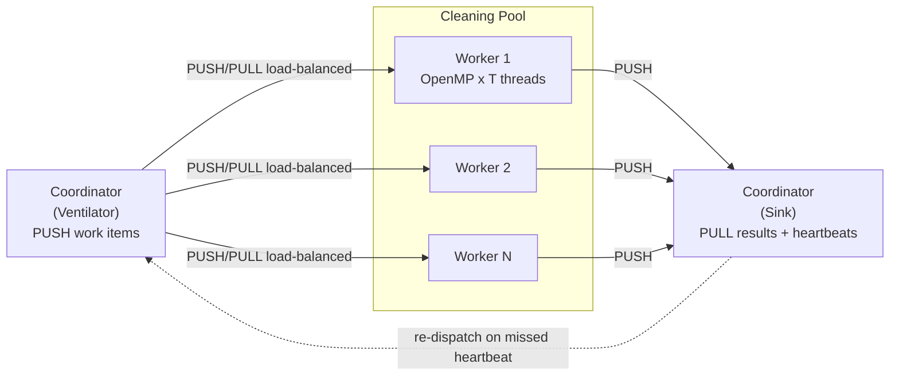

# Multi-Agent System for Industrial IoT Data Refinement & Analytics — Design Spec

- **Project**: AROL Q3 — MAS for Equatorque capping-machine telemetry
- **Date**: 2026-07-04
- **Status**: Approved design (pre-implementation)
- **Team**: 3 people, ~1 month
- **Course**: System and Device Programming (Quer)

---

## 1. Context & Problem

AROL S.p.A. builds capping/filling machinery. The `Equatorque` is a **36-head rotary
capping machine**. It emits high-frequency telemetry that is synchronized from the Cloud
and stored locally. The raw stream is noisy in a specific, structural way: the machine is
**polled at 1 Hz**, but a given head applies a cap only every few seconds, so most rows are
**held (stale) repeats** of the previous reading. The project builds a **decentralized
Multi-Agent System (MAS)** that ingests, cleans/deduplicates, and analyzes this data, and
**demonstrates that the agent-based approach scales better than a monolithic script**.

## 2. Data Description (measured from real files)

- **Format**: CSV, one file per day, `timestamp` + **108 sensor columns** = 36 heads ×
  `{Count, AppTorque, Status}` → **109 columns total**.
- **Sampling**: 1 Hz. **86,400 rows/day** (measured 86,399 in the sample day).
- **Size**: ~57 MB/day uncompressed, 28 files ≈ **1.6 GB/month**. Multi-month = a few GB
  (medium data, not big data).
- **Columns per head**:
  - `Count` — monotonic cumulative counter of caps applied by that head (increments on each cap).
  - `AppTorque` — applied torque of the **last** cap, **held** until the next cap (~2.0 Nm).
  - `Status` — status/quality code.
- **Status codes observed**: `0.0` (idle / no cap / held), `2.0` (OK cap), `65.0` (fault —
  **only ~10 occurrences/day**, i.e. rare).
- **Torque (nonzero)**: min 1.885, max 2.317, mean 1.998 Nm — tight band around 2.0.
- **The core noise structure (measured on 2026-02-01)**:
  - Exact-duplicate consecutive rows: **~24.5%** → naive row-dedup saves little.
  - Per-head real cap rate (H01): **21,270 increments/day**, ~**4.1 polled readings per real cap**.
  - Aggregate: ~**3.1M head-readings/day → ~765k real cap events/day** (~**4× reduction**)
    once we collapse held readings to actual cap events.

**Multi-month data**: additional months are used mainly for a **train/test split** of the
anomaly model (train on "normal" months, test detection on a held-out month), not because
volume is needed.

## 3. Goals & Non-Goals

**Goals** (map to the five stated objectives):
1. Data ingestion & local sync (from a *simulated* cloud).
2. Agent-based cleaning: collapse polling/production mismatch to real cap events.
3. Deduplication & logic filtering preserving capping timestamps.
4. Advanced analytics agents: KPIs + anomaly detection.
5. Demonstrate MAS scalability vs a monolithic baseline.

**Non-Goals (YAGNI)**:
- No real cloud provider integration (simulated source instead).
- No production dashboard beyond lightweight plots / optional Grafana.
- No distributed multi-machine deployment required (single host, multi-process is enough);
  multi-host is a thesis-track stretch.
- GPU acceleration is **optional stretch** for analytics only, not the cleaning core.

## 4. Key Decisions

| Decision | Choice | Rationale |
|---|---|---|
| Primary emphasis | **Systems & performance** | SDP course; brief demands parallelization + scalability proof. |
| Scope | 3 people, ~1 month | Enough for real IPC layer + small agent set + benchmark. |
| Language | **C++ core + Python analytics** | C++ for ingestion, cleaning/dedup, agent runtime, IPC (graded core); Python for ML anomaly agent + plots. |
| Cloud sync | **Simulated** (local dir / MinIO mock) | No accounts/credentials; reproducible demo. |
| Architecture | **A (ZeroMQ decentralized MAS) + C (threaded monolith) as benchmark control** | Two scaling stories + a fair experimental control. |

## 5. Architecture (C4)

### 5.1 Level 1 — System Context



### 5.2 Level 2 — Containers (each box = one Docker container)



**ZeroMQ fabric** (brokerless): `PUSH/PULL` Coordinator→Cleaning pool (load-balanced across
N workers — the scalability knob); `PUB/SUB` for telemetry/event fan-out; `REQ/REP` +
heartbeats for registration, health, config.

**Baseline monolith** (`[C++]`, not in the topology): one process doing
ingest→clean→analyze. Experimental **control** only — the "monolithic script" MAS must beat.

### 5.3 Level 3 — Cleaning Agent internals (the graded hot path)



### 5.4 Level 3 — Anomaly Agent internals (Python)



## 6. Core Domain: the dedup transform

Collapse wide 1 Hz polled rows into a long stream of **real cap events**, one per `Count`
increment per head.

```
init last_count[h] = None  for h in 1..36
for row in rows_sorted_by_ts:              # 1 Hz wide rows
    for h in 1..36 (parallel, OpenMP):     # heads independent
        c = row.Count[h]
        if last_count[h] is None:
            last_count[h] = c; continue    # seed, no event
        if c > last_count[h]:              # real cap(s) applied
            emit CapEvent(machine, head=h, ts=row.ts, cap_seq=c,
                          torque=row.AppTorque[h], status=row.Status[h],
                          delta=c-last_count[h],           # >1 = polling missed caps
                          is_fault=(row.Status[h] in FAULT_CODES),
                          aggregated=(c-last_count[h] > 1))
            last_count[h] = c
        elif c < last_count[h]:            # counter reset / rollover
            emit ResetMarker(h, row.ts); last_count[h] = c
        # else: held value -> dropped (this is the dedup)
```

**Cleaned Event Store schema** (tidy long, columnar):

```
cap_events(machine_id TEXT, head_id SMALLINT, ts TIMESTAMP,
           cap_seq BIGINT, app_torque REAL, status REAL,
           delta INT, is_fault BOOL, aggregated BOOL)
   -- partitioned by (machine_id, date(ts)), sorted (head_id, ts)
   -- UNIQUE (machine_id, head_id, cap_seq)  -> idempotent upsert
```

Reduction: ~3.1M head-readings/day → ~765k cap events/day; noise removed, timestamps preserved.

## 7. SOLID (how it is ensured)

SOLID buys three concrete things here: **testability** (inject fakes → TDD), a **fair
benchmark** (monolith and MAS reuse the *same* domain code → the experiment measures
orchestration only), and **parallel teamwork** (3 devs code against interfaces).

```cpp
// transport (ISP: recv and send split by socket role)
struct IMessageSource { virtual std::optional<Message> recv() = 0; virtual ~IMessageSource()=default; };
struct IMessageSink   { virtual void send(const Message&)   = 0; virtual ~IMessageSink()=default;   };

// persistence (DIP seam: domain never sees DuckDB/CSV)
struct IRawReader  { virtual RawChunk read(const WorkItem&)        = 0; virtual ~IRawReader()=default;  };
struct IEventStore { virtual void write(std::span<const CapEvent>) = 0; virtual ~IEventStore()=default; };

// domain logic (SRP: pure, zero I/O)
struct ICleaningRule    { virtual void apply(CapEvent&) = 0; virtual ~ICleaningRule()=default; };
class  CapEventExtractor { /* Count-increment dedup; knows nothing of zmq/duckdb */ };

// analytics (OCP/LSP: pluggable strategies)
struct IAnalyzer { virtual Results analyze(const EventQuery&) = 0; virtual ~IAnalyzer()=default; };

// runtime (LSP: every agent is an IAgent)
struct IAgent { virtual void run() = 0; virtual Health health() const = 0; virtual ~IAgent()=default; };

// dependencies injected at construction = DIP in practice:
CleaningAgent(IMessageSource& work, IRawReader& raw, CapEventExtractor extractor,
              std::vector<std::unique_ptr<ICleaningRule>> rules,
              IEventStore& out, IMessageSink& report);
```

| Principle | How ensured | Payoff |
|---|---|---|
| SRP | Transport, parsing, dedup, persistence never share a class; `CapEventExtractor` holds only the algorithm. | Swap CSV parser without touching dedup. |
| OCP | New agent = new `IAgent` + register; new check = append `ICleaningRule`; new detector = new `IAnalyzer`. | Extend without editing working code. |
| LSP | Monolith injects the **identical** `CapEventExtractor`/`IAnalyzer` as the MAS; any `ISource` swappable. | Benchmark fair by construction. |
| ISP | Small role interfaces; no god-Agent; PULL worker sees only `recv`. | Minimal coupling. |
| DIP | Domain layer never `#include`s `zmq.hpp`/`duckdb.hpp`; adapters injected. C++↔Python boundary depends on shared schema, not code. | TDD everywhere; decoupled. |

## 8. Concurrency & Parallelism

Classic ZeroMQ ventilator/worker/sink pipeline:



- **Unit of work** = one day-file → coarse-grained, self-contained, easy load-balancing.
- **Day-boundary seeding**: first row of a day seeds `last_count` (no spurious event);
  optionally pass prior-day final counts in the work item for exact cross-day continuity.
- **Two parallel axes**: inter-process (N workers) × intra-process (OpenMP over 36
  independent heads).
- **GPU**: optional stretch for analytics only (rolling stats / scoring via cuDF/numba).
  The integer-compare dedup is memory-bound → poor GPU fit; CPU parallelism is the story.

## 9. Benchmark / Experimental Evaluation

- **Variables**: workers N ∈ {1,2,4,8,16}; threads/agent T; data volume {day, week, month,
  replicated multi-month}; architecture {monolith 1-thread, monolith+OpenMP, MAS}.
- **Metrics**: throughput (rows/s, events/s, MB/s), wall-clock/month, speedup S=T₁/Tₙ,
  efficiency E=S/N, strong & weak scaling, peak RAM, CPU util, event→cleaned latency.
- **Plots**: throughput vs N (MAS rising, monolith flat); speedup & efficiency vs
  ideal-linear; wall-clock vs volume (divergence); OpenMP threads vs speedup.
- **Expected**: MAS scales ~linearly until I/O- or coordinator-bound; monolith flatlines.
- **Reproducibility**: Dockerized, fixed seeds, `make bench`; larger datasets synthesized
  by replicating months.

## 10. Error Handling & Resilience

- **Idempotency backbone**: unique `(machine_id, head_id, cap_seq)`, upsert on write →
  reprocessing any day is safe; simplifies all recovery.
- Ingestion: corrupt/partial file → quarantine + log, never crash; validate row-count /
  checksum; re-pull safe (dedup by file hash).
- Backpressure: ZeroMQ high-water marks; `PUSH/PULL` blocks when workers saturate.
- Agent crash: missed heartbeat → Coordinator re-dispatches work item → Docker restarts
  container; idempotent reprocessing avoids double-count.
- Data quirks (counter reset, `delta>1`, idle spans) handled in the extractor
  (ResetMarker / `aggregated` flag), not treated as errors.
- Cross-language isolation: Python anomaly agent failure does not stop KPI flow.

## 11. Testing Strategy (TDD)

- **Correctness oracle**: slow, obviously-correct Python reference of the dedup; assert the
  fast C++ `CapEventExtractor` matches it on real files, and cross-check against the measured
  ~765k events/day.
- **Unit** (`CapEventExtractor`): normal increment, held rows→dedup, `delta>1`, counter
  reset, idle→production transition, per-head independence, day-boundary seeding, head-offset
  outlier. Golden fixtures sliced from real data.
- **Property tests**: per head, Σdelta == finalCount − initialCount; no events during
  constant-`Count` spans; `cap_seq` monotonic.
- **Agent tests**: in-memory fakes for `IMessageSource/Sink`, `IEventStore`, `IRawReader`.
- **Integration**: docker-compose ingestion+coordinator+2 workers on a known day; assert
  event count == reference.
- **ML**: anomaly agent on held-out month; precision/recall on rare fault codes **plus
  injected synthetic anomalies** (real faults ~10/day too few alone).

## 12. Deployment & Packaging

- Each agent → a Docker image; `docker-compose up --scale cleaning=N` is both the demo and
  the scalability knob.
- Local persistence: **DuckDB** (embedded columnar; ideal for the analytic scans) with
  Parquet for the raw/cleaned stores.
- Data files stay **out of git** (`.gitignore` the CSV/ZIP — ~1.6 GB/month).

## 13. Suggested 3-Person Workstream Split

- **Dev A — Ingestion + Cleaning core (C++)**: Sync agent, CSV parser, `CapEventExtractor`,
  OpenMP, cleaned-store writer. Owns the hot path.
- **Dev B — Agent runtime + IPC + orchestration (C++)**: `IAgent`/interfaces, ZeroMQ
  transport adapters, Coordinator (ventilator/sink, heartbeats), Docker/compose, monolith
  baseline.
- **Dev C — Analytics + benchmark + docs (Python)**: KPI agent, anomaly agent (rules +
  Isolation Forest), benchmark harness + plots, DOCUMENTATION + slides.

Interfaces (Section 7) are the contracts that let the three work in parallel.

## 14. Open Questions & Risks (verify against real data)

1. **Off-by-one**: confirm `AppTorque`/`Status` align with the `Count`-increment row, not one
   poll later (PLC pipeline delay).
2. **Head synchronization**: the rotary carousel may advance all 36 heads together — verify
   whether increments are simultaneous; affects the `delta>1` "aggregated" interpretation.
3. **Cross-day continuity**: decide whether day-boundary seeding is acceptable or worth
   carrying prior-day final counts.
4. **DuckDB write concurrency** from multiple cleaning processes — may need per-worker Parquet
   files merged by the sink rather than concurrent writers to one DuckDB file.

## 15. Tech Stack

- **C++17/20**, CMake, OpenMP, `cppzmq`/`libzmq`, a fast CSV parser, DuckDB C++ API.
- **pybind11** (optional) or file/DB hand-off for the C++↔Python boundary.
- **Python**: pandas/numpy, scikit-learn (Isolation Forest), matplotlib, duckdb, pyzmq.
- **Infra**: Docker + docker-compose, MinIO (optional) for the simulated cloud.
- **Test**: GoogleTest / Catch2 (C++), pytest (Python).

## Appendix A — Measured Evidence (sample day 2026-02-01)

- 86,399 data rows; 109 columns.
- Exact-duplicate consecutive rows: 24.55%.
- `Count`-block changes: 65,149 (75.40%); avg 1.33 s between any count change.
- H01 real caps (increments): 21,270/day; ~4.1 polled readings per cap.
- Status codes: `0.0` (1.23M held/idle), `2.0` (OK), `65.0` (10 → rare fault).
- Nonzero `AppTorque`: min 1.885, max 2.317, mean 1.998 Nm.
